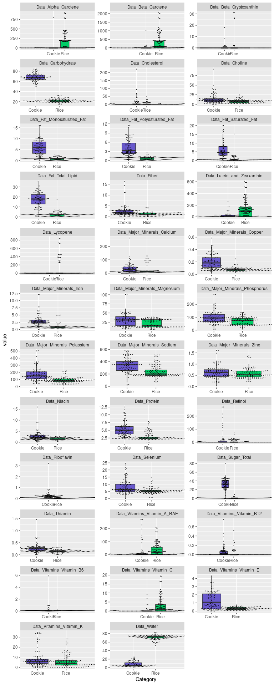
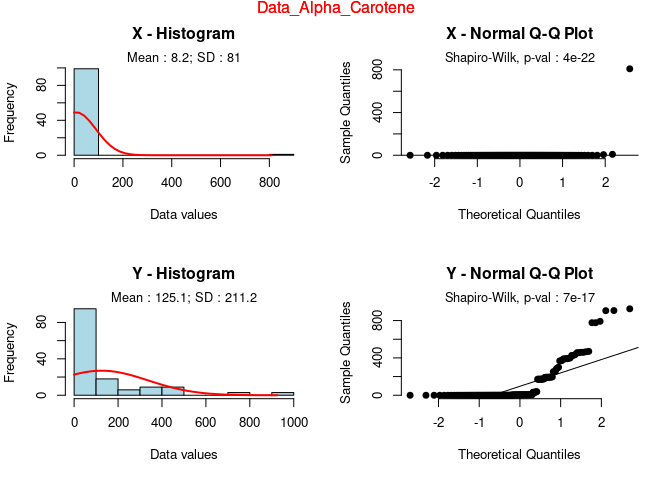
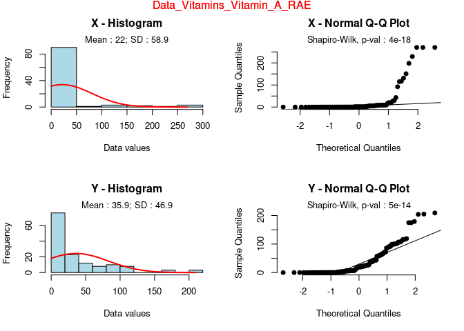
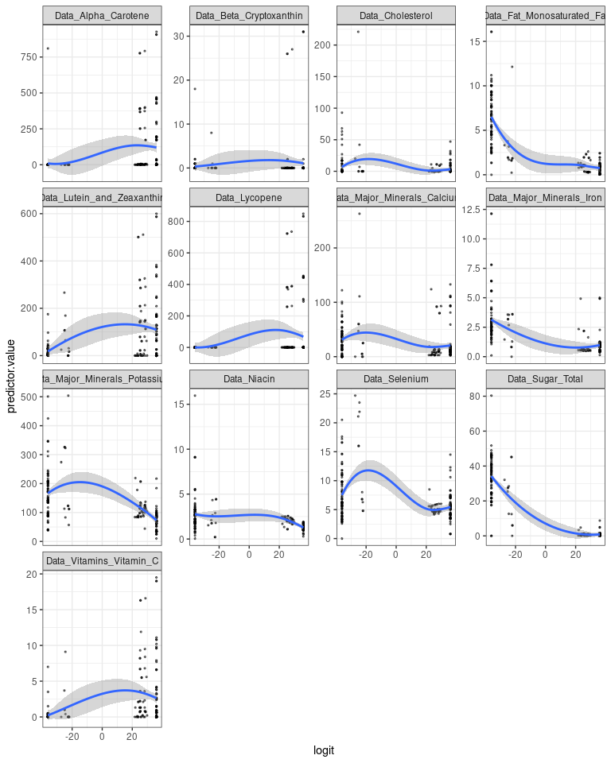

##### Список изменений (каждый ответ сопровождён '>>')
- измененён метод подсчёта NA (количество переменных с NA в датасете и число наблюдений с NA в каждой такой переменной) 
- убрана легенда из графиков с боксплотами с наложенными beeplots - за ненадобностью 
- посчитан процент от общего количества внутри данной группы
- дабы уменьшить размер RMD-файла, была имплементирована работа функции sepfoo в цикле (*shame on me за предыдущий ручной вызов функции для каждой переменной*)


# Чтение данных

В вашем варианте нужно использовать датасет food. +

> Все верно


```r
food <- read.csv("data/raw/food.csv")
```

# Выведите общее описание данных +

> Все верно, выбрано как описание статистическое, так и в виде первых значений переменных в таблице


```r
str(food)
```

```
## 'data.frame':	7083 obs. of  38 variables:
##  $ Category                      : chr  "Milk" "Milk" "Milk" "Milk" ...
##  $ Description                   : chr  "Milk, human" "Milk, NFS" "Milk, whole" "Milk, low sodium, whole" ...
##  $ Nutrient.Data.Bank.Number     : int  11000000 11100000 11111000 11111100 11111150 11111160 11111170 11112110 11112120 11112130 ...
##  $ Data.Alpha.Carotene           : int  0 0 0 0 0 0 0 0 0 0 ...
##  $ Data.Beta.Carotene            : int  7 4 7 7 7 1 0 3 1 3 ...
##  $ Data.Beta.Cryptoxanthin       : int  0 0 0 0 0 0 0 0 0 0 ...
##  $ Data.Carbohydrate             : num  6.89 4.87 4.67 4.46 4.67 5.19 4.85 4.91 5.19 4.91 ...
##  $ Data.Cholesterol              : int  14 8 12 14 12 5 2 8 5 8 ...
##  $ Data.Choline                  : num  16 17.9 17.8 16 17.8 17.4 16 18.2 17.4 18.2 ...
##  $ Data.Fiber                    : num  0 0 0 0 0 0 0 0 0 0 ...
##  $ Data.Lutein.and.Zeaxanthin    : int  0 0 0 0 0 0 0 0 0 0 ...
##  $ Data.Lycopene                 : int  0 0 0 0 0 0 0 0 0 0 ...
##  $ Data.Niacin                   : num  0.177 0.11 0.105 0.043 0.105 0.113 0.088 0.112 0.113 0.112 ...
##  $ Data.Protein                  : num  1.03 3.34 3.28 3.1 3.28 3.38 3.4 3.35 3.38 3.35 ...
##  $ Data.Retinol                  : int  60 58 31 28 31 58 137 83 58 83 ...
##  $ Data.Riboflavin               : num  0.036 0.137 0.138 0.105 0.138 0.14 0.14 0.137 0.14 0.137 ...
##  $ Data.Selenium                 : num  1.8 1.9 1.9 2 1.9 2.1 2.1 1.8 2.1 1.8 ...
##  $ Data.Sugar.Total              : num  6.89 4.89 4.81 4.46 4.81 4.96 4.85 4.89 4.96 4.89 ...
##  $ Data.Thiamin                  : num  0.014 0.057 0.056 0.02 0.056 0.057 0.036 0.059 0.057 0.059 ...
##  $ Data.Water                    : num  87.5 89 88.1 88.2 88.1 ...
##  $ Data.Fat.Monosaturated.Fat    : num  1.658 0.426 0.688 0.999 0.688 ...
##  $ Data.Fat.Polysaturated.Fat    : num  0.497 0.065 0.108 0.128 0.108 0.032 0.007 0.058 0.032 0.058 ...
##  $ Data.Fat.Saturated.Fat        : num  2.01 1.16 1.86 2.15 1.86 ...
##  $ Data.Fat.Total.Lipid          : num  4.38 1.99 3.2 3.46 3.2 0.95 0.18 1.9 0.95 1.9 ...
##  $ Data.Major.Minerals.Calcium   : int  32 126 123 101 123 126 204 126 126 126 ...
##  $ Data.Major.Minerals.Copper    : num  0.052 0.001 0.001 0.01 0.001 0.001 0.011 0.001 0.001 0.001 ...
##  $ Data.Major.Minerals.Iron      : num  0.03 0 0 0.05 0 0 0.04 0 0 0 ...
##  $ Data.Major.Minerals.Magnesium : int  3 12 12 5 12 12 11 12 12 12 ...
##  $ Data.Major.Minerals.Phosphorus: int  14 103 101 86 101 103 101 103 103 103 ...
##  $ Data.Major.Minerals.Potassium : int  51 157 150 253 150 159 166 159 159 159 ...
##  $ Data.Major.Minerals.Sodium    : int  17 39 38 3 38 39 52 39 39 39 ...
##  $ Data.Major.Minerals.Zinc      : num  0.17 0.42 0.41 0.38 0.41 0.43 0.4 0.43 0.43 0.43 ...
##  $ Data.Vitamins.Vitamin.A...RAE : int  61 59 32 29 32 58 137 83 58 83 ...
##  $ Data.Vitamins.Vitamin.B12     : num  0.05 0.56 0.54 0.36 0.54 0.61 0.38 0.55 0.61 0.55 ...
##  $ Data.Vitamins.Vitamin.B6      : num  0.011 0.06 0.061 0.034 0.061 0.06 0.04 0.061 0.06 0.061 ...
##  $ Data.Vitamins.Vitamin.C       : num  5 0.1 0 0.9 0 0 1 0.2 0 0.2 ...
##  $ Data.Vitamins.Vitamin.E       : num  0.08 0.03 0.05 0.08 0.05 0.02 0.01 0.03 0.02 0.03 ...
##  $ Data.Vitamins.Vitamin.K       : num  0.3 0.2 0.3 0.3 0.3 0.1 0 0.2 0.1 0.2 ...
```

```r
psych::describe(food)
```

```
##                                vars    n        mean          sd      median
## Category*                         1 7083     1195.95      658.67     1187.00
## Description*                      2 7083     3542.00     2044.83     3542.00
## Nutrient.Data.Bank.Number         3 7083 48849646.00 24251589.40 53260200.00
## Data.Alpha.Carotene               4 7083       43.76      259.52        0.00
## Data.Beta.Carotene                5 7083      255.36      995.71        8.00
## Data.Beta.Cryptoxanthin           6 7083        4.86       38.05        0.00
## Data.Carbohydrate                 7 7083       20.83       21.89       13.30
## Data.Cholesterol                  8 7083       34.46       77.48        8.00
## Data.Choline                      9 7083       34.44       43.90       19.60
## Data.Fiber                       10 7083        1.70        2.56        1.00
## Data.Lutein.and.Zeaxanthin       11 7083      213.35     1015.89       18.00
## Data.Lycopene                    12 7083      263.57     1161.25        0.00
## Data.Niacin                      13 7083        2.65        3.99        1.49
## Data.Protein                     14 7083        8.60        8.30        6.19
## Data.Retinol                     15 7083       49.83      227.99        8.00
## Data.Riboflavin                  16 7083        0.19        0.35        0.12
## Data.Selenium                    17 7083       13.09       27.17        8.10
## Data.Sugar.Total                 18 7083        7.34       12.80        2.39
## Data.Thiamin                     19 7083        0.17        0.41        0.09
## Data.Water                       20 7083       59.80       26.83       66.59
## Data.Fat.Monosaturated.Fat       21 7083        3.22        4.63        1.87
## Data.Fat.Polysaturated.Fat       22 7083        2.17        3.90        1.04
## Data.Fat.Saturated.Fat           23 7083        2.80        4.10        1.44
## Data.Fat.Total.Lipid             24 7083        8.96       11.05        5.48
## Data.Major.Minerals.Calcium      25 7083       73.47      114.86       37.00
## Data.Major.Minerals.Copper       26 7083        0.14        0.39        0.08
## Data.Major.Minerals.Iron         27 7083        1.75        3.64        1.04
## Data.Major.Minerals.Magnesium    28 7083       27.79       38.21       20.00
## Data.Major.Minerals.Phosphorus   29 7083      133.09      126.50      102.00
## Data.Major.Minerals.Potassium    30 7083      217.13      204.81      183.00
## Data.Major.Minerals.Sodium       31 7083      340.50      350.33      313.00
## Data.Major.Minerals.Zinc         32 7083        1.28        2.92        0.68
## Data.Vitamins.Vitamin.A...RAE    33 7083       73.14      241.91       20.00
## Data.Vitamins.Vitamin.B12        34 7083        0.71        2.50        0.18
## Data.Vitamins.Vitamin.B6         35 7083        0.20        0.37        0.11
## Data.Vitamins.Vitamin.C          36 7083        5.70       15.55        0.70
## Data.Vitamins.Vitamin.E          37 7083        1.09        3.13        0.55
## Data.Vitamins.Vitamin.K          38 7083       14.21       54.94        3.80
##                                    trimmed         mad     min         max
## Category*                          1190.55      760.57 1.0e+00     2429.00
## Description*                       3542.00     2625.68 1.0e+00     7083.00
## Nutrient.Data.Bank.Number      47858496.82 33190669.68 1.1e+07 99998210.00
## Data.Alpha.Carotene                   1.42        0.00 0.0e+00     4655.00
## Data.Beta.Carotene                   41.82       11.86 0.0e+00    14134.00
## Data.Beta.Cryptoxanthin               0.64        0.00 0.0e+00     1922.00
## Data.Carbohydrate                    16.90       13.36 0.0e+00      100.00
## Data.Cholesterol                     20.70       11.86 0.0e+00     3074.00
## Data.Choline                         26.69       18.98 0.0e+00      820.20
## Data.Fiber                            1.20        1.48 0.0e+00       46.20
## Data.Lutein.and.Zeaxanthin           43.51       26.69 0.0e+00    15643.00
## Data.Lycopene                         8.35        0.00 0.0e+00    45902.00
## Data.Niacin                           1.92        1.75 0.0e+00      127.50
## Data.Protein                          7.36        6.66 0.0e+00       78.13
## Data.Retinol                         18.71       11.86 0.0e+00     9349.00
## Data.Riboflavin                       0.14        0.11 0.0e+00       17.50
## Data.Selenium                        10.46       10.97 0.0e+00     1917.00
## Data.Sugar.Total                      4.17        3.16 0.0e+00       99.80
## Data.Thiamin                          0.11        0.09 0.0e+00       23.38
## Data.Water                           62.76       24.86 0.0e+00       99.98
## Data.Fat.Monosaturated.Fat            2.39        2.42 0.0e+00       75.22
## Data.Fat.Polysaturated.Fat            1.43        1.32 0.0e+00       67.85
## Data.Fat.Saturated.Fat                2.01        1.88 0.0e+00       82.50
## Data.Fat.Total.Lipid                  7.01        6.78 0.0e+00      100.00
## Data.Major.Minerals.Calcium          50.95       40.03 0.0e+00     1375.00
## Data.Major.Minerals.Copper            0.09        0.05 0.0e+00       14.47
## Data.Major.Minerals.Iron              1.16        0.95 0.0e+00       64.10
## Data.Major.Minerals.Magnesium        20.99       11.86 0.0e+00      611.00
## Data.Major.Minerals.Phosphorus      115.53       96.37 0.0e+00     1429.00
## Data.Major.Minerals.Potassium       191.88      115.64 0.0e+00     6040.00
## Data.Major.Minerals.Sodium          299.28      246.11 0.0e+00     7851.00
## Data.Major.Minerals.Zinc              0.85        0.65 0.0e+00       98.86
## Data.Vitamins.Vitamin.A...RAE        33.32       29.65 0.0e+00     9363.00
## Data.Vitamins.Vitamin.B12             0.30        0.27 0.0e+00       82.44
## Data.Vitamins.Vitamin.B6              0.13        0.10 0.0e+00       12.00
## Data.Vitamins.Vitamin.C               2.47        1.04 0.0e+00      560.00
## Data.Vitamins.Vitamin.E               0.67        0.58 0.0e+00      149.40
## Data.Vitamins.Vitamin.K               5.24        5.04 0.0e+00     1640.00
##                                      range  skew kurtosis        se
## Category*                          2428.00  0.05    -1.09      7.83
## Description*                       7082.00  0.00    -1.20     24.30
## Nutrient.Data.Bank.Number      88998210.00  0.22    -1.04 288158.60
## Data.Alpha.Carotene                4655.00 10.68   133.52      3.08
## Data.Beta.Carotene                14134.00  6.69    53.22     11.83
## Data.Beta.Cryptoxanthin            1922.00 30.36  1262.68      0.45
## Data.Carbohydrate                   100.00  1.48     1.41      0.26
## Data.Cholesterol                   3074.00 13.52   394.80      0.92
## Data.Choline                        820.20  4.61    42.61      0.52
## Data.Fiber                           46.20  4.91    46.97      0.03
## Data.Lutein.and.Zeaxanthin        15643.00  9.60   105.99     12.07
## Data.Lycopene                     45902.00 12.65   362.82     13.80
## Data.Niacin                         127.50  7.94   162.30      0.05
## Data.Protein                         78.13  1.66     4.83      0.10
## Data.Retinol                       9349.00 22.43   711.39      2.71
## Data.Riboflavin                      17.50 20.95   906.45      0.00
## Data.Selenium                      1917.00 49.11  3402.32      0.32
## Data.Sugar.Total                     99.80  3.15    11.71      0.15
## Data.Thiamin                         23.38 29.90  1484.67      0.00
## Data.Water                           99.98 -0.83    -0.27      0.32
## Data.Fat.Monosaturated.Fat           75.22  4.98    44.08      0.06
## Data.Fat.Polysaturated.Fat           67.85  6.64    71.18      0.05
## Data.Fat.Saturated.Fat               82.50  5.13    51.30      0.05
## Data.Fat.Total.Lipid                100.00  3.39    18.43      0.13
## Data.Major.Minerals.Calcium        1375.00  4.79    32.53      1.36
## Data.Major.Minerals.Copper           14.47 19.87   581.45      0.00
## Data.Major.Minerals.Iron             64.10  7.77    77.66      0.04
## Data.Major.Minerals.Magnesium       611.00  6.33    58.18      0.45
## Data.Major.Minerals.Phosphorus     1429.00  2.98    17.26      1.50
## Data.Major.Minerals.Potassium      6040.00  7.94   142.79      2.43
## Data.Major.Minerals.Sodium         7851.00  6.47    96.36      4.16
## Data.Major.Minerals.Zinc             98.86 15.25   359.68      0.03
## Data.Vitamins.Vitamin.A...RAE      9363.00 18.91   558.44      2.87
## Data.Vitamins.Vitamin.B12            82.44 16.30   400.88      0.03
## Data.Vitamins.Vitamin.B6             12.00 10.07   197.75      0.00
## Data.Vitamins.Vitamin.C             560.00 11.47   278.28      0.18
## Data.Vitamins.Vitamin.E             149.40 21.20   786.04      0.04
## Data.Vitamins.Vitamin.K            1640.00 10.84   177.20      0.65
```

# Очистка данных

1) Уберите переменные, в которых пропущенных значений больше 20% или уберите субъектов со слишком большим количеством пропущенных значений. Или совместите оба варианта. Напишите обоснование, почему вы выбрали тот или иной вариант: +


```r
food %>% 
  rowwise() %>% 
  mutate(num_missing = sum(is.na(c_across(Nutrient.Data.Bank.Number:last_col())))) %>% 
  select(everything()) %>% 
  arrange(desc(num_missing)) -> food2

food %>%
  summarise(across(everything(), ~ sum(is.na(.x))))
```

```
##   Category Description Nutrient.Data.Bank.Number Data.Alpha.Carotene
## 1        0           0                         0                   0
##   Data.Beta.Carotene Data.Beta.Cryptoxanthin Data.Carbohydrate Data.Cholesterol
## 1                  0                       0                 0                0
##   Data.Choline Data.Fiber Data.Lutein.and.Zeaxanthin Data.Lycopene Data.Niacin
## 1            0          0                          0             0           0
##   Data.Protein Data.Retinol Data.Riboflavin Data.Selenium Data.Sugar.Total
## 1            0            0               0             0                0
##   Data.Thiamin Data.Water Data.Fat.Monosaturated.Fat Data.Fat.Polysaturated.Fat
## 1            0          0                          0                          0
##   Data.Fat.Saturated.Fat Data.Fat.Total.Lipid Data.Major.Minerals.Calcium
## 1                      0                    0                           0
##   Data.Major.Minerals.Copper Data.Major.Minerals.Iron
## 1                          0                        0
##   Data.Major.Minerals.Magnesium Data.Major.Minerals.Phosphorus
## 1                             0                              0
##   Data.Major.Minerals.Potassium Data.Major.Minerals.Sodium
## 1                             0                          0
##   Data.Major.Minerals.Zinc Data.Vitamins.Vitamin.A...RAE
## 1                        0                             0
##   Data.Vitamins.Vitamin.B12 Data.Vitamins.Vitamin.B6 Data.Vitamins.Vitamin.C
## 1                         0                        0                       0
##   Data.Vitamins.Vitamin.E Data.Vitamins.Vitamin.K
## 1                       0                       0
```

**Обоснование**: 
Исходя из текущих реалий, в данном датасете отсутствуют пропущенные значения, т.е нет нужды в удалении какой-то информации. Стратегия обработки пропущенных значений во многом зависит от того, какого харакетра пропуски имеют место в наборе данных (MCAR, MAR, MNAR) и каков объём пропусков - если при удалении значения используемого статистического теста изменяются несущественно, то удаление безопасно, но, вероятно, мощность теста будет сниженной. Я бы не стал удалять столбец (==поле, атрибут) таблицы при указанных 20% пропусков, но задумался бы об этом при достижении 50-60%, особенно если переменная не является значительной для анализа. 

> Обоснование решения и возможных сценариев работы с пропусками разумно

2) Переименуйте переменные в человекочитаемый вид (что делать с пробелами в названиях?); +

> Snakecase - отличный выбор


```r
names(food2) <- gsub("\\.", "_", names(food2))
names(food2) <- sub("___", "_", names(food2))
```


3) В соответствии с описанием данных приведите переменные к нужному типу (numeric или factor); +

> Все конвнертации выбраны разумно - в том числе уникальных переменных (отсутствие конвертации в их случае - отличный выбор в силу их неинформативности)

4) Отсортируйте данные по углеводам по убыванию; +
> Все верно


```r
food2 %>% 
  mutate(across(-c(Category, Description, Nutrient_Data_Bank_Number), as.numeric)) %>% 
  mutate(across(Category, as.factor)) %>% 
  arrange(desc(Data_Carbohydrate))-> food3
```

5) Сохраните в файл outliers.csv субъектов, которые являются выбросами (например, по правилу трёх сигм) — это необязательное задание со звёздочкой;  +
> Фильтрация выполнена в соответствии с правилом трёх сигм - все верно


```r
threesigmafoo <- function(x) abs(x-mean(x))/sd(x)

food3$z_carbo <- threesigmafoo(food3$Data_Carbohydrate)

food3 %>%
  filter(z_carbo>3) %>% 
  select(-c("z_carbo", "num_missing")) %>% 
  write_csv("data/outliers.csv")
```

6) Отфильтруйте датасет так, чтобы остались только Rice и Cookie (переменная Category и есть группирующая); +
> Фильтрация проведена верно, вспомогательные переменные с прошлых пунктов предусмотрительно удалены

7) Присвойте получившийся датасет переменной "cleaned_data". +
> Датасет присвоен нужной переменной


```r
cleaned_data <- food3 %>%
  select(-c("num_missing", "z_carbo")) %>% 
  filter(Category %in% c("Rice", "Cookie"))
```

# Сколько осталось переменных? +
> Эффективный и простой способ


```r
ncol(cleaned_data)
```

```
## [1] 38
```

# Сколько осталось случаев? +
> Эффективный и простой способ


```r
nrow(cleaned_data)
```

```
## [1] 243
```

# Есть ли в данных идентичные строки? +
> Эффективный и простой способ


```r
sum(duplicated(cleaned_data))
```

```
## [1] 0
```

# Сколько всего переменных с пропущенными значениями в данных и сколько пропущенных точек в каждой такой переменной? -

> Задача не выполнена - нет ответа на вопрос о количестве в разбиении по переменным и в общем

>> переделано (20NOV2023)


```r
# Сколько всего переменных с пропущенными значениями в данных
cleaned_data %>% 
  select(where(function(x) any(is.na(x)))) %>% 
  ncol()
```

```
## [1] 0
```

```r
# Cколько пропущенных точек в каждой такой переменной?
sapply(cleaned_data, function(x) sum(is.na(x)))
```

```
##                       Category                    Description 
##                              0                              0 
##      Nutrient_Data_Bank_Number            Data_Alpha_Carotene 
##                              0                              0 
##             Data_Beta_Carotene        Data_Beta_Cryptoxanthin 
##                              0                              0 
##              Data_Carbohydrate               Data_Cholesterol 
##                              0                              0 
##                   Data_Choline                     Data_Fiber 
##                              0                              0 
##     Data_Lutein_and_Zeaxanthin                  Data_Lycopene 
##                              0                              0 
##                    Data_Niacin                   Data_Protein 
##                              0                              0 
##                   Data_Retinol                Data_Riboflavin 
##                              0                              0 
##                  Data_Selenium               Data_Sugar_Total 
##                              0                              0 
##                   Data_Thiamin                     Data_Water 
##                              0                              0 
##     Data_Fat_Monosaturated_Fat     Data_Fat_Polysaturated_Fat 
##                              0                              0 
##         Data_Fat_Saturated_Fat           Data_Fat_Total_Lipid 
##                              0                              0 
##    Data_Major_Minerals_Calcium     Data_Major_Minerals_Copper 
##                              0                              0 
##       Data_Major_Minerals_Iron  Data_Major_Minerals_Magnesium 
##                              0                              0 
## Data_Major_Minerals_Phosphorus  Data_Major_Minerals_Potassium 
##                              0                              0 
##     Data_Major_Minerals_Sodium       Data_Major_Minerals_Zinc 
##                              0                              0 
##    Data_Vitamins_Vitamin_A_RAE      Data_Vitamins_Vitamin_B12 
##                              0                              0 
##       Data_Vitamins_Vitamin_B6        Data_Vitamins_Vitamin_C 
##                              0                              0 
##        Data_Vitamins_Vitamin_E        Data_Vitamins_Vitamin_K 
##                              0                              0
```

# Описательные статистики

## Количественные переменные

1) Рассчитайте для всех количественных переменных для каждой группы (Category): +

1.1) Количество значений;

1.2) Количество пропущенных значений;

1.3) Среднее;

1.4) Медиану;

1.5) Стандартное отклонение;

1.6) 25% квантиль и 75% квантиль;

1.7) Интерквартильный размах;

1.8) Минимум;

1.9) Максимум;

1.10) 95% ДИ для среднего - задание со звёздочкой.


> Все посчитано верно


```r
calcse <- function(x) sd(x)/sqrt(length(x))

statistics <- list(
      `__Количество субъектов` = ~length(.x) %>% as.character(),
      `__Количество (есть данные)` = ~sum(!is.na(.x)) %>% as.character(),
      `__Нет данных` = ~sum(is.na(.x)) %>% as.character(),
      `__Ср. знач.` = ~ifelse(sum(!is.na(.x)) == 0, "Н/П*", mean(.x, na.rm = TRUE) %>% round(2) %>% as.character()),
      `__Медиана` = ~ifelse(sum(!is.na(.x)) == 0, "Н/П*", median(.x, na.rm = TRUE) %>% round(2) %>% as.character()),
      `__Станд. отклон.` = ~ifelse(sum(!is.na(.x)) < 3, "Н/П*", sd(.x, na.rm = TRUE) %>% round(2) %>% as.character()),
      `__Q1 - Q3` = ~ifelse(sum(!is.na(.x)) == 0, "Н/П*", paste0(quantile(.x, 0.25, na.rm = TRUE) %>% round(2), " - ", quantile(.x, 0.75, na.rm = TRUE) %>% round(2))),
      `__Интерквартильный размах` = ~ifelse(sum(!is.na(.x)) == 0, "Н/П*", IQR(.x, na.rm = TRUE)) %>% round(2) %>% as.character(),
      `__Минимум` = ~ifelse(sum(!is.na(.x)) == 0, "Н/П*", min(.x, na.rm = TRUE) %>% round(2) %>% as.character()),
      `__Максимум` = ~ifelse(sum(!is.na(.x)) == 0, "Н/П*", max(.x, na.rm = TRUE) %>% round(2) %>% as.character()),
      `__95% ДИ для среднего` = ~ifelse(sum(!is.na(.x)) == 0, "Н/П*", calcse(.x)) %>% round(2) %>% as.character()
)
  
cleaned_data %>% 
  select(Category, starts_with("Data")) %>% 
  group_by(Category) %>% 
  summarise(across(where(is.numeric), statistics)) %>% 
  pivot_longer(!Category) %>% 
  separate(name, into=c("Переменная", "Статистика"), sep="___") %>% 
  rename(`Значение` = value)
```

```
## # A tibble: 770 × 4
##    Category Переменная          Статистика               Значение
##    <fct>    <chr>               <chr>                    <chr>   
##  1 Cookie   Data_Alpha_Carotene Количество субъектов     100     
##  2 Cookie   Data_Alpha_Carotene Количество (есть данные) 100     
##  3 Cookie   Data_Alpha_Carotene Нет данных               0       
##  4 Cookie   Data_Alpha_Carotene Ср. знач.                8.25    
##  5 Cookie   Data_Alpha_Carotene Медиана                  0       
##  6 Cookie   Data_Alpha_Carotene Станд. отклон.           80.99   
##  7 Cookie   Data_Alpha_Carotene Q1 - Q3                  0 - 0   
##  8 Cookie   Data_Alpha_Carotene Интерквартильный размах  0       
##  9 Cookie   Data_Alpha_Carotene Минимум                  0       
## 10 Cookie   Data_Alpha_Carotene Максимум                 810     
## # ℹ 760 more rows
```

## Категориальные переменные    

1) Рассчитайте для всех категориальных переменных для каждой группы (Category):

1.1) Абсолютное количество; +

1.2) Относительное количество внутри группы;    *not done*

1.3) 95% ДИ для доли внутри группы - задание со звёздочкой. 

В наших данных всего одна категориальная перменная, потому не представляется расчёт пунктов 1.2 и 1.3 (p.s.: вероятно, я что-то понял превратно)

> В 1.2 нужно было посчитать процент от общего количества внутри данной группы

>> посчитан и добавлен процент (19NOV2023) 


```r
cleaned_data %>% 
  group_by(Category) %>% 
  summarise(n=n()) %>% 
  mutate(rel_pct=paste0(round(n*100/sum(n), 2), "%"))
```

```
## # A tibble: 2 × 3
##   Category     n rel_pct
##   <fct>    <int> <chr>  
## 1 Cookie     100 41.15% 
## 2 Rice       143 58.85%
```

# Визуализация

## Количественные переменные

1) Для каждой количественной переменной сделайте боксплоты по группам. Расположите их либо на отдельных рисунках, либо на одном, но читаемо;
> Боксплоты построены читаемо на одном графике - учтены размеры графика, достаточные для обеспечения читаемости

2) Наложите на боксплоты beeplots - задание со звёздочкой.  
> Beeplots наложены

3) Раскрасьте боксплоты с помощью библиотеки RColorBrewer. 
> Функции использованы


```r
df.long1 <- cleaned_data %>% 
  pivot_longer(Data_Alpha_Carotene:Data_Vitamins_Vitamin_K, names_to = 'variable', values_to = 'value')

#ggplot(data = cleaned_data, aes(x = Category, y = Data_Alpha_Carotene, fill = Category)) +
#  geom_boxplot(outlier.shape = NA) +
#  scale_fill_manual(values=c("slateblue3", "springgreen3"))+
#  theme(legend.position="bottom") +
#  geom_beeswarm(cex=5, size=0.1)

ggplot(data = df.long1, aes(x = Category, y = value, fill = Category)) +
  geom_boxplot(outlier.shape = NA) +
  scale_fill_manual(values=c("slateblue3", "springgreen3"))+
  theme(legend.position="none") +                                     #19NOV2023
  geom_beeswarm(cex=3, size=0.1) +
  facet_wrap(facets = ~variable, scales = 'free', ncol=3)
```

<!-- -->

```r
#ggplot(data = df.long1, aes(x = Category, y = value, fill = Category)) +
#  geom_boxplot(outlier.colour =  'red3', outlier.shape = 3, outlier.size = 0.5) +
#  scale_fill_manual(values=c("slateblue3", "springgreen3"))+
#  theme(legend.position="bottom") +
#  geom_beeswarm(cex=1)+
#  facet_wrap(facets = ~variable, scales = 'free', ncol=3)
```

## Категориальные переменные

1) Сделайте подходящие визуализации категориальных переменных. Обоснуйте, почему выбрали именно этот тип. +

> Выбор обоснован, диаграмма подобрана оптимальная - отображает и пропорцию, и количество


```r
ggplot(data=cleaned_data,  aes(x=Category, fill=Category)) +
  geom_bar()+
  geom_text(stat='count', aes(label=..count..), vjust = -0.2)
```

<!-- -->

В данных всего одна категориальная переменная с 2мя уровнями, потому и была выбрана столбиковая диаграмма для визуализации.

# Статистические оценки

## Проверка на нормальность

1) Оцените каждую переменную на соответствие нормальному распределению с помощью теста Шапиро-Уилка. Какие из переменных являются нормальными и как как вы это поняли? +

> Дана верная интерпретация и обоснование ответа


```r
cleaned_data %>% 
  select(starts_with("Data_")) -> num_part_of_cd

do.call(rbind, lapply(num_part_of_cd, function(x) shapiro.test(x)[c("statistic", "p.value")]))
```

```
##                                statistic p.value     
## Data_Alpha_Carotene            0.4979695 9.676071e-26
## Data_Beta_Carotene             0.554394  1.715896e-24
## Data_Beta_Cryptoxanthin        0.1884713 4.175524e-31
## Data_Carbohydrate              0.7790791 8.226354e-18
## Data_Cholesterol               0.2902534 1.484996e-29
## Data_Choline                   0.6824783 4.016347e-21
## Data_Fiber                     0.6148296 5.202927e-23
## Data_Lutein_and_Zeaxanthin     0.6985567 1.250007e-20
## Data_Lycopene                  0.341717  1.058249e-28
## Data_Niacin                    0.6130087 4.667352e-23
## Data_Protein                   0.8382668 3.300713e-15
## Data_Retinol                   0.3054584 2.620854e-29
## Data_Riboflavin                0.4014662 1.212901e-27
## Data_Selenium                  0.7552767 1.027989e-18
## Data_Sugar_Total               0.7512548 7.34277e-19 
## Data_Thiamin                   0.699119  1.301707e-20
## Data_Water                     0.7405159 3.048579e-19
## Data_Fat_Monosaturated_Fat     0.7928399 2.954615e-17
## Data_Fat_Polysaturated_Fat     0.7651067 2.381111e-18
## Data_Fat_Saturated_Fat         0.6999729 1.384479e-20
## Data_Fat_Total_Lipid           0.8200375 4.490983e-16
## Data_Major_Minerals_Calcium    0.6861165 5.172792e-21
## Data_Major_Minerals_Copper     0.764165  2.194573e-18
## Data_Major_Minerals_Iron       0.7328306 1.652164e-19
## Data_Major_Minerals_Magnesium  0.8729268 2.387868e-13
## Data_Major_Minerals_Phosphorus 0.9096507 6.00984e-11 
## Data_Major_Minerals_Potassium  0.8356289 2.449477e-15
## Data_Major_Minerals_Sodium     0.9453805 6.830264e-08
## Data_Major_Minerals_Zinc       0.9152223 1.575115e-10
## Data_Vitamins_Vitamin_A_RAE    0.6285073 1.191785e-22
## Data_Vitamins_Vitamin_B12      0.4683625 2.364644e-26
## Data_Vitamins_Vitamin_B6       0.1407899 8.855802e-32
## Data_Vitamins_Vitamin_C        0.5692384 3.831207e-24
## Data_Vitamins_Vitamin_E        0.7380033 2.49161e-19 
## Data_Vitamins_Vitamin_K        0.7408719 3.13734e-19
```
Судя по результатам работы критерия Шапиро-Уилка в датасете нет ни одной числовой переменной, которая была бы распределена нормально (значение p.value << 0.05).

2) Постройте для каждой количественной переменной QQ-плот. Отличаются ли выводы от теста Шапиро-Уилка? Какой метод вы бы предпочли и почему? +

> Увидел ответ на данный вопрос в следующем - лучше писать ответ к вопросу, на который он дается. Ответ верный, решение корректное.


```r
#qq_plot <- ggplot(df.long1, aes(sample=value)) +
#  stat_qq() + 
#  stat_qq_line()

ggplot(data = df.long1, aes(sample = value, color = variable)) +
  stat_qq_line()+
  stat_qq()+
  theme(legend.position="none") +
  facet_wrap(facets = ~variable, scales = 'free', ncol=3)
```

<!-- -->

3) Ниже напишите, какие ещё методы проверки на нормальность вы знаете и какие у них есть ограничения. +

**Напишите текст здесь**
Для оценки нормальности распределения данных я скорее предпочёл бы не полагаться на какой-то единственный метод проверки, а учитывать результаты нескольких, т.е. чтобы оценка была интегральной. Но если вопрос ставить именно так, то я опирался бы в первую очередь на QQ-plot, нежели чем на тест Шапиро-Уилка, т.к. последний ведёт себя подобно другим статистическим тестам - чем больше выборка, тем с большей вероятностью он “поймает” отклонения от нормальности; чем меньше выборка, тем с меньшей вероятностью он обнаружит даже серьезные отклонения от нормальности, хотя мы заинтересованы в обратном. При большой выборке отклонения от нормальности не так страшны, а при маленькой тест все равно ничего не обнаружит. Т.к. идеально нормальных распределений в природе почти не существует, это значит, что при достаточно большой выборке тест Шапиро-Уилка практически всегда будет находить отклонения от нормальности (например QQ-plot для Data_Major_Minerals_Sodium выглядит вполне прилично). Все это делает его во многом малоинформативным при тестировании допущения о нормальности. Это же верно и для других тестов на нормальность (критерий Колмогорова-Смирнова, критерий Андерсона-Дарлинга и др.). Также графически можно оценить нормальность с помощью гистограммы (с наложением поверх функции плотности вероятности для нормального распределённых данных).

> Вкратце, но описаны другие методы и их ограничения

## Сравнение групп

1) Сравните группы (переменная **Category**) по каждой переменной (как количественной, так и категориальной). Для каждой переменной выберите нужный критерий и кратко обоснуйте его выбор в комментариях. +


```r
rquery.t.test<-function(x, y, var.equal.p, main_title, graph = TRUE)
{
      var.equal.p<-signif(var.equal.p,1) 
      
          if(graph) par(mfrow=c(2,2))
          # normality test
          shapiro.px<-normaTest(x, graph, 
                                hist.title="X - Histogram",
                                qq.title="X - Normal Q-Q Plot", 
                                main_title = main_title)
          shapiro.py<-normaTest(y, graph,
                                hist.title="Y - Histogram",
                                qq.title="Y - Normal Q-Q Plot",
                                main_title = main_title)
          if(shapiro.px < 0.05 | shapiro.py < 0.05){
              warning("x or y is not normally distributed!",
                      " Shapiro test p-value : ", shapiro.px,
                      " (for x) and ", shapiro.py, " (for y)",
                      " Levene's test p-value :", var.equal.p)
            }
   }
normaTest<-function(x, graph=TRUE, 
                    hist.title="Histogram", 
                    qq.title="Normal Q-Q Plot",
                    main_title,...)
  {  
  # Significance test
  #++++++++++++++++++++++
  shapiro.p<-signif(shapiro.test(x)$p.value,1) 
  
  if(graph){
    # Plot : Visual inspection
    #++++++++++++++++
    h<-hist(x, col="lightblue", main=hist.title, 
            xlab="Data values", ...)
    m<-round(mean(x),1)
    s<-round(sd(x),1)
    mtext(get("main_title"),side=3,line=-1,col="red", cex=1, outer=TRUE)
    mtext(paste0("Mean : ", m, "; SD : ", s),
          side=3, cex=0.8)
    # add normal curve
    xfit<-seq(min(x),max(x),length=40)
    yfit<-dnorm(xfit,mean=mean(x),sd=sd(x))
    yfit <- yfit*diff(h$mids[1:2])*length(x)
    lines(xfit, yfit, col="red", lwd=2)
    # qq plot
    qqnorm(x, pch=19, frame.plot=FALSE,main=qq.title)
    qqline(x)
    mtext(paste0("Shapiro-Wilk, p-val : ", shapiro.p),
          side=3, cex=0.8)
  }
  return(shapiro.p)
}

sepfoo <- function(dep_var) {
  
  cleaned_data %>%
    filter(Category == "Cookie") %>%
    pull({{ dep_var }}) -> x
  
  cleaned_data  %>%
    filter(Category == "Rice") %>%
    pull({{ dep_var }}) -> y
  
  dat <- cleaned_data %>% 
     select(Category, {{ dep_var }}) %>% 
     rename(dep_var = {{ dep_var }})
  
  var.equal.p = first(car::leveneTest(data = dat, dep_var ~ Category)$`Pr(>F)`) 
  
  print(i)
  
  rquery.t.test(x, y, var.equal.p, main_title=i)
}
```


```r
dt_num_vars <- names(cleaned_data)[4:ncol(cleaned_data)]

for (i in dt_num_vars) {
  sepfoo(all_of(i))
}
```

```
## [1] "Data_Alpha_Carotene"
```

<!-- -->

```
## [1] "Data_Beta_Carotene"
```

<!-- -->

```
## [1] "Data_Beta_Cryptoxanthin"
```

<!-- -->

```
## [1] "Data_Carbohydrate"
```

<!-- -->

```
## [1] "Data_Cholesterol"
```

<!-- -->

```
## [1] "Data_Choline"
```

<!-- -->

```
## [1] "Data_Fiber"
```

<!-- -->

```
## [1] "Data_Lutein_and_Zeaxanthin"
```

<!-- -->

```
## [1] "Data_Lycopene"
```

<!-- -->

```
## [1] "Data_Niacin"
```

<!-- -->

```
## [1] "Data_Protein"
```

<!-- -->

```
## [1] "Data_Retinol"
```

<!-- -->

```
## [1] "Data_Riboflavin"
```

<!-- -->

```
## [1] "Data_Selenium"
```

<!-- -->

```
## [1] "Data_Sugar_Total"
```

<!-- -->

```
## [1] "Data_Thiamin"
```

<!-- -->

```
## [1] "Data_Water"
```

<!-- -->

```
## [1] "Data_Fat_Monosaturated_Fat"
```

<!-- -->

```
## [1] "Data_Fat_Polysaturated_Fat"
```

<!-- -->

```
## [1] "Data_Fat_Saturated_Fat"
```

<!-- -->

```
## [1] "Data_Fat_Total_Lipid"
```

<!-- -->

```
## [1] "Data_Major_Minerals_Calcium"
```

<!-- -->

```
## [1] "Data_Major_Minerals_Copper"
```

<!-- -->

```
## [1] "Data_Major_Minerals_Iron"
```

<!-- -->

```
## [1] "Data_Major_Minerals_Magnesium"
```

<!-- -->

```
## [1] "Data_Major_Minerals_Phosphorus"
```

<!-- -->

```
## [1] "Data_Major_Minerals_Potassium"
```

<!-- -->

```
## [1] "Data_Major_Minerals_Sodium"
```

<!-- -->

```
## [1] "Data_Major_Minerals_Zinc"
```

<!-- -->

```
## [1] "Data_Vitamins_Vitamin_A_RAE"
```

<!-- -->

```
## [1] "Data_Vitamins_Vitamin_B12"
```

<!-- -->

```
## [1] "Data_Vitamins_Vitamin_B6"
```

<!-- -->

```
## [1] "Data_Vitamins_Vitamin_C"
```

<!-- -->

```
## [1] "Data_Vitamins_Vitamin_E"
```

<!-- -->

```
## [1] "Data_Vitamins_Vitamin_K"
```

<!-- -->

Для подавляющего большинства параметров не выполняются условия нормальности распределения (тест Шапиро-Уилка, QQ-plot) и одинаковости дисперсии между группами (тест Левина). Априори предположим, что имеет место независимость значений в выборке. Учитывая вышесказанное, кажется уместным для поиска разницы между группами (по переменной Category) использовать тест Манна-Уитни. Для параметра Data_Carbohydrate и Data_Major_Minerals_Zinc дополнительно будет применён t-тест c поправкой Уэлча (p.s: выглядят более менее прилично). 

> Обоснование звучит разумно, однако стоило хотя бы выполнять функцию sepfoo в цикле, чтобы не копировать порядка 30 раз

>> исправлено (19NOV2023)


```r
func <- function (x) {with(cleaned_data, wilcox.test(x[Category == "Rice"], x[Category == "Cookie"]))[c("statistic", "p.value")]}

do.call(rbind, lapply(num_part_of_cd, function(x) func (x)))
```

```
##                                statistic p.value     
## Data_Alpha_Carotene            11123.5   8.50543e-18 
## Data_Beta_Carotene             11948.5   4.35776e-20 
## Data_Beta_Cryptoxanthin        6835      0.2412422   
## Data_Carbohydrate              0         3.981248e-40
## Data_Cholesterol               6719.5    0.3160814   
## Data_Choline                   4541.5    1.317225e-06
## Data_Fiber                     3211      2.60071e-13 
## Data_Lutein_and_Zeaxanthin     9384.5    3.184908e-05
## Data_Lycopene                  8593.5    3.89452e-06 
## Data_Niacin                    3409.5    4.029143e-12
## Data_Protein                   1596      7.072975e-25
## Data_Retinol                   5512      0.00031024  
## Data_Riboflavin                318       8.528726e-37
## Data_Selenium                  4529.5    1.167088e-06
## Data_Sugar_Total               431       1.224372e-35
## Data_Thiamin                   2647      6.790742e-17
## Data_Water                     14300     3.980513e-40
## Data_Fat_Monosaturated_Fat     375       3.338033e-36
## Data_Fat_Polysaturated_Fat     719       8.684614e-33
## Data_Fat_Saturated_Fat         606       6.856874e-34
## Data_Fat_Total_Lipid           362       2.448533e-36
## Data_Major_Minerals_Calcium    4788      1.169725e-05
## Data_Major_Minerals_Copper     1864.5    1.098611e-22
## Data_Major_Minerals_Iron       887.5     3.437394e-31
## Data_Major_Minerals_Magnesium  4709      5.824575e-06
## Data_Major_Minerals_Phosphorus 4424      4.298967e-07
## Data_Major_Minerals_Potassium  2433.5    2.19127e-18 
## Data_Major_Minerals_Sodium     3371.5    2.437825e-12
## Data_Major_Minerals_Zinc       6221      0.08498116  
## Data_Vitamins_Vitamin_A_RAE    9914.5    2.005246e-07
## Data_Vitamins_Vitamin_B12      4584      3.177608e-08
## Data_Vitamins_Vitamin_B6       10829     8.929251e-12
## Data_Vitamins_Vitamin_C        11016     4.774018e-14
## Data_Vitamins_Vitamin_E        3063      3.462062e-14
## Data_Vitamins_Vitamin_K        5290      0.0005620782
```

```r
t.test(data=cleaned_data, Data_Carbohydrate ~ Category)
```

```
## 
## 	Welch Two Sample t-test
## 
## data:  Data_Carbohydrate by Category
## t = 61.913, df = 128.8, p-value < 2.2e-16
## alternative hypothesis: true difference in means between group Cookie and group Rice is not equal to 0
## 95 percent confidence interval:
##  44.66484 47.61381
## sample estimates:
## mean in group Cookie   mean in group Rice 
##             68.08730             21.94797
```

```r
t.test(data=cleaned_data, Data_Major_Minerals_Zinc ~ Category)
```

```
## 
## 	Welch Two Sample t-test
## 
## data:  Data_Major_Minerals_Zinc by Category
## t = 1.935, df = 162.68, p-value = 0.05473
## alternative hypothesis: true difference in means between group Cookie and group Rice is not equal to 0
## 95 percent confidence interval:
##  -0.001322471  0.130265128
## sample estimates:
## mean in group Cookie   mean in group Rice 
##            0.6358000            0.5713287
```

За исключением некоторых переменных (Data_Beta_Cryptoxanthin, Data_Cholesterol, Data_Major_Minerals_Zinc) справедливо предположить, что две выборки (по переменной Category) взяты из распределений с разным средним в генеральной совокупности.

> Верно, обоснование также разумное

# Далее идут **необязательные** дополнительные задания, которые могут принести вам дополнительные баллы в том числе в случае ошибок в предыдущих

## Корреляционный анализ

1) Создайте корреляционную матрицу с визуализацией и поправкой на множественные сравнения. Объясните, когда лучше использовать корреляционные матрицы и в чём минусы и плюсы корреляционных исследований. +


```r
cor_plot <- cleaned_data %>%
  select(starts_with("Data_")) %>%
  psych::corr.test(adjust = "BH")           #поправка Бенджамини — Хохберга

corrplot(corr = cor_plot$r,
         p.mat = cor_plot$p,
         method = "color",
         order = "hclust")
```

<!-- -->

Крестиками отмечены статистические незначимые (с p.value > 0.05), без крестиков – статистически значимые коэффициенты корреляции. 

Корреляционные матрицы преимущественно используются:
1) для удобного обобщения набора данных
2) для диагностики регрессии
3) в качестве исходных данных для других анализов, например исследовательский факторный анализ

Плюсы корреляционных исследований:
- возможность изучить широкий диапазон переменных
- дает информацию о направлении и силе взаимосвязи между переменным
- исследование достаточно просто в реализации

Минусы:
- мало возможностей для установления контроля над переменными
- нет возможности проанализировать сложные взаимодействия между переменными, если они имеют место быть
- выявленная корреляция не эквивалентна непосредственной каузальной связи

> Таблица построена читаемо, плюсы и минусы выявлены корректно

## Моделирование

1) Постройте регрессионную модель для переменной **Category**. Опишите процесс построения +

Сделаем переменную **Category** бинарной и из общей модели со всеми числовыми предикторами удалим наиболее скоррелированные. Для этого воспользуемся функцией vif() из пакета broom - итерационно вызываем эту функцию на модели и удаляем переменную с наибольшим значеним VIF. Повторяем эту процедуру до тех пор пока не останется ни одной переменной с VIF больше 5. 


> Селекция переменных - разумный шаг


```r
cleaned_data %>% 
  mutate(Category2 = as.integer(ifelse(Category == "Cookie", 0, 1))) %>% 
  relocate(Category2, .after=Category) %>% 
  select(Category2, where(is.numeric)) %>% 
  select(-Nutrient_Data_Bank_Number) -> cleaned_data_m

pre_model <- glm(data = cleaned_data_m, family = "binomial", Category2 ~ .)

# names(car::vif(pre_model))

model <- glm(data = cleaned_data_m, family = "binomial", Category2 ~ . -Data_Carbohydrate -Data_Vitamins_Vitamin_A_RAE -Data_Fat_Total_Lipid -Data_Beta_Carotene -Data_Water -Data_Riboflavin -Data_Vitamins_Vitamin_E -Data_Vitamins_Vitamin_B12 -Data_Protein -Data_Major_Minerals_Phosphorus -Data_Vitamins_Vitamin_B6 -Data_Major_Minerals_Zinc -Data_Major_Minerals_Copper -Data_Vitamins_Vitamin_K -Data_Fiber -Data_Thiamin -Data_Fat_Saturated_Fat -Data_Fat_Polysaturated_Fat -Data_Retinol -Data_Major_Minerals_Magnesium -Data_Choline -Data_Major_Minerals_Sodium) 
```

Следующий шаг - проверка на линейность. Для этого отрисуем графики с logit по оси абцисс и значением той или иной числовой переменной, оставшейся после селекции на предыдущем шаге.

> Дополнительный шаг также выглядит разумно, однако не обязательно было удалять подозрительную переменную - она могла дать также прирост в точности


```r
probabilities <- predict(model, type = "response")
logit <- log(probabilities/(1-probabilities))
predictors <- names(car::vif(model))

cleaned_data_m1 <- cleaned_data_m %>% select(predictors)
cleaned_data_m1$logit <- logit

cleaned_data_m2 <- cleaned_data_m1 %>% 
   gather(key = "predictors", value = "predictor.value", -logit)
  
ggplot(cleaned_data_m2, aes(logit, predictor.value))+
  geom_point(size = 0.5, alpha = 0.5) +
  geom_smooth(method = "loess") + 
  theme_bw() +
  facet_wrap(~predictors, scales = "free_y", ncol=4)
```

```
## `geom_smooth()` using formula = 'y ~ x'
```

<!-- -->

Перемеенная Data_Selenium не свзана линейно с logit (~= как мне кажется), потому удалим этот предиктор. 


```r
model2 <- glm(data = cleaned_data_m, family = "binomial", Category2 ~ Data_Alpha_Carotene + Data_Beta_Cryptoxanthin + Data_Cholesterol + Data_Lutein_and_Zeaxanthin + Data_Lycopene + Data_Niacin + Data_Sugar_Total + Data_Fat_Monosaturated_Fat + Data_Major_Minerals_Calcium + Data_Major_Minerals_Iron + Data_Major_Minerals_Potassium + Data_Vitamins_Vitamin_C)
```

```
## Warning: glm.fit: algorithm did not converge
```

```
## Warning: glm.fit: fitted probabilities numerically 0 or 1 occurred
```

Воспользуемся функцией step() из пакета MASS, чтобы найти наиболее значимые предикторы для предсказания **Category**. Будем ориентироваться на информационный критерий Акаике (чем меньше, тем лучше). Также посчитаем Байесовский критерий.

> Данный шаг также разумный. В целом в процессе сделан упор на отбор переменных, что является одним из разумных путей


```r
best_model <- MASS::stepAIC(model2,trace = FALSE)
summary(best_model)
```

```
## 
## Call:
## glm(formula = Category2 ~ Data_Sugar_Total + Data_Fat_Monosaturated_Fat, 
##     family = "binomial", data = cleaned_data_m)
## 
## Deviance Residuals: 
##        Min          1Q      Median          3Q         Max  
## -1.697e-04  -2.100e-08   2.100e-08   2.100e-08   2.254e-04  
## 
## Coefficients:
##                            Estimate Std. Error z value Pr(>|z|)
## (Intercept)                  124.57   15745.41   0.008    0.994
## Data_Sugar_Total             -11.23    1456.62  -0.008    0.994
## Data_Fat_Monosaturated_Fat   -40.78    5469.03  -0.007    0.994
## 
## (Dispersion parameter for binomial family taken to be 1)
## 
##     Null deviance: 3.2922e+02  on 242  degrees of freedom
## Residual deviance: 1.4783e-07  on 240  degrees of freedom
## AIC: 6
## 
## Number of Fisher Scoring iterations: 25
```

```r
AIC(best_model)
```

```
## [1] 6
```

```r
BIC(best_model)
```

```
## [1] 16.47918
```


