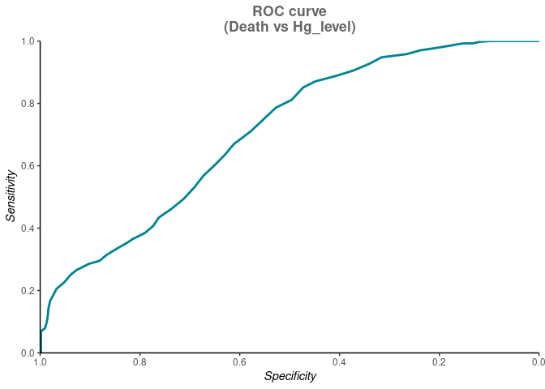
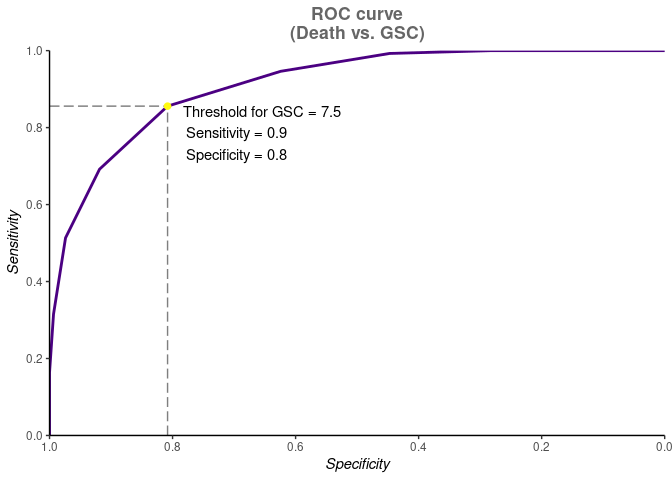

```r
trauma <- read.csv("data/trauma.csv")
```

## Задание №1

Предварительно преобразуем данные, переведя параметры рост (Height) и вес (Weight) субъектов в соответствии с нормальной метрической системой мер - сантиметры и кг соответственно
  + поменяем тип данных с текстового на числовой для уровня гемоглобина (Hb), переведя в NA нулевые значения
  + рассчитаем описательные статистики
  + рассчитаем коэффициент массы тела BMI
  + отметим субъектов чей BMI больше 30 (BMIgt30)


```r
trauma1 <- trauma %>% 
   select(-X) %>% 
   mutate(Height_cm = round(inch2cm(as.numeric(gsub('"', "", Height))),1),
          Weight_kg = round(lbs2kg(as.numeric(gsub(',', ".", Weight))),1),
          Hb_num = if_else(Hb != '0', as.numeric(gsub(',', ".", Hb)), NA_integer_)) %>% 
   select(-c("Height", "Weight", "Hb"))

psych::describe(trauma1) %>% 
  as_tibble(rownames = "param") %>% 
  filter(!param %in% c("id", "Name*", "Sex*"))
```

```
## # A tibble: 9 × 14
##   param      vars     n    mean     sd median trimmed   mad   min   max range
##   <chr>     <int> <dbl>   <dbl>  <dbl>  <dbl>   <dbl> <dbl> <dbl> <dbl> <dbl>
## 1 Age           4  1024  40.9   13.7     41    41.0   17.8   18    64    46  
## 2 SBP           5  1024 111.     7.45   110   111.     8.90  90   134    44  
## 3 DBP           6  1024  84.8    8.42    84    84.7    8.90  58   110    52  
## 4 FOUR          7  1024   8.85   3.01     9     8.86   2.97   0    16    16  
## 5 GSC           8  1024   7.79   2.69     8     7.75   2.97   3    14    11  
## 6 Death         9  1024   0.399  0.490    0     0.374  0      0     1     1  
## 7 Height_cm    10  1024 184.     8.39   185.  184.     9.79 162.  203.   40.8
## 8 Weight_kg    11  1024  87.8    8.27    88    87.8    7.93  60.5 115.   54.3
## 9 Hb_num       12  1008  13.0    1.28    13.1  13.1    1.33   9.4  16.2   6.8
## # ℹ 3 more variables: skew <dbl>, kurtosis <dbl>, se <dbl>
```

```r
trauma2 <- trauma1 %>% 
  mutate(BMI = round(calc_bmi(Weight_kg,Height_cm),1),
         Hb_status = if_else(Sex == "Female", if_else(between(Hb_num, 12, 14), 0, 1), if_else(between(Hb_num, 13.5, 16), 0, 1)),
         BMIgt30 = if_else(BMI > 30, 1, 0)) 
```

Рассчитаем: 
  1) количество пациентов
  2) процент случаев среди людей 
со сниженным гемоглобина (мужчин и женщин отдельно)


```r
trauma2 %>% 
  filter(!is.na(Hb_status)) %>% 
  group_by(Sex, Hb_status) %>% 
  count()
```

```
## # A tibble: 4 × 3
## # Groups:   Sex, Hb_status [4]
##   Sex    Hb_status     n
##   <chr>      <dbl> <int>
## 1 Female         0   150
## 2 Female         1   226
## 3 Male           0   399
## 4 Male           1   233
```

```r
trauma2 %>% 
  filter(!is.na(Hb_status)) %>% 
  group_by(Sex) %>% 
  summarise(mean_Hb_status = mean(Hb_status))
```

```
## # A tibble: 2 × 2
##   Sex    mean_Hb_status
##   <chr>           <dbl>
## 1 Female          0.601
## 2 Male            0.369
```
Можем резюмировать, что большинство женщин (~60%) в той или иной степени обнаруживают анемию в анамнезе; среди мужчин - 37% таковых.

## Задание №2

Рассчитаем: 
  1) среднее значение и стандартное отклонение коээфициента BMI среди всех пострадавших от самоката; 
  2) количество людей, чей BMI больше 30 (== страдающие серьёзной степенью ожирения).


```r
trauma2 %>% 
  summarise(BMI_mean = mean(BMI), 
            BMI_SD = sd(BMI))
```

```
##   BMI_mean   BMI_SD
## 1  26.0042 2.565401
```

```r
trauma2 %>% 
  group_by(BMIgt30) %>% 
  count()
```

```
## # A tibble: 2 × 2
## # Groups:   BMIgt30 [2]
##   BMIgt30     n
##     <dbl> <int>
## 1       0   957
## 2       1    67
```
Подавляещее большинство людей имеют BMI меньше 30 (>93%). Ожирение диагностировано у ~7% пострадавших.
В среднем коэффициент BMI пострадавших равен 26, стандартное отклонение - 2.57.

## Задание №3


```r
death_Hb_roc <- roc(Death ~ Hb_num, data=trauma2, ci=TRUE)

ggroc(death_Hb_roc,  color="#008491", size=1)+
  scale_y_continuous(expand=c(0,0),
                     breaks=seq(0,1,0.2))+
  scale_x_reverse(expand=c(0,0),
                  breaks=seq(0,1,0.2))+
  labs(y="Sensitivity", x="Specificity",
       title="ROC curve\n(Death vs Hg_level)")+
  theme_classic()+
  theme(axis.title = element_text(face="italic"),
        plot.title = element_text(face="bold", hjust = 0.5, color="grey40"))
```

<!-- -->

Данная форма кривой может быть обусловлена характером связи (низкая/умеренная) между числовым уровнем гемоглобина при поступлении (Hg_num) и изучаемым исходом (наступление/не наступление смерти). Может статьтся так, что вследствии травмы пострадавший/-ая потерял/-а много крови (постгемморагическая анемия, острая или острая вкупе с хронической (например как бывает у женщин на фоне обильных месячных)), в результате чего вероятность умереть может повыситься.  

## Задание №4

Площадь под ROC-кривой, 95% двусторонний ДИ для площади под ROC-кривой.


```r
death_Hb_roc$auc
```

```
## Area under the curve: 0.7078
```

```r
death_Hb_roc$ci
```

```
## 95% CI: 0.6763-0.7392 (DeLong)
```

## Задание №5

Результаты расчёта порогового значения, чувствительности и специфичности для шкалы комы Глазго отображены на графике ниже. 


```r
death_gsc_roc <- roc(Death ~ GSC, data = trauma2, ci = TRUE)

best_death_gsc_roc <- death_gsc_roc %>% 
  coords(x = "best", best.method = "closest.topleft") %>%
  mutate(label_ = sprintf("Threshold for GSC = %.1f\n  Sensitivity = %.1f\n  Specificity = %.1f",
                       threshold, sensitivity, specificity))

ggroc(death_gsc_roc, color = "#4b0082", size = 1) +
  geom_line(aes(x = x, y = y),
            data.frame(x = c(1, best_death_gsc_roc$specificity),
                       y = best_death_gsc_roc$sensitivity),
            linetype = "longdash", linewidth = 0.5, color =  "grey50") +
  geom_line(aes(x = x, y = y),
            data.frame(x = best_death_gsc_roc$specificity,
                       y = c(0, best_death_gsc_roc$sensitivity)),
            linetype = "longdash", linewidth = 0.5, color =  "grey50") +
  geom_point(aes(x = specificity, y = sensitivity), best_death_gsc_roc,
             color = "#fffA0e", size = 2) +
  geom_text(aes(x = specificity, y = sensitivity, label = label_),
            best_death_gsc_roc, hjust = -0.1, vjust = 1) +
  scale_y_continuous(expand = c(0,0),
                     breaks = seq(0,1,0.2)) +
  scale_x_reverse(expand = c(0,0),
                  breaks = seq(0,1,0.2)) +
  labs(x = "Specificity", y = "Sensitivity",
       title = "ROC curve\n(Death vs. GSC)") +
  theme_classic() +
  theme(axis.title = element_text(face = "italic"),
        plot.title = element_text(face = "bold", hjust = 0.5, color="grey40"))
```

<!-- -->

## Задание №6


```r
trauma2 %>% 
  select(-id, -Name, -Sex, -Hb_status, -BMIgt30) %>% 
  pivot_longer(cols=-Death, names_to="Var") %>% 
  group_by(Var) %>% 
  summarize(AUC = roc(Death, value, ci=T)$ci[2]) %>% 
  arrange(-AUC)
```

```
## # A tibble: 9 × 2
##   Var         AUC
##   <chr>     <dbl>
## 1 FOUR      0.934
## 2 GSC       0.912
## 3 SBP       0.786
## 4 DBP       0.744
## 5 Hb_num    0.708
## 6 Age       0.527
## 7 Weight_kg 0.518
## 8 BMI       0.498
## 9 Height_cm 0.482
```
Исходя из полученных результатов, у параметра балл по шкале комы FOUR (FOUR) максимальная площадь под ROC-кривой т.к. этот параметр, вероятно, в силу своей эффективности (относительно оценок неврологического статуса, рефлексов ствола мозга, дыхательного паттерна и т.д.) даёт наиболее точное предсказание исхода (смерть/выживание пострадавшего) при черепно-мозговой травме и, хоть и не намного, даже превосходит другую шкалу - шкалу комы Глазго (GSC). Наименьшую же площадь даёт числовая переменная роста (Height_cm, после ряда преобразований) - скорее всего потому, что как таковую связь между вышеуказанными проследить затруднительно в данном контексте. 
