```r
ins <- read_csv("data/insurance_cost.csv")
```


```r
ins %>% 
  select(is.numeric) %>% 
  pivot_longer(age:charges, names_to = 'variable', values_to = 'value') %>% 
  ggplot(aes(x=value, fill=variable)) +
  geom_histogram() + 
  theme(legend.position = "none")+
  facet_wrap(. ~ variable, scales = "free")
```

```
## `stat_bin()` using `bins = 30`. Pick better value with `binwidth`.
```

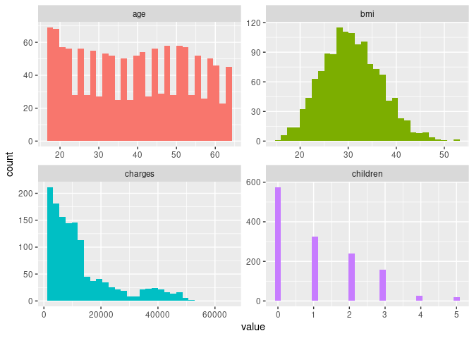<!-- -->


```r
charge_stats <- c(round(mean(ins$charges, na.rm = T),2), round(median(ins$charges, na.rm = T), 2)) 

denplot <- ggplot(data=ins, aes(x=charges))+
  geom_density()+
  geom_vline(aes(xintercept = charge_stats[1], color = "red2")) +
  geom_vline(aes(xintercept = charge_stats[2], color = "navy")) +
  annotate("text",
           x=charge_stats[2] + 10000, 
           y=4.2e-05,
           label=paste0("Mean=", charge_stats[1]),
           color="red2")+
  annotate("text",
           x=charge_stats[1] + 2500, 
           y=5.2e-05,
           label=paste0("Median=", charge_stats[2]),
           color="navy")+
  theme_classic()+
  scale_colour_identity()+
    xlab("Charges") +
  ylab("Density")

denplot
```

<!-- -->


```r
# ins %>% 
#   select(sex, smoker, region, charges) %>% 
#   pivot_longer(cols = c("sex", "smoker", "region"), names_to = "param") %>% 
#   arrange(param,value) %>% 
#   ggplot(aes(x=value, y=charges, color=param))+
#   geom_boxplot()+
#   facet_grid(. ~ param, scales = "free")+
#   theme_classic()+
#   theme(axis.text.x = element_text(angle = 45, vjust=0.55),
#         legend.position = "none")

bxplot1 <- ins %>% 
  select(sex, charges) %>% 
  ggplot(aes(x=sex, y=charges))+
  geom_boxplot()+
  theme_classic()+
  theme(axis.text.x = element_text(angle = 45, vjust=0.55)) +
  ylab("Charges") +
  xlab("Sex")

bxplot2 <- ins %>% 
  select(smoker, charges) %>% 
  ggplot(aes(x=smoker, y=charges))+
  geom_boxplot()+
  theme_classic()+
  theme(axis.text.x = element_text(angle = 45, vjust=0.55)) +
  ylab("Charges") +
  xlab("Smoker")

bxplot3 <- ins %>% 
  select(region, charges) %>% 
  ggplot(aes(x=region, y=charges))+
  geom_boxplot()+
  theme_classic()+
  theme(axis.text.x = element_text(angle = 45, vjust=0.55)) +
  ylab("Charges") +
  xlab("Region")


bxplot1; bxplot2; bxplot3
```

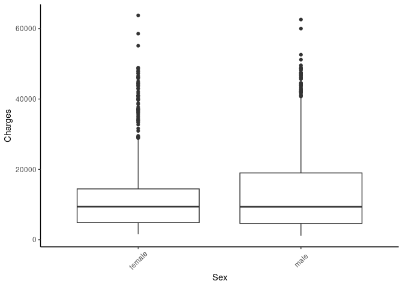<!-- -->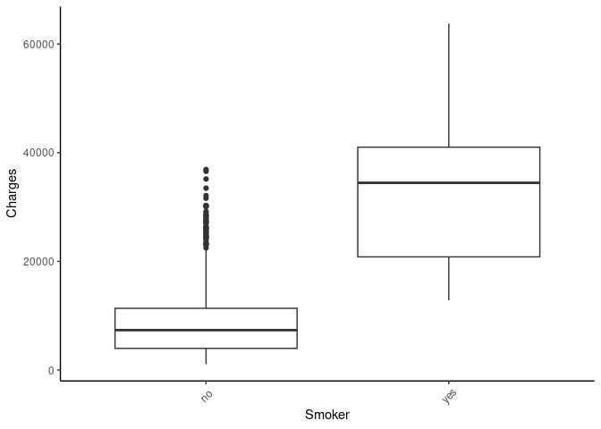<!-- -->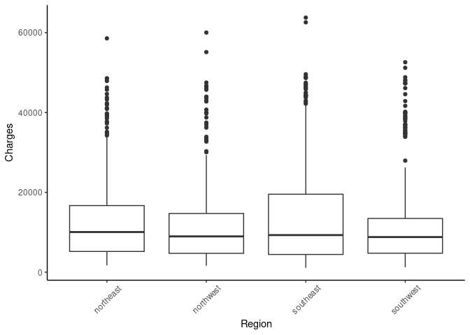<!-- -->


```r
cmplxplot <- ggarrange(denplot, ggarrange(bxplot1, bxplot2, bxplot3, ncol=3), 
                  nrow = 2)
annotate_figure(cmplxplot, top = text_grob("Density plot + 3 boxplots (Charges vs Sex, Smoker & Region)", 
               color = "red", face = "bold", size = 14))
```

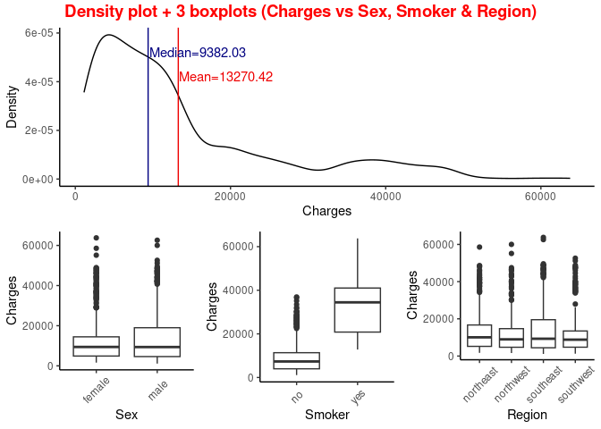<!-- -->


```r
stats <- ins %>% select(region, charges) %>% group_by(region) %>% 
  summarise(median=round(median(charges, na.rm = TRUE), 2), 
            mean=round(mean(charges, na.rm = TRUE), 2))

ins2 <- ins %>% left_join(stats, by = join_by(region))

ins2 %>%
  select(region, charges, mean, median) %>% 
  ggplot(aes(x=charges)) +
  geom_density() +
  geom_vline(aes(xintercept = mean, color="mean")) +
  geom_vline(aes(xintercept = median,color="median")) +
  scale_color_manual(name = "statistics", values = c(mean = "red2", median = "navy"))+
  labs(color = "statistics") +
  facet_wrap( ~ region, ncol = 2, scales = "free", labeller = label_both)
```

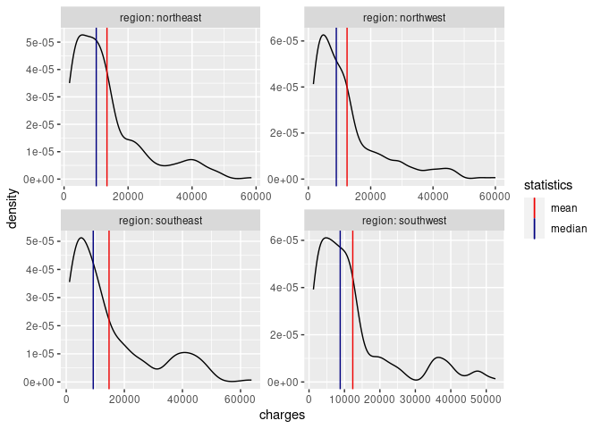<!-- -->


```r
ggplot(data=ins, aes(y=charges, x=age))+
  geom_point()+
  geom_smooth(method = "lm")+
  xlab("Age")+
  ylab("Charges")+
  ggtitle("Charges vs Age")+
  theme_bw()+
  theme(plot.title = element_text(hjust = 0.5, colour = 'red', size = 18),
        axis.text=element_text(size=14),
        axis.title=element_text(size=16))
```

```
## `geom_smooth()` using formula = 'y ~ x'
```

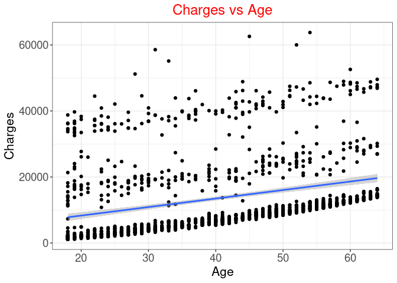<!-- -->

```r
ggplot(data=ins, aes(y=charges, x=age))+
  geom_point()+
  geom_smooth(aes(color=smoker), method = "lm")+
  xlab("Age")+
  ylab("Charges")+
  ggtitle("Charges vs Age")+
  theme_bw()+
  theme(plot.title = element_text(hjust = 0.5, colour = '#4b0082', size = 18),
        axis.text=element_text(size=14),
        axis.title=element_text(size=16))
```

```
## `geom_smooth()` using formula = 'y ~ x'
```

<!-- -->


```r
ggplot(data=ins, aes(y=charges, x=bmi))+
  geom_point()+
  geom_smooth(aes(color=smoker), method = "lm")+
  xlab("BMI")+
  ylab("Charges")+
  ggtitle("Charges vs BMI")+
  theme_bw()+
  theme(plot.title = element_text(hjust = 0.5, colour = '#008080', size = 18),
        axis.text=element_text(size=14),
        axis.title=element_text(size=16))
```

```
## `geom_smooth()` using formula = 'y ~ x'
```

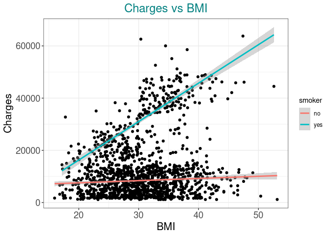<!-- -->

Каково распределение переменной BMI по регионам у некурящих? Для этого воспользуемся скрипичной диаграммой, которая способна достаточно наглядно и компактно её показать. Также вывел наблюдения в виде точек, дабы удостовериться, что диаграммы не построены на нескольких наблюдениях.


```r
ins %>% 
  filter(smoker == "no") %>% 
  ggplot(aes(region, bmi, fill=sex))+
  geom_violin()+
  geom_jitter(alpha=0.25)+
  theme_classic() +
  theme(legend.position = "bottom", plot.title = element_text(hjust = 0.5))+
  ggtitle("Violin plots (bmi vs region) for nonsmoker people of different sex")
```

<!-- -->

Какова связь между переменными возраста(age), издержек(charges) и количества детей (children) у мужчин (sex=male) из юго-восточных регионов (region = southeast)? В таких случаях удобна для визуализации нескольких числовых переменных пузырьковая диаграмма.


```r
ins %>% 
  filter(sex == "male" & region == "southeast") %>%   
  ggplot(aes(x=age, y=charges))+
  geom_point(aes(size=children, color=smoker), alpha=0.5)+
  scale_color_manual(values=c("#E7B800", "#481567FF"))+
  theme_bw() +
  theme(plot.title = element_text(hjust = 0.5))+
  ggtitle("Bubble plot (charges vs age) for men from southeast region")
```

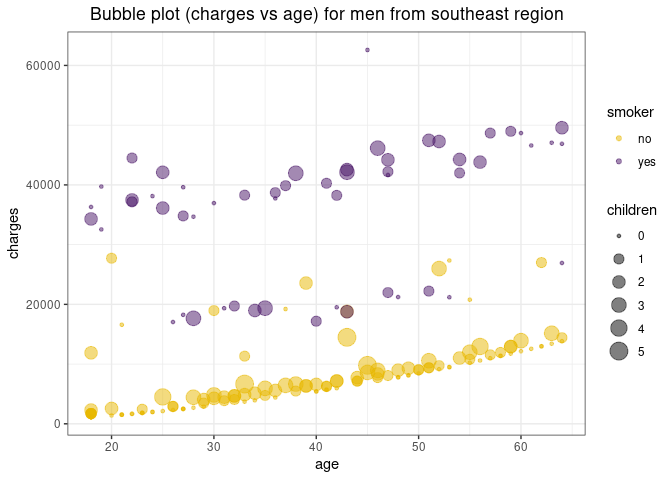<!-- -->

Как связаны между собой переменные children и charges у респондентов женского пола (sex=female)? Здесь была выбрана столбиковая диаграмма (barplot) т.к. переменная children по своей сути является скорее ординальной категориальной переменной, уровни которой и отражает barplot.


```r
ins %>% 
  filter(sex=="female") %>% 
  ggplot(aes(x=factor(children), y=charges))+
    geom_col()+
    theme_light()+
    xlab("Children")+
    ylab("Charges")+
    theme(plot.title = element_text(hjust = 0.5))+
    ggtitle("Barplot (charges vs children) for women")
```

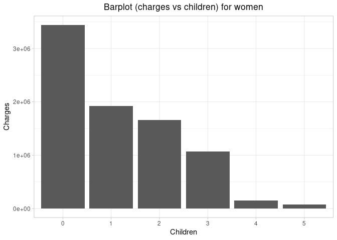<!-- -->


```r
ins3 <- ins %>% 
  mutate(age_group = case_when(21 <= age & age <= 34 ~ "age: 21-34",
                          35 <= age & age <= 49 ~ "age: 35-49",
                          age >= 50 ~ "age: 50+",
                          .default  = "age: <21")) %>% 
  filter(age_group %in% c("age: 21-34", "age: 35-49", "age: 50+"))


ggplot(data=ins3, aes(x = bmi, y = log(charges)))+
  geom_point(color="#6900C6", alpha=0.5)+
  geom_smooth(method = "lm", aes(color = age_group))+
  facet_wrap(.~age_group)+
  theme_bw()+
  theme(legend.position = "bottom", plot.title = element_text(hjust = 0.5))+
  ggtitle("Отношение индекса массы тела к логарифму трат по возрастным группам")
```

```
## `geom_smooth()` using formula = 'y ~ x'
```

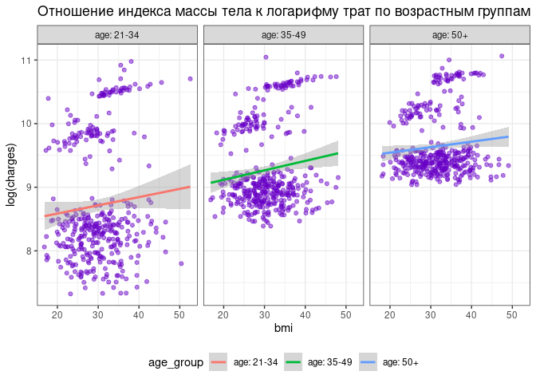<!-- -->


