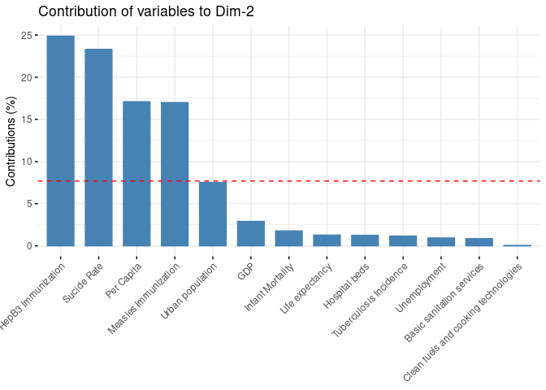

## Задание 1 


```r
lifexp <- readRDS("data/life_expectancy_data.RDS")
```

## Задание 2 


```r
plot_ly(data = lifexp %>% 
          mutate(lbl = sprintf("Unemployment: %.2f Life expectancy: %.1f",
                               Unemployment, `Life expectancy`)),
        x = ~Unemployment, y = ~`Life expectancy`, 
        type = 'scatter', mode = "markers", 
        color = ~continent,
        text = ~lbl, hoverinfo = "text",
        marker = list(size = 10), alpha = 0.5) %>%
  layout(xaxis = list(title = "Unemployment, %"),
         yaxis = list(title = "Life expectancy, year", zeroline = FALSE),
         title = "Life expectancy vs. Unemployment, by Continent")
```

```{=html}
<div class="plotly html-widget html-fill-item-overflow-hidden html-fill-item" id="htmlwidget-68ffc69774d7cc7f07a7" style="width:672px;height:480px;"></div>
<script type="application/json" data-for="htmlwidget-68ffc69774d7cc7f07a7">{"x":{"visdat":{"624536982f8b":["function () ","plotlyVisDat"]},"cur_data":"624536982f8b","attrs":{"624536982f8b":{"x":{},"y":{},"mode":"markers","text":{},"hoverinfo":"text","marker":{"size":10},"color":{},"alpha":0.5,"alpha_stroke":1,"sizes":[10,100],"spans":[1,20],"type":"scatter"}},"layout":{"margin":{"b":40,"l":60,"t":25,"r":10},"xaxis":{"domain":[0,1],"automargin":true,"title":"Unemployment, %"},"yaxis":{"domain":[0,1],"automargin":true,"title":"Life expectancy, year","zeroline":false},"title":"Life expectancy vs. Unemployment, by Continent","hovermode":"closest","showlegend":true},"source":"A","config":{"modeBarButtonsToAdd":["hoverclosest","hovercompare"],"showSendToCloud":false},"data":[{"x":[18.629999160766602,7.83500003814697,1.7170000076293901,23.520999908447301,4.6409997940063503,1.23300004005432,11.621000289916999,4.16499996185303,0.76899999380111705,10.3090000152588,3.7660000324249299,21.909000396728501,3.9179999828338601,36.442001342773402,21.208999633789102,9.7819995880127006,6.77600002288818,24.580999374389599,2.9990000724792498,28.326999664306602,12.557000160217299,4.4910001754760698,5.0570001602172896,6.8039999008178702,5.2519998550415004,22.281999588012699,2.35800004005432,25.593000411987301,1.8949999809265099,7.2849998474121103,8.4139995574951207,11.647000312805201,9.7139997482299805,10.8420000076294,3.7309999465942401,18.742000579833999,0.47600001096725503,7.4720001220703098,1.1940000057220499,20.381999969482401,3.0390000343322798,3.9549999237060498,24.370000839233398,30.513999938964801,13.2480001449585,28.5130004882813,2.8059999942779501,2.8199999332428001,22.1879997253418,2.4519999027252202,13.08899974823,5.2480001449584996],"y":[78.132999999999996,64.039000000000001,63.323999999999998,72.385999999999996,62.293999999999997,63.377000000000002,76.197000000000003,60.561,55.668999999999997,66.120999999999995,62.232999999999997,66.022999999999996,59.119,69.356999999999999,74.349999999999994,59.917999999999999,68.555000000000007,64.844999999999999,68.536000000000001,68.668999999999997,63.481000000000002,65.177000000000007,62.116999999999997,60.213000000000001,69.049000000000007,57.579999999999998,65.497,75.950999999999993,68.682000000000002,67.412999999999997,60.085000000000001,66.515000000000001,77.560000000000002,77.894999999999996,63.670999999999999,66.516000000000005,63.621000000000002,55.619,71.132000000000005,72.813999999999993,69.918000000000006,55.494999999999997,59.131999999999998,67.679000000000002,59.383000000000003,67.186999999999998,67.233000000000004,61.917999999999999,78.721000000000004,65.622,66.891000000000005,62.899000000000001],"mode":"markers","text":["Unemployment: 18.63 Life expectancy: 78.1","Unemployment: 7.84 Life expectancy: 64.0","Unemployment: 1.72 Life expectancy: 63.3","Unemployment: 23.52 Life expectancy: 72.4","Unemployment: 4.64 Life expectancy: 62.3","Unemployment: 1.23 Life expectancy: 63.4","Unemployment: 11.62 Life expectancy: 76.2","Unemployment: 4.16 Life expectancy: 60.6","Unemployment: 0.77 Life expectancy: 55.7","Unemployment: 10.31 Life expectancy: 66.1","Unemployment: 3.77 Life expectancy: 62.2","Unemployment: 21.91 Life expectancy: 66.0","Unemployment: 3.92 Life expectancy: 59.1","Unemployment: 36.44 Life expectancy: 69.4","Unemployment: 21.21 Life expectancy: 74.3","Unemployment: 9.78 Life expectancy: 59.9","Unemployment: 6.78 Life expectancy: 68.6","Unemployment: 24.58 Life expectancy: 64.8","Unemployment: 3.00 Life expectancy: 68.5","Unemployment: 28.33 Life expectancy: 68.7","Unemployment: 12.56 Life expectancy: 63.5","Unemployment: 4.49 Life expectancy: 65.2","Unemployment: 5.06 Life expectancy: 62.1","Unemployment: 6.80 Life expectancy: 60.2","Unemployment: 5.25 Life expectancy: 69.0","Unemployment: 22.28 Life expectancy: 57.6","Unemployment: 2.36 Life expectancy: 65.5","Unemployment: 25.59 Life expectancy: 76.0","Unemployment: 1.89 Life expectancy: 68.7","Unemployment: 7.28 Life expectancy: 67.4","Unemployment: 8.41 Life expectancy: 60.1","Unemployment: 11.65 Life expectancy: 66.5","Unemployment: 9.71 Life expectancy: 77.6","Unemployment: 10.84 Life expectancy: 77.9","Unemployment: 3.73 Life expectancy: 63.7","Unemployment: 18.74 Life expectancy: 66.5","Unemployment: 0.48 Life expectancy: 63.6","Unemployment: 7.47 Life expectancy: 55.6","Unemployment: 1.19 Life expectancy: 71.1","Unemployment: 20.38 Life expectancy: 72.8","Unemployment: 3.04 Life expectancy: 69.9","Unemployment: 3.95 Life expectancy: 55.5","Unemployment: 24.37 Life expectancy: 59.1","Unemployment: 30.51 Life expectancy: 67.7","Unemployment: 13.25 Life expectancy: 59.4","Unemployment: 28.51 Life expectancy: 67.2","Unemployment: 2.81 Life expectancy: 67.2","Unemployment: 2.82 Life expectancy: 61.9","Unemployment: 22.19 Life expectancy: 78.7","Unemployment: 2.45 Life expectancy: 65.6","Unemployment: 13.09 Life expectancy: 66.9","Unemployment: 5.25 Life expectancy: 62.9"],"hoverinfo":["text","text","text","text","text","text","text","text","text","text","text","text","text","text","text","text","text","text","text","text","text","text","text","text","text","text","text","text","text","text","text","text","text","text","text","text","text","text","text","text","text","text","text","text","text","text","text","text","text","text","text","text"],"marker":{"color":"rgba(102,194,165,0.5)","size":10,"line":{"color":"rgba(102,194,165,1)"}},"type":"scatter","name":"Africa","textfont":{"color":"rgba(102,194,165,0.5)"},"error_y":{"color":"rgba(102,194,165,0.5)"},"error_x":{"color":"rgba(102,194,165,0.5)"},"line":{"color":"rgba(102,194,165,0.5)"},"xaxis":"x","yaxis":"y","frame":null},{"x":[8.2562851933973498,10.697999954223601,8.2562851933973498,10.0380001068115,7.2670001983642596,9.8690004348754901,8.2562851933973498,4.3959999084472701,14.138999938964799,5.25,8.0150003433227504,12.7480001449585,14.9409999847412,1.87000000476837,9.6319999694824201,4.5910000801086399,4.3790001869201696,8.2562851933973498,2.9170000553131099,16.5130004882813,16.6809997558594,8.2150001525878906,9.9110002517700195,3.51699995994568,5.2969999313354501,5.8899998664856001,8.3299999237060494,3.7379999160766602,6.8949999809265101,16.941999435424801,8.2562851933973498,18.468999862670898,11.213000297546399,3.41100001335144,3.6110000610351598,10.6780004501343,5.9980001449584996,13.543000221252401],"y":[78.103999999999999,79.995000000000005,78.641000000000005,76.081000000000003,80.481999999999999,77.843000000000004,85.790000000000006,74.507999999999996,79.555000000000007,84.200000000000003,82.441999999999993,80.019000000000005,82.893000000000001,80.778999999999996,77.381,79.837999999999994,77.841999999999999,74.953000000000003,77.150999999999996,73.094999999999999,66.182000000000002,77.551000000000002,76.117999999999995,77.879000000000005,77.981999999999999,81.756,76.396000000000001,79.507000000000005,83.498000000000005,77.579999999999998,83.200000000000003,75.131,75.063000000000002,76.224000000000004,81.400000000000006,81.477999999999994,76.004000000000005,83.099999999999994],"mode":"markers","text":["Unemployment: 8.26 Life expectancy: 78.1","Unemployment: 10.70 Life expectancy: 80.0","Unemployment: 8.26 Life expectancy: 78.6","Unemployment: 10.04 Life expectancy: 76.1","Unemployment: 7.27 Life expectancy: 80.5","Unemployment: 9.87 Life expectancy: 77.8","Unemployment: 8.26 Life expectancy: 85.8","Unemployment: 4.40 Life expectancy: 74.5","Unemployment: 14.14 Life expectancy: 79.6","Unemployment: 5.25 Life expectancy: 84.2","Unemployment: 8.02 Life expectancy: 82.4","Unemployment: 12.75 Life expectancy: 80.0","Unemployment: 14.94 Life expectancy: 82.9","Unemployment: 1.87 Life expectancy: 80.8","Unemployment: 9.63 Life expectancy: 77.4","Unemployment: 4.59 Life expectancy: 79.8","Unemployment: 4.38 Life expectancy: 77.8","Unemployment: 8.26 Life expectancy: 75.0","Unemployment: 2.92 Life expectancy: 77.2","Unemployment: 16.51 Life expectancy: 73.1","Unemployment: 16.68 Life expectancy: 66.2","Unemployment: 8.22 Life expectancy: 77.6","Unemployment: 9.91 Life expectancy: 76.1","Unemployment: 3.52 Life expectancy: 77.9","Unemployment: 5.30 Life expectancy: 78.0","Unemployment: 5.89 Life expectancy: 81.8","Unemployment: 8.33 Life expectancy: 76.4","Unemployment: 3.74 Life expectancy: 79.5","Unemployment: 6.89 Life expectancy: 83.5","Unemployment: 16.94 Life expectancy: 77.6","Unemployment: 8.26 Life expectancy: 83.2","Unemployment: 18.47 Life expectancy: 75.1","Unemployment: 11.21 Life expectancy: 75.1","Unemployment: 3.41 Life expectancy: 76.2","Unemployment: 3.61 Life expectancy: 81.4","Unemployment: 10.68 Life expectancy: 81.5","Unemployment: 6.00 Life expectancy: 76.0","Unemployment: 13.54 Life expectancy: 83.1"],"hoverinfo":["text","text","text","text","text","text","text","text","text","text","text","text","text","text","text","text","text","text","text","text","text","text","text","text","text","text","text","text","text","text","text","text","text","text","text","text","text","text"],"marker":{"color":"rgba(252,141,98,0.5)","size":10,"line":{"color":"rgba(252,141,98,1)"}},"type":"scatter","name":"Americas","textfont":{"color":"rgba(252,141,98,0.5)"},"error_y":{"color":"rgba(252,141,98,0.5)"},"error_x":{"color":"rgba(252,141,98,0.5)"},"line":{"color":"rgba(252,141,98,0.5)"},"xaxis":"x","yaxis":"y","frame":null},{"x":[14.064999580383301,3.9319999217987101,6.7550001144409197,3.33500003814697,0.178000003099442,3.92400002479553,2.3050000667571999,4.9320001602172896,3.34800004959106,17.5690002441406,30.1280002593994,3.9249999523162802,2.2300000190734899,23.877000808715799,5.3080000877380398,2.6540000438690199,3.5829999446868901,5.7480001449584996,8.8990001678466797,14.7239999771118,1.3359999656677199,3.40100002288818,4.7699999809265101,4.88800001144409,0.58899998664856001,2.9449999332428001,8.1440000534057599,4.1620001792907697,2.53200006484985,0.28299999237060502,21.448999404907202,8.2562851933973498,3.3280000686645499,6.9520001411437997,19.8090000152588,5.6459999084472701,0.73600000143051103,2.7019999027252202,5.8920001983642596,5.625,2.0079998970031698,25.027000427246101],"y":[66.388000000000005,78.423000000000002,74.594999999999999,72.176000000000002,71.909000000000006,79.244,88.099999999999994,70.950000000000003,73.966999999999999,77.885000000000005,72.652000000000001,84.700000000000003,87.450000000000003,76.305999999999997,77.299999999999997,75.744,86.299999999999997,76.579999999999998,75.799999999999997,80.869,87.179000000000002,78.316999999999993,80.778999999999996,74.141999999999996,70.119,72.207999999999998,80.343000000000004,68.287000000000006,75.504999999999995,82.010000000000005,76.759,78.400000000000006,85.700000000000003,80.260999999999996,78.102999999999994,73.388999999999996,80.900000000000006,71.716999999999999,79.313999999999993,73.828999999999994,79.522999999999996,67.825999999999993],"mode":"markers","text":["Unemployment: 14.06 Life expectancy: 66.4","Unemployment: 3.93 Life expectancy: 78.4","Unemployment: 6.76 Life expectancy: 74.6","Unemployment: 3.34 Life expectancy: 72.2","Unemployment: 0.18 Life expectancy: 71.9","Unemployment: 3.92 Life expectancy: 79.2","Unemployment: 2.31 Life expectancy: 88.1","Unemployment: 4.93 Life expectancy: 71.0","Unemployment: 3.35 Life expectancy: 74.0","Unemployment: 17.57 Life expectancy: 77.9","Unemployment: 30.13 Life expectancy: 72.7","Unemployment: 3.92 Life expectancy: 84.7","Unemployment: 2.23 Life expectancy: 87.5","Unemployment: 23.88 Life expectancy: 76.3","Unemployment: 5.31 Life expectancy: 77.3","Unemployment: 2.65 Life expectancy: 75.7","Unemployment: 3.58 Life expectancy: 86.3","Unemployment: 5.75 Life expectancy: 76.6","Unemployment: 8.90 Life expectancy: 75.8","Unemployment: 14.72 Life expectancy: 80.9","Unemployment: 1.34 Life expectancy: 87.2","Unemployment: 3.40 Life expectancy: 78.3","Unemployment: 4.77 Life expectancy: 80.8","Unemployment: 4.89 Life expectancy: 74.1","Unemployment: 0.59 Life expectancy: 70.1","Unemployment: 2.94 Life expectancy: 72.2","Unemployment: 8.14 Life expectancy: 80.3","Unemployment: 4.16 Life expectancy: 68.3","Unemployment: 2.53 Life expectancy: 75.5","Unemployment: 0.28 Life expectancy: 82.0","Unemployment: 21.45 Life expectancy: 76.8","Unemployment: 8.26 Life expectancy: 78.4","Unemployment: 3.33 Life expectancy: 85.7","Unemployment: 6.95 Life expectancy: 80.3","Unemployment: 19.81 Life expectancy: 78.1","Unemployment: 5.65 Life expectancy: 73.4","Unemployment: 0.74 Life expectancy: 80.9","Unemployment: 2.70 Life expectancy: 71.7","Unemployment: 5.89 Life expectancy: 79.3","Unemployment: 5.62 Life expectancy: 73.8","Unemployment: 2.01 Life expectancy: 79.5","Unemployment: 25.03 Life expectancy: 67.8"],"hoverinfo":["text","text","text","text","text","text","text","text","text","text","text","text","text","text","text","text","text","text","text","text","text","text","text","text","text","text","text","text","text","text","text","text","text","text","text","text","text","text","text","text","text","text"],"marker":{"color":"rgba(141,160,203,0.5)","size":10,"line":{"color":"rgba(141,160,203,1)"}},"type":"scatter","name":"Asia","textfont":{"color":"rgba(141,160,203,0.5)"},"error_y":{"color":"rgba(141,160,203,0.5)"},"error_x":{"color":"rgba(141,160,203,0.5)"},"line":{"color":"rgba(141,160,203,0.5)"},"xaxis":"x","yaxis":"y","frame":null},{"x":[11.3219995498657,19.291999816894499,4.3509998321533203,5.7119998931884801,3.1930000782012899,4.9390001296997097,18.739000320434599,3.8689999580383301,6.73699998855591,7.1620001792907697,8.0059995651245099,2.375,5.2690000534057599,4.8470001220703098,8.2562851933973498,6.16499996185303,8.3479995727539098,10.1510000228882,2.73300004005432,21.544000625610401,3.49600005149841,3.1229999065399201,4.6900000572204599,11.0989999771118,8.2562851933973498,5.4270000457763699,8.2562851933973498,5.5,5.5250000953674299,4.0019998550415004,4.3410000801086399,15.675000190734901,3.3589999675750701,18.3920001983643,3.3989999294281001,3.60199999809265,7.1440000534057599,3.37899994850159,4.3359999656677202,11.0740003585815,5.9520001411437997,4.9549999237060502,15.987999916076699,6.9549999237060502,4.7090001106262198,16.3850002288818,7.8559999465942401,3.5339999198913601],"y":[80.200999999999993,78.516000000000005,84.200000000000003,75.454999999999998,79.400000000000006,84,79.856999999999999,78.5,84.915000000000006,81.599999999999994,83.031999999999996,82.099999999999994,83.200000000000003,82.799999999999997,85,84.5,85.599999999999994,78.140000000000001,83.400000000000006,84.5,79.299999999999997,84.200000000000003,84.299999999999997,85.400000000000006,74.799999999999997,79.900000000000006,85.5,81,84.700000000000003,84.700000000000003,76.156999999999996,79.302999999999997,83.599999999999994,77.846000000000004,84.700000000000003,81.799999999999997,83.5,79.299999999999997,78.170000000000002,78.400000000000006,80.799999999999997,84.200000000000003,86.200000000000003,84.700000000000003,85.599999999999994,80.563000000000002,76.980000000000004,83.099999999999994],"mode":"markers","text":["Unemployment: 11.32 Life expectancy: 80.2","Unemployment: 19.29 Life expectancy: 78.5","Unemployment: 4.35 Life expectancy: 84.2","Unemployment: 5.71 Life expectancy: 75.5","Unemployment: 3.19 Life expectancy: 79.4","Unemployment: 4.94 Life expectancy: 84.0","Unemployment: 18.74 Life expectancy: 79.9","Unemployment: 3.87 Life expectancy: 78.5","Unemployment: 6.74 Life expectancy: 84.9","Unemployment: 7.16 Life expectancy: 81.6","Unemployment: 8.01 Life expectancy: 83.0","Unemployment: 2.38 Life expectancy: 82.1","Unemployment: 5.27 Life expectancy: 83.2","Unemployment: 4.85 Life expectancy: 82.8","Unemployment: 8.26 Life expectancy: 85.0","Unemployment: 6.16 Life expectancy: 84.5","Unemployment: 8.35 Life expectancy: 85.6","Unemployment: 10.15 Life expectancy: 78.1","Unemployment: 2.73 Life expectancy: 83.4","Unemployment: 21.54 Life expectancy: 84.5","Unemployment: 3.50 Life expectancy: 79.3","Unemployment: 3.12 Life expectancy: 84.2","Unemployment: 4.69 Life expectancy: 84.3","Unemployment: 11.10 Life expectancy: 85.4","Unemployment: 8.26 Life expectancy: 74.8","Unemployment: 5.43 Life expectancy: 79.9","Unemployment: 8.26 Life expectancy: 85.5","Unemployment: 5.50 Life expectancy: 81.0","Unemployment: 5.53 Life expectancy: 84.7","Unemployment: 4.00 Life expectancy: 84.7","Unemployment: 4.34 Life expectancy: 76.2","Unemployment: 15.68 Life expectancy: 79.3","Unemployment: 3.36 Life expectancy: 83.6","Unemployment: 18.39 Life expectancy: 77.8","Unemployment: 3.40 Life expectancy: 84.7","Unemployment: 3.60 Life expectancy: 81.8","Unemployment: 7.14 Life expectancy: 83.5","Unemployment: 3.38 Life expectancy: 79.3","Unemployment: 4.34 Life expectancy: 78.2","Unemployment: 11.07 Life expectancy: 78.4","Unemployment: 5.95 Life expectancy: 80.8","Unemployment: 4.95 Life expectancy: 84.2","Unemployment: 15.99 Life expectancy: 86.2","Unemployment: 6.95 Life expectancy: 84.7","Unemployment: 4.71 Life expectancy: 85.6","Unemployment: 16.39 Life expectancy: 80.6","Unemployment: 7.86 Life expectancy: 77.0","Unemployment: 3.53 Life expectancy: 83.1"],"hoverinfo":["text","text","text","text","text","text","text","text","text","text","text","text","text","text","text","text","text","text","text","text","text","text","text","text","text","text","text","text","text","text","text","text","text","text","text","text","text","text","text","text","text","text","text","text","text","text","text","text"],"marker":{"color":"rgba(231,138,195,0.5)","size":10,"line":{"color":"rgba(231,138,195,1)"}},"type":"scatter","name":"Europe","textfont":{"color":"rgba(231,138,195,0.5)"},"error_y":{"color":"rgba(231,138,195,0.5)"},"error_x":{"color":"rgba(231,138,195,0.5)"},"line":{"color":"rgba(231,138,195,0.5)"},"xaxis":"x","yaxis":"y","frame":null},{"x":[5.1009998321533203,8.2829999923706108,5.6490001678466797,13.1709995269775,5.2740001678466797,8.2562851933973498,8.2562851933973498,15.855999946594199,4.4270000457763699,1.5099999904632599,9.8380002975463903,0.78299999237060502,5.96000003814697,3.6400001049041699,1.5809999704361],"y":[85,77.105999999999995,69.331000000000003,79.897999999999996,83.549999999999997,72.341999999999999,69.596000000000004,80.400000000000006,83.5,65.819999999999993,75.463999999999999,74.866,71.635000000000005,72.887,72.153999999999996],"mode":"markers","text":["Unemployment: 5.10 Life expectancy: 85.0","Unemployment: 8.28 Life expectancy: 77.1","Unemployment: 5.65 Life expectancy: 69.3","Unemployment: 13.17 Life expectancy: 79.9","Unemployment: 5.27 Life expectancy: 83.5","Unemployment: 8.26 Life expectancy: 72.3","Unemployment: 8.26 Life expectancy: 69.6","Unemployment: 15.86 Life expectancy: 80.4","Unemployment: 4.43 Life expectancy: 83.5","Unemployment: 1.51 Life expectancy: 65.8","Unemployment: 9.84 Life expectancy: 75.5","Unemployment: 0.78 Life expectancy: 74.9","Unemployment: 5.96 Life expectancy: 71.6","Unemployment: 3.64 Life expectancy: 72.9","Unemployment: 1.58 Life expectancy: 72.2"],"hoverinfo":["text","text","text","text","text","text","text","text","text","text","text","text","text","text","text"],"marker":{"color":"rgba(166,216,84,0.5)","size":10,"line":{"color":"rgba(166,216,84,1)"}},"type":"scatter","name":"Oceania","textfont":{"color":"rgba(166,216,84,0.5)"},"error_y":{"color":"rgba(166,216,84,0.5)"},"error_x":{"color":"rgba(166,216,84,0.5)"},"line":{"color":"rgba(166,216,84,0.5)"},"xaxis":"x","yaxis":"y","frame":null}],"highlight":{"on":"plotly_click","persistent":false,"dynamic":false,"selectize":false,"opacityDim":0.20000000000000001,"selected":{"opacity":1},"debounce":0},"shinyEvents":["plotly_hover","plotly_click","plotly_selected","plotly_relayout","plotly_brushed","plotly_brushing","plotly_clickannotation","plotly_doubleclick","plotly_deselect","plotly_afterplot","plotly_sunburstclick"],"base_url":"https://plot.ly"},"evals":[],"jsHooks":[]}</script>
```

## Задание 3


```r
lifexp1 <- lifexp %>% 
  filter(continent %in% c("Africa", "Americas")) 

stat.test <- lifexp1 %>% 
  rstatix::t_test(`Life expectancy` ~ continent) %>% 
  add_xy_position(x = "continent")

ggboxplot(
  lifexp1, 
  x = "continent", y = "Life expectancy", 
  ylab = "Life expectancy, year", xlab = "Continent", 
  add = "jitter"
  ) + 
  labs(subtitle = get_test_label(stat.test, detailed = TRUE)) + 
  stat_pvalue_manual(stat.test, tip.length = 0) 
```

<!-- -->

## Задание 4


```r
lifexp2 <- lifexp %>% 
  select(is.integer | is.numeric, -Year)

cor_plot <- lifexp2 %>%
  select(everything()) %>%
  psych::corr.test(adjust = "BH")  

corrplot(corr = cor_plot$r,
         p.mat = cor_plot$p,
         method = "color",
         order = "hclust")
```

<!-- -->


```r
cor_plot2 <- ggpairs(lifexp2,
        title = 'Correlations in lifeExp dataset',progress = F) +
    theme_minimal() +
    scale_fill_manual(values = c('#69b3a2')) +
    scale_colour_manual(values = c('#69b3a2'))

cor_plot2
```

<!-- -->

## Задание 5


```r
lifexp2 <- lifexp %>%
  column_to_rownames('Country')%>% 
  select(is.integer | is.numeric, -Year)

lifexp2_scaled <- scale(lifexp2) %>% round(2)
lifexp2_dist<- dist(lifexp2_scaled, 
                        method = "euclidean")

as.matrix(lifexp2_dist)[1:6,1:6]
```

```
##                     Afghanistan  Albania  Algeria   Angola Antigua and Barbuda
## Afghanistan            0.000000 7.605169 6.330893 4.411814            6.647481
## Albania                7.605169 0.000000 2.620801 7.916066            3.357946
## Algeria                6.330893 2.620801 0.000000 6.318647            4.347229
## Angola                 4.411814 7.916066 6.318647 0.000000            8.092558
## Antigua and Barbuda    6.647481 3.357946 4.347229 8.092558            0.000000
## Argentina              7.922399 3.625245 3.459422 7.159518            4.967353
##                     Argentina
## Afghanistan          7.922399
## Albania              3.625245
## Algeria              3.459422
## Angola               7.159518
## Antigua and Barbuda  4.967353
## Argentina            0.000000
```

```r
lifexp2_hc_ward <- hclust(d = lifexp2_dist, 
                        method = "ward.D2")

fviz_dend(lifexp2_hc_ward, 
          cex = 0.4, main = "Dendrogram, All variables numeric, Ward's method",
          k=5, k_colors = c("#cc0337", "#010d85", "#37953f", "#f98866", "#5BC7F2"),
          color_labels_by_k = TRUE,
          rect = TRUE)
```

<!-- -->

```r
fviz_dend(lifexp2_hc_ward, 
          cex = 0.4, main = "Dendrogram, All variables numeric, Ward's method(circular)",
          k=5, k_colors = c("#cc0337", "#010d85", "#37953f", "#f98866", "#5BC7F2"),
          color_labels_by_k = TRUE,
          type = "circular")
```

<!-- -->

## Задание 6


```r
pheatmap(lifexp2_scaled, 
         show_rownames = FALSE, 
         clustering_distance_rows = lifexp2_dist,
         clustering_method = "ward.D2", 
         cutree_rows = 5,
         cutree_cols = length(colnames(lifexp2_scaled)),
         angle_col = 45, 
         main = "Dendrograms for clustering rows and columns with heatmap")
```

<!-- -->

Строки объединены в 5 кластеров (исходя из дендрограммы выше). Довольно ярко выражена однородность между переменными GDP и GNI (для всех кластеров). Для первого и второго кластеров подобная однородность прослеживается для переменной Per Capita. Весьма примечателен второй клатер, включающий в себя узкую группу наблюдений. Также более менее однородным является первый и второй кластера для переменнной Hospital beds. Для переменных Measless Immunization, DPT Immunization и HepB3 Immunization ситуация аналогична предыдущей (особенно первый кластер).

## Задание 7


```r
lifexp_full.pca <- prcomp(lifexp2, 
                        scale = T,
                        ) 

summary(lifexp_full.pca)
```

```
## Importance of components:
##                           PC1    PC2    PC3     PC4     PC5     PC6    PC7
## Standard deviation     2.7526 1.4841 1.3952 1.17177 1.08375 0.96347 0.9288
## Proportion of Variance 0.3988 0.1159 0.1025 0.07227 0.06182 0.04886 0.0454
## Cumulative Proportion  0.3988 0.5147 0.6172 0.68945 0.75126 0.80012 0.8455
##                            PC8     PC9    PC10    PC11    PC12    PC13    PC14
## Standard deviation     0.85740 0.69263 0.68937 0.59106 0.54986 0.47085 0.36596
## Proportion of Variance 0.03869 0.02525 0.02501 0.01839 0.01591 0.01167 0.00705
## Cumulative Proportion  0.88421 0.90946 0.93447 0.95286 0.96877 0.98044 0.98749
##                           PC15    PC16    PC17    PC18      PC19
## Standard deviation     0.34546 0.26941 0.20224 0.06968 3.394e-16
## Proportion of Variance 0.00628 0.00382 0.00215 0.00026 0.000e+00
## Cumulative Proportion  0.99377 0.99759 0.99974 1.00000 1.000e+00
```

```r
fviz_eig(lifexp_full.pca, addlabels = T, ylim = c(0, 40))
```

<!-- -->

```r
fviz_pca_var(lifexp_full.pca, select.var = list(contrib = 5), col.var = "contrib")
```

<!-- -->

```r
fviz_contrib(lifexp_full.pca, choice = "var", axes = 1, top = 20) # 1
```

<!-- -->

```r
fviz_contrib(lifexp_full.pca, choice = "var", axes = 2, top = 20) # 2
```

<!-- -->

```r
fviz_contrib(lifexp_full.pca, choice = "var", axes = 3, top = 20) # 3
```

<!-- -->

Наибольший вклад в изменении вариативности наблюдений вносит первая компонента PC1 (39.9%). Далее представлен PCA-plot, для которого число наиболее важных переменных для двух главных компонент сокращено до 5 и выделен вклад каждой из них (посредством длины стрелки переменной и её направления, всего 3 группы), при этом переменная Infant Mortality направлена обратно пропорциональна Immunization переменным. Также были отдельно отображены конкретные переменные, вклад которых наиболее существенен для первых 3 главных компонент (особенно приятен взору разбор третий компоненты, где первые две переменные объясняют львиную долю её вариации).

## Задание 8


```r
plott <- ggbiplot(lifexp_full.pca, 
         scale=0, 
         groups = as.factor(lifexp$continent),
         ellipse = T,
         alpha = 0.2,
         labels = rownames(lifexp2), 
         labels.size = 2.1) +
  theme_minimal()

plott
```

<!-- -->

```r
ggplotly(plott)
```

```{=html}
<div class="plotly html-widget html-fill-item-overflow-hidden html-fill-item" id="htmlwidget-773ca53eb3acb07a1acf" style="width:672px;height:480px;"></div>
<script type="application/json" data-for="htmlwidget-773ca53eb3acb07a1acf">{"x":{"data":[{"x":[0,1.0184150541498851,null,0,-0.1345395072928916,null,0,-0.98597069692887751,null,0,0.28622626469012052,null,0,0.2886195281341723,null,0,0.96241408259782157,null,0,0.61939588730450823,null,0,-0.78216351113141758,null,0,-0.71006183889039609,null,0,0.7470690120869915,null,0,0.64601446013624253,null,0,0.75910667313367586,null,0,0.63155427243009044,null,0,0.96918688528920993,null,0,-0.43602968349575233,null,0,0.75700317470456935,null,0,-0.75700317470456913,null,0,-0.81318846944968259,null,0,0.11965861375744573],"y":[0,0.17650374518399076,null,0,0.36527469204434454,null,0,0.27051010139750964,null,0,0.67758357168872463,null,0,0.70539229570626771,null,0,0.15594044908552523,null,0,0.71302742245800699,null,0,-0.18040256364096893,null,0,0.12617317010184295,null,0,-1.318666430822419,null,0,-1.4746431494425625,null,0,-1.2403308201323739,null,0,0.009230196038423873,null,0,0.16448741358367225,null,0,-0.42621081792433169,null,0,0.95051037050499443,null,0,-0.95051037050499476,null,0,-0.15276438047772581,null,0,0.50358784745003826],"text":["x: 0<br />y: 0<br />xvar:  1.0184151<br />yvar:  0.176503745","x: 0<br />y: 0<br />xvar:  1.0184151<br />yvar:  0.176503745",null,"x: 0<br />y: 0<br />xvar: -0.1345395<br />yvar:  0.365274692","x: 0<br />y: 0<br />xvar: -0.1345395<br />yvar:  0.365274692",null,"x: 0<br />y: 0<br />xvar: -0.9859707<br />yvar:  0.270510101","x: 0<br />y: 0<br />xvar: -0.9859707<br />yvar:  0.270510101",null,"x: 0<br />y: 0<br />xvar:  0.2862263<br />yvar:  0.677583572","x: 0<br />y: 0<br />xvar:  0.2862263<br />yvar:  0.677583572",null,"x: 0<br />y: 0<br />xvar:  0.2886195<br />yvar:  0.705392296","x: 0<br />y: 0<br />xvar:  0.2886195<br />yvar:  0.705392296",null,"x: 0<br />y: 0<br />xvar:  0.9624141<br />yvar:  0.155940449","x: 0<br />y: 0<br />xvar:  0.9624141<br />yvar:  0.155940449",null,"x: 0<br />y: 0<br />xvar:  0.6193959<br />yvar:  0.713027422","x: 0<br />y: 0<br />xvar:  0.6193959<br />yvar:  0.713027422",null,"x: 0<br />y: 0<br />xvar: -0.7821635<br />yvar: -0.180402564","x: 0<br />y: 0<br />xvar: -0.7821635<br />yvar: -0.180402564",null,"x: 0<br />y: 0<br />xvar: -0.7100618<br />yvar:  0.126173170","x: 0<br />y: 0<br />xvar: -0.7100618<br />yvar:  0.126173170",null,"x: 0<br />y: 0<br />xvar:  0.7470690<br />yvar: -1.318666431","x: 0<br />y: 0<br />xvar:  0.7470690<br />yvar: -1.318666431",null,"x: 0<br />y: 0<br />xvar:  0.6460145<br />yvar: -1.474643149","x: 0<br />y: 0<br />xvar:  0.6460145<br />yvar: -1.474643149",null,"x: 0<br />y: 0<br />xvar:  0.7591067<br />yvar: -1.240330820","x: 0<br />y: 0<br />xvar:  0.7591067<br />yvar: -1.240330820",null,"x: 0<br />y: 0<br />xvar:  0.6315543<br />yvar:  0.009230196","x: 0<br />y: 0<br />xvar:  0.6315543<br />yvar:  0.009230196",null,"x: 0<br />y: 0<br />xvar:  0.9691869<br />yvar:  0.164487414","x: 0<br />y: 0<br />xvar:  0.9691869<br />yvar:  0.164487414",null,"x: 0<br />y: 0<br />xvar: -0.4360297<br />yvar: -0.426210818","x: 0<br />y: 0<br />xvar: -0.4360297<br />yvar: -0.426210818",null,"x: 0<br />y: 0<br />xvar:  0.7570032<br />yvar:  0.950510371","x: 0<br />y: 0<br />xvar:  0.7570032<br />yvar:  0.950510371",null,"x: 0<br />y: 0<br />xvar: -0.7570032<br />yvar: -0.950510371","x: 0<br />y: 0<br />xvar: -0.7570032<br />yvar: -0.950510371",null,"x: 0<br />y: 0<br />xvar: -0.8131885<br />yvar: -0.152764380","x: 0<br />y: 0<br />xvar: -0.8131885<br />yvar: -0.152764380",null,"x: 0<br />y: 0<br />xvar:  0.1196586<br />yvar:  0.503587847","x: 0<br />y: 0<br />xvar:  0.1196586<br />yvar:  0.503587847"],"type":"scatter","mode":"lines","line":{"width":1.8897637795275593,"color":"rgba(131,36,36,1)","dash":"solid"},"hoveron":"points","showlegend":false,"xaxis":"x","yaxis":"y","hoverinfo":"text","frame":null},{"x":[0.54068098142810928,-4.1113930836251296,-4.0644808599213818,-0.72205455368791505,-3.5356263653513218,-3.5515186363936131,0.6320191969639577,-4.1552127579231071,-6.9365776950467719,-2.8760946684501896,-5.9610019168886588,-3.2682146442979878,-3.3696467316273617,-2.0950750481186229,0.26958716769961372,-4.4227741539381116,-2.9760336863457675,-3.2411223550987129,-4.5653784737985132,-2.0499262781547376,-2.5565553033234432,-2.0766304960739781,-6.2816243940834422,-4.2403398095089884,-2.8454208124781868,-4.9969242969969727,-4.3099358006066115,-0.1586976897255781,-4.1991509278625587,-3.1556920870989624,-4.0795791079137871,-2.5578610063832468,0.97393761584766392,0.67028930165813672,-4.0230166634277742,-2.9076164359679404,-4.2311039724359842,-5.2230000272134127,-1.962837008576011,-0.75961627077920391,-1.7492318069681267,-4.6134649360924911,-6.7948908596058386,-2.0919734040012701,-6.5611037641066821,-2.331599171860522,-3.1313079756728737,-3.5914578084447841,1.1352560514333052,-3.2771895730707721,-2.8897445375364219,-3.4532936429940091],"y":[0.18334909286369719,3.330713851904644,0.28412746436340147,-0.39826370692082874,-1.7200418673844495,-2.6540432403211214,-1.1506197286777244,1.6375936924942667,2.4204093598747152,-1.6917843109023043,2.0291202065797593,1.0392658527890561,-0.2105556227800571,1.0257970823888924,-1.3497214438117595,3.7047178852693059,-2.4439720695623195,-1.0722767296317288,0.48291690522939879,3.0155920128276912,-0.48157809780537536,-1.6643867907414303,2.9345460957171001,-0.64630448146783082,-1.8336529148884553,0.14151034810379723,0.23545647922102497,2.0433411385464586,-0.16302541401396139,-2.6188261099386092,0.28223206242822008,0.19465734193114348,-1.691885309017132,-1.3485609734684587,-1.2135276246404649,-0.27705819572299434,-1.1909656318047801,2.5785166109989657,-2.8685812702614388,-0.85217917980872948,-1.4856027500722189,-1.7341749683179308,3.8980136994979753,1.9713073996301738,2.3418160598193012,-1.3489683289073147,-1.5874002886485745,-0.60233977741232303,-0.43500346001154927,-2.1204022963051901,-1.0747386084854553,-1.3494945161703877],"text":["Algeria","Angola","Benin","Botswana","Burkina Faso","Burundi","Cabo Verde","Cameroon","Chad","Comoros","Congo, Dem. Rep.","Congo, Rep.","Cote d'Ivoire","Djibouti","Egypt, Arab Rep.","Equatorial Guinea","Eritrea","Eswatini","Ethiopia","Gabon","Gambia, The","Ghana","Guinea","Guinea-Bissau","Kenya","Lesotho","Liberia","Libya","Madagascar","Malawi","Mali","Mauritania","Mauritius","Morocco","Mozambique","Namibia","Niger","Nigeria","Rwanda","Sao Tome and Principe","Senegal","Sierra Leone","Somalia","South Africa","South Sudan","Sudan","Tanzania","Togo","Tunisia","Uganda","Zambia","Zimbabwe"],"hovertext":["xvar:  0.540680981<br />yvar:  0.18334909<br />labels: Algeria<br />groups: Africa","xvar: -4.111393084<br />yvar:  3.33071385<br />labels: Angola<br />groups: Africa","xvar: -4.064480860<br />yvar:  0.28412746<br />labels: Benin<br />groups: Africa","xvar: -0.722054554<br />yvar: -0.39826371<br />labels: Botswana<br />groups: Africa","xvar: -3.535626365<br />yvar: -1.72004187<br />labels: Burkina Faso<br />groups: Africa","xvar: -3.551518636<br />yvar: -2.65404324<br />labels: Burundi<br />groups: Africa","xvar:  0.632019197<br />yvar: -1.15061973<br />labels: Cabo Verde<br />groups: Africa","xvar: -4.155212758<br />yvar:  1.63759369<br />labels: Cameroon<br />groups: Africa","xvar: -6.936577695<br />yvar:  2.42040936<br />labels: Chad<br />groups: Africa","xvar: -2.876094668<br />yvar: -1.69178431<br />labels: Comoros<br />groups: Africa","xvar: -5.961001917<br />yvar:  2.02912021<br />labels: Congo, Dem. Rep.<br />groups: Africa","xvar: -3.268214644<br />yvar:  1.03926585<br />labels: Congo, Rep.<br />groups: Africa","xvar: -3.369646732<br />yvar: -0.21055562<br />labels: Cote d'Ivoire<br />groups: Africa","xvar: -2.095075048<br />yvar:  1.02579708<br />labels: Djibouti<br />groups: Africa","xvar:  0.269587168<br />yvar: -1.34972144<br />labels: Egypt, Arab Rep.<br />groups: Africa","xvar: -4.422774154<br />yvar:  3.70471789<br />labels: Equatorial Guinea<br />groups: Africa","xvar: -2.976033686<br />yvar: -2.44397207<br />labels: Eritrea<br />groups: Africa","xvar: -3.241122355<br />yvar: -1.07227673<br />labels: Eswatini<br />groups: Africa","xvar: -4.565378474<br />yvar:  0.48291691<br />labels: Ethiopia<br />groups: Africa","xvar: -2.049926278<br />yvar:  3.01559201<br />labels: Gabon<br />groups: Africa","xvar: -2.556555303<br />yvar: -0.48157810<br />labels: Gambia, The<br />groups: Africa","xvar: -2.076630496<br />yvar: -1.66438679<br />labels: Ghana<br />groups: Africa","xvar: -6.281624394<br />yvar:  2.93454610<br />labels: Guinea<br />groups: Africa","xvar: -4.240339810<br />yvar: -0.64630448<br />labels: Guinea-Bissau<br />groups: Africa","xvar: -2.845420812<br />yvar: -1.83365291<br />labels: Kenya<br />groups: Africa","xvar: -4.996924297<br />yvar:  0.14151035<br />labels: Lesotho<br />groups: Africa","xvar: -4.309935801<br />yvar:  0.23545648<br />labels: Liberia<br />groups: Africa","xvar: -0.158697690<br />yvar:  2.04334114<br />labels: Libya<br />groups: Africa","xvar: -4.199150928<br />yvar: -0.16302541<br />labels: Madagascar<br />groups: Africa","xvar: -3.155692087<br />yvar: -2.61882611<br />labels: Malawi<br />groups: Africa","xvar: -4.079579108<br />yvar:  0.28223206<br />labels: Mali<br />groups: Africa","xvar: -2.557861006<br />yvar:  0.19465734<br />labels: Mauritania<br />groups: Africa","xvar:  0.973937616<br />yvar: -1.69188531<br />labels: Mauritius<br />groups: Africa","xvar:  0.670289302<br />yvar: -1.34856097<br />labels: Morocco<br />groups: Africa","xvar: -4.023016663<br />yvar: -1.21352762<br />labels: Mozambique<br />groups: Africa","xvar: -2.907616436<br />yvar: -0.27705820<br />labels: Namibia<br />groups: Africa","xvar: -4.231103972<br />yvar: -1.19096563<br />labels: Niger<br />groups: Africa","xvar: -5.223000027<br />yvar:  2.57851661<br />labels: Nigeria<br />groups: Africa","xvar: -1.962837009<br />yvar: -2.86858127<br />labels: Rwanda<br />groups: Africa","xvar: -0.759616271<br />yvar: -0.85217918<br />labels: Sao Tome and Principe<br />groups: Africa","xvar: -1.749231807<br />yvar: -1.48560275<br />labels: Senegal<br />groups: Africa","xvar: -4.613464936<br />yvar: -1.73417497<br />labels: Sierra Leone<br />groups: Africa","xvar: -6.794890860<br />yvar:  3.89801370<br />labels: Somalia<br />groups: Africa","xvar: -2.091973404<br />yvar:  1.97130740<br />labels: South Africa<br />groups: Africa","xvar: -6.561103764<br />yvar:  2.34181606<br />labels: South Sudan<br />groups: Africa","xvar: -2.331599172<br />yvar: -1.34896833<br />labels: Sudan<br />groups: Africa","xvar: -3.131307976<br />yvar: -1.58740029<br />labels: Tanzania<br />groups: Africa","xvar: -3.591457808<br />yvar: -0.60233978<br />labels: Togo<br />groups: Africa","xvar:  1.135256051<br />yvar: -0.43500346<br />labels: Tunisia<br />groups: Africa","xvar: -3.277189573<br />yvar: -2.12040230<br />labels: Uganda<br />groups: Africa","xvar: -2.889744538<br />yvar: -1.07473861<br />labels: Zambia<br />groups: Africa","xvar: -3.453293643<br />yvar: -1.34949452<br />labels: Zimbabwe<br />groups: Africa"],"textfont":{"size":7.937007874015749,"color":"rgba(248,118,109,1)"},"type":"scatter","mode":"text","hoveron":"points","name":"Africa","legendgroup":"Africa","showlegend":true,"xaxis":"x","yaxis":"y","hoverinfo":"text","frame":null},{"x":[0.98643863897015638,2.3353966779039612,-0.093430890454593629,1.5174413533856024,1.0406770282487201,0.6758518137272046,2.1523255111667159,-0.88515538826705475,1.2820948750016423,2.7082907633899387,2.6084285098575513,1.7450496936000208,2.1519234848506668,2.3809427540037782,-0.35327950851234269,0.709132031227662,0.32927580824519909,0.8901616281784952,-0.72732601965630028,-0.51026776782684913,-4.7775711693858689,-0.38580247357100672,0.82400079398963022,0.42278493755997421,0.49270530904208854,1.4961202877099837,0.20440704813292601,0.94579437022272284,0.97425862506610061,-0.3089838926290856,-0.0056089859658756082,0.8231367002343345,-0.1302530202810698,1.4640241289686713,4.8098369310027014,2.5346341004691011,-0.22554472858468588,0.91009669357481571],"y":[-1.9624381470451846,0.98208714523900342,0.44815421068169947,0.83416070105890316,-1.4449721560927959,-1.6503332119814249,2.843541879085997,1.0105652790654651,1.7902177064443483,1.6129115749701299,-0.10368966723005664,-0.062359701650328059,-0.41965501471147065,-0.94211197499224153,-0.19423099360514923,0.16191541194973313,0.4925103473617149,-1.1799646189877415,-0.70488287090298019,-1.5790093474570128,2.9587059176125581,-0.5881936397372588,-1.1931211914790463,2.36962093226819,-1.6826745580366638,-0.34745847616794873,-0.026520490779392329,0.17700728064375093,1.5874013879646229,-1.7494912948361414,0.95311663863892337,-1.5970467163759001,1.7829381995666751,-0.93950512351266102,5.6348367548391503,0.45485395308508569,1.8638686919624412,2.1164423841798676],"text":["Antigua and Barbuda","Argentina","Aruba","Bahamas, The","Barbados","Belize","Bermuda","Bolivia","Brazil","Canada","Chile","Colombia","Costa Rica","Cuba","Dominican Republic","Ecuador","El Salvador","Grenada","Guatemala","Guyana","Haiti","Honduras","Jamaica","Mexico","Nicaragua","Panama","Paraguay","Peru","Puerto Rico","St. Lucia","St. Martin (French part)","St. Vincent and the Grenadines","Suriname","Trinidad and Tobago","United States","Uruguay","Venezuela, RB","Virgin Islands (U.S.)"],"hovertext":["xvar:  0.986438639<br />yvar: -1.96243815<br />labels: Antigua and Barbuda<br />groups: Americas","xvar:  2.335396678<br />yvar:  0.98208715<br />labels: Argentina<br />groups: Americas","xvar: -0.093430890<br />yvar:  0.44815421<br />labels: Aruba<br />groups: Americas","xvar:  1.517441353<br />yvar:  0.83416070<br />labels: Bahamas, The<br />groups: Americas","xvar:  1.040677028<br />yvar: -1.44497216<br />labels: Barbados<br />groups: Americas","xvar:  0.675851814<br />yvar: -1.65033321<br />labels: Belize<br />groups: Americas","xvar:  2.152325511<br />yvar:  2.84354188<br />labels: Bermuda<br />groups: Americas","xvar: -0.885155388<br />yvar:  1.01056528<br />labels: Bolivia<br />groups: Americas","xvar:  1.282094875<br />yvar:  1.79021771<br />labels: Brazil<br />groups: Americas","xvar:  2.708290763<br />yvar:  1.61291157<br />labels: Canada<br />groups: Americas","xvar:  2.608428510<br />yvar: -0.10368967<br />labels: Chile<br />groups: Americas","xvar:  1.745049694<br />yvar: -0.06235970<br />labels: Colombia<br />groups: Americas","xvar:  2.151923485<br />yvar: -0.41965501<br />labels: Costa Rica<br />groups: Americas","xvar:  2.380942754<br />yvar: -0.94211197<br />labels: Cuba<br />groups: Americas","xvar: -0.353279509<br />yvar: -0.19423099<br />labels: Dominican Republic<br />groups: Americas","xvar:  0.709132031<br />yvar:  0.16191541<br />labels: Ecuador<br />groups: Americas","xvar:  0.329275808<br />yvar:  0.49251035<br />labels: El Salvador<br />groups: Americas","xvar:  0.890161628<br />yvar: -1.17996462<br />labels: Grenada<br />groups: Americas","xvar: -0.727326020<br />yvar: -0.70488287<br />labels: Guatemala<br />groups: Americas","xvar: -0.510267768<br />yvar: -1.57900935<br />labels: Guyana<br />groups: Americas","xvar: -4.777571169<br />yvar:  2.95870592<br />labels: Haiti<br />groups: Americas","xvar: -0.385802474<br />yvar: -0.58819364<br />labels: Honduras<br />groups: Americas","xvar:  0.824000794<br />yvar: -1.19312119<br />labels: Jamaica<br />groups: Americas","xvar:  0.422784938<br />yvar:  2.36962093<br />labels: Mexico<br />groups: Americas","xvar:  0.492705309<br />yvar: -1.68267456<br />labels: Nicaragua<br />groups: Americas","xvar:  1.496120288<br />yvar: -0.34745848<br />labels: Panama<br />groups: Americas","xvar:  0.204407048<br />yvar: -0.02652049<br />labels: Paraguay<br />groups: Americas","xvar:  0.945794370<br />yvar:  0.17700728<br />labels: Peru<br />groups: Americas","xvar:  0.974258625<br />yvar:  1.58740139<br />labels: Puerto Rico<br />groups: Americas","xvar: -0.308983893<br />yvar: -1.74949129<br />labels: St. Lucia<br />groups: Americas","xvar: -0.005608986<br />yvar:  0.95311664<br />labels: St. Martin (French part)<br />groups: Americas","xvar:  0.823136700<br />yvar: -1.59704672<br />labels: St. Vincent and the Grenadines<br />groups: Americas","xvar: -0.130253020<br />yvar:  1.78293820<br />labels: Suriname<br />groups: Americas","xvar:  1.464024129<br />yvar: -0.93950512<br />labels: Trinidad and Tobago<br />groups: Americas","xvar:  4.809836931<br />yvar:  5.63483675<br />labels: United States<br />groups: Americas","xvar:  2.534634100<br />yvar:  0.45485395<br />labels: Uruguay<br />groups: Americas","xvar: -0.225544729<br />yvar:  1.86386869<br />labels: Venezuela, RB<br />groups: Americas","xvar:  0.910096694<br />yvar:  2.11644238<br />labels: Virgin Islands (U.S.)<br />groups: Americas"],"textfont":{"size":7.937007874015749,"color":"rgba(163,165,0,1)"},"type":"scatter","mode":"text","hoveron":"points","name":"Americas","legendgroup":"Americas","showlegend":true,"xaxis":"x","yaxis":"y","hoverinfo":"text","frame":null},{"x":[-4.7076318196403522,3.175398962798722,-1.3091783623789914,-0.42067000525785525,-2.1674615273011741,2.6440935343194907,1.4284396970364985,-0.98520112272624294,-0.61114075172393401,1.4919972593978241,-0.3593176814776744,3.5832902866242664,5.3095808968287459,1.2888131221106098,1.7875374480595505,0.48486837197808508,3.9614044364060153,2.5612686410694621,0.53318277375308598,1.0545296810424409,1.6115883509159235,1.5700313798521122,2.0258750911181944,-0.24271090813979956,-2.3894605821611266,-1.759666579583099,2.4271374368557743,-3.2961455837025673,-2.6206266367526907,3.3486247897256449,1.3094726672312944,1.9910995396766453,3.8956800159529035,0.27228327268444769,-1.6000520831336957,-0.2676955488504702,0.77462687105758077,0.6065772479026279,2.6691432129674122,0.77167647897953051,-0.47313586316410977,-3.462977893644104],"y":[0.88921375965648108,-0.03416035615534032,-2.1664241064263834,-1.9830809741036066,-1.8635891150752577,1.8001572079639281,2.0189569436166961,-0.5734254061168903,-0.12383077860622968,-0.91863825994003234,0.62574705032449063,0.051072216790212607,1.5223677159618061,0.6132384341344016,-1.2335547427311859,-0.6687998019891247,0.52446201547264093,0.44579372486522356,-1.6846681345999204,1.1289505124623926,2.1897074128225431,-0.8400567179872005,-1.7937495724863584,-1.258639084285287,-1.4695837337576882,-2.1505717194637231,-0.46199954722832925,0.32274598219293582,1.5687589792046186,0.18112773583816008,-0.22010129162510736,-1.2584142505343996,0.86562417636153999,-2.5365992257609853,2.8665693694598953,-2.3439307424573865,-1.5234203355669651,-1.7155821642123372,-0.27950966833048707,-1.5614262103663237,-1.3681023238932213,0.89431428164959348],"text":["Afghanistan","Bahrain","Bangladesh","Bhutan","Cambodia","China","Hong Kong SAR, China","India","Indonesia","Iran, Islamic Rep.","Iraq","Israel","Japan","Jordan","Kazakhstan","Korea, Dem. People's Rep.","Korea, Rep.","Kuwait","Kyrgyz Republic","Lebanon","Macao SAR, China","Malaysia","Maldives","Mongolia","Myanmar","Nepal","Oman","Pakistan","Philippines","Qatar","Saudi Arabia","Seychelles","Singapore","Sri Lanka","Syrian Arab Republic","Tajikistan","Thailand","Turkmenistan","United Arab Emirates","Uzbekistan","Vietnam","Yemen, Rep."],"hovertext":["xvar: -4.707631820<br />yvar:  0.88921376<br />labels: Afghanistan<br />groups: Asia","xvar:  3.175398963<br />yvar: -0.03416036<br />labels: Bahrain<br />groups: Asia","xvar: -1.309178362<br />yvar: -2.16642411<br />labels: Bangladesh<br />groups: Asia","xvar: -0.420670005<br />yvar: -1.98308097<br />labels: Bhutan<br />groups: Asia","xvar: -2.167461527<br />yvar: -1.86358912<br />labels: Cambodia<br />groups: Asia","xvar:  2.644093534<br />yvar:  1.80015721<br />labels: China<br />groups: Asia","xvar:  1.428439697<br />yvar:  2.01895694<br />labels: Hong Kong SAR, China<br />groups: Asia","xvar: -0.985201123<br />yvar: -0.57342541<br />labels: India<br />groups: Asia","xvar: -0.611140752<br />yvar: -0.12383078<br />labels: Indonesia<br />groups: Asia","xvar:  1.491997259<br />yvar: -0.91863826<br />labels: Iran, Islamic Rep.<br />groups: Asia","xvar: -0.359317681<br />yvar:  0.62574705<br />labels: Iraq<br />groups: Asia","xvar:  3.583290287<br />yvar:  0.05107222<br />labels: Israel<br />groups: Asia","xvar:  5.309580897<br />yvar:  1.52236772<br />labels: Japan<br />groups: Asia","xvar:  1.288813122<br />yvar:  0.61323843<br />labels: Jordan<br />groups: Asia","xvar:  1.787537448<br />yvar: -1.23355474<br />labels: Kazakhstan<br />groups: Asia","xvar:  0.484868372<br />yvar: -0.66879980<br />labels: Korea, Dem. People's Rep.<br />groups: Asia","xvar:  3.961404436<br />yvar:  0.52446202<br />labels: Korea, Rep.<br />groups: Asia","xvar:  2.561268641<br />yvar:  0.44579372<br />labels: Kuwait<br />groups: Asia","xvar:  0.533182774<br />yvar: -1.68466813<br />labels: Kyrgyz Republic<br />groups: Asia","xvar:  1.054529681<br />yvar:  1.12895051<br />labels: Lebanon<br />groups: Asia","xvar:  1.611588351<br />yvar:  2.18970741<br />labels: Macao SAR, China<br />groups: Asia","xvar:  1.570031380<br />yvar: -0.84005672<br />labels: Malaysia<br />groups: Asia","xvar:  2.025875091<br />yvar: -1.79374957<br />labels: Maldives<br />groups: Asia","xvar: -0.242710908<br />yvar: -1.25863908<br />labels: Mongolia<br />groups: Asia","xvar: -2.389460582<br />yvar: -1.46958373<br />labels: Myanmar<br />groups: Asia","xvar: -1.759666580<br />yvar: -2.15057172<br />labels: Nepal<br />groups: Asia","xvar:  2.427137437<br />yvar: -0.46199955<br />labels: Oman<br />groups: Asia","xvar: -3.296145584<br />yvar:  0.32274598<br />labels: Pakistan<br />groups: Asia","xvar: -2.620626637<br />yvar:  1.56875898<br />labels: Philippines<br />groups: Asia","xvar:  3.348624790<br />yvar:  0.18112774<br />labels: Qatar<br />groups: Asia","xvar:  1.309472667<br />yvar: -0.22010129<br />labels: Saudi Arabia<br />groups: Asia","xvar:  1.991099540<br />yvar: -1.25841425<br />labels: Seychelles<br />groups: Asia","xvar:  3.895680016<br />yvar:  0.86562418<br />labels: Singapore<br />groups: Asia","xvar:  0.272283273<br />yvar: -2.53659923<br />labels: Sri Lanka<br />groups: Asia","xvar: -1.600052083<br />yvar:  2.86656937<br />labels: Syrian Arab Republic<br />groups: Asia","xvar: -0.267695549<br />yvar: -2.34393074<br />labels: Tajikistan<br />groups: Asia","xvar:  0.774626871<br />yvar: -1.52342034<br />labels: Thailand<br />groups: Asia","xvar:  0.606577248<br />yvar: -1.71558216<br />labels: Turkmenistan<br />groups: Asia","xvar:  2.669143213<br />yvar: -0.27950967<br />labels: United Arab Emirates<br />groups: Asia","xvar:  0.771676479<br />yvar: -1.56142621<br />labels: Uzbekistan<br />groups: Asia","xvar: -0.473135863<br />yvar: -1.36810232<br />labels: Vietnam<br />groups: Asia","xvar: -3.462977894<br />yvar:  0.89431428<br />labels: Yemen, Rep.<br />groups: Asia"],"textfont":{"size":7.937007874015749,"color":"rgba(0,191,125,1)"},"type":"scatter","mode":"text","hoveron":"points","name":"Asia","legendgroup":"Asia","showlegend":true,"xaxis":"x","yaxis":"y","hoverinfo":"text","frame":null},{"x":[1.8374228530901511,1.2107896116283512,2.8183243162165095,1.2494113988207509,3.0552793372606675,3.8729175548009711,0.072170826201547633,1.7093620243214613,-0.31388642404945982,2.6592622813442905,2.9786870554340106,3.07240706267996,3.4549889233888491,2.5885126538595586,-0.083686566292365358,3.6861948233326052,4.142030195272322,1.1270510670556098,3.8204888707467344,3.5847952483389607,2.5924585619786531,3.1793943516205569,3.6042915727038989,3.1419999898015645,-0.955387055348346,2.5980329171752103,0.37037478086581815,2.3626138131789363,4.5934677793765708,3.5970584633721914,0.90161549617971359,0.004052381266927271,3.4096145750393774,0.87893595440394701,3.7500778658192444,2.3972560494426158,2.8446166217726323,1.4221942939353944,2.7056917682072061,1.3400028119719538,2.2690966863408879,2.4216106066889185,3.5742256170976718,3.7641596675623048,3.4729818654377471,2.303924182575019,1.4098696451738333,3.1966763674048244],"y":[-1.2444823114396273,-0.65732535875813047,0.47170721297878432,-1.2503731561408251,-0.68858354598460969,0.70929305123104658,1.3860532871300442,-0.097076216778287858,0.2080761363820931,-0.10406846004228398,0.11805612815169225,-0.37576462168022784,1.2130674084691544,0.11449680804164808,0.61505400344441363,1.368651856437298,1.6413126692789637,-1.1345304152830744,1.290036252221032,0.35295447959709902,-0.035920041527120188,1.1048717325357817,0.79161824121045321,0.28223188119024462,0.28942860329091497,-0.93723553282655014,0.95508446653803458,-0.16383213230907392,1.1424226583939856,-0.070092424952181667,-1.4172028869022208,2.2583763915977277,0.85177418891700052,-0.082768953305923529,0.37255920973554757,-0.49822187140086399,-0.75206089110664465,-0.55840128559268631,-0.16899955056652116,-0.76931174345834019,-1.2746700912535813,-0.053290115542554826,0.4987419873603639,0.57205654915948989,1.6565994380527616,-0.63987210221803092,0.69768475332610702,0.97428343128597472],"text":["Albania","Armenia","Austria","Azerbaijan","Belarus","Belgium","Bosnia and Herzegovina","Bulgaria","Channel Islands","Croatia","Cyprus","Czech Republic","Denmark","Estonia","Faroe Islands","Finland","France","Georgia","Germany","Greece","Hungary","Iceland","Ireland","Italy","Kosovo","Latvia","Liechtenstein","Lithuania","Luxembourg","Malta","Moldova","Montenegro","Netherlands","North Macedonia","Norway","Poland","Portugal","Romania","Russian Federation","Serbia","Slovak Republic","Slovenia","Spain","Sweden","Switzerland","Turkey","Ukraine","United Kingdom"],"hovertext":["xvar:  1.837422853<br />yvar: -1.24448231<br />labels: Albania<br />groups: Europe","xvar:  1.210789612<br />yvar: -0.65732536<br />labels: Armenia<br />groups: Europe","xvar:  2.818324316<br />yvar:  0.47170721<br />labels: Austria<br />groups: Europe","xvar:  1.249411399<br />yvar: -1.25037316<br />labels: Azerbaijan<br />groups: Europe","xvar:  3.055279337<br />yvar: -0.68858355<br />labels: Belarus<br />groups: Europe","xvar:  3.872917555<br />yvar:  0.70929305<br />labels: Belgium<br />groups: Europe","xvar:  0.072170826<br />yvar:  1.38605329<br />labels: Bosnia and Herzegovina<br />groups: Europe","xvar:  1.709362024<br />yvar: -0.09707622<br />labels: Bulgaria<br />groups: Europe","xvar: -0.313886424<br />yvar:  0.20807614<br />labels: Channel Islands<br />groups: Europe","xvar:  2.659262281<br />yvar: -0.10406846<br />labels: Croatia<br />groups: Europe","xvar:  2.978687055<br />yvar:  0.11805613<br />labels: Cyprus<br />groups: Europe","xvar:  3.072407063<br />yvar: -0.37576462<br />labels: Czech Republic<br />groups: Europe","xvar:  3.454988923<br />yvar:  1.21306741<br />labels: Denmark<br />groups: Europe","xvar:  2.588512654<br />yvar:  0.11449681<br />labels: Estonia<br />groups: Europe","xvar: -0.083686566<br />yvar:  0.61505400<br />labels: Faroe Islands<br />groups: Europe","xvar:  3.686194823<br />yvar:  1.36865186<br />labels: Finland<br />groups: Europe","xvar:  4.142030195<br />yvar:  1.64131267<br />labels: France<br />groups: Europe","xvar:  1.127051067<br />yvar: -1.13453042<br />labels: Georgia<br />groups: Europe","xvar:  3.820488871<br />yvar:  1.29003625<br />labels: Germany<br />groups: Europe","xvar:  3.584795248<br />yvar:  0.35295448<br />labels: Greece<br />groups: Europe","xvar:  2.592458562<br />yvar: -0.03592004<br />labels: Hungary<br />groups: Europe","xvar:  3.179394352<br />yvar:  1.10487173<br />labels: Iceland<br />groups: Europe","xvar:  3.604291573<br />yvar:  0.79161824<br />labels: Ireland<br />groups: Europe","xvar:  3.141999990<br />yvar:  0.28223188<br />labels: Italy<br />groups: Europe","xvar: -0.955387055<br />yvar:  0.28942860<br />labels: Kosovo<br />groups: Europe","xvar:  2.598032917<br />yvar: -0.93723553<br />labels: Latvia<br />groups: Europe","xvar:  0.370374781<br />yvar:  0.95508447<br />labels: Liechtenstein<br />groups: Europe","xvar:  2.362613813<br />yvar: -0.16383213<br />labels: Lithuania<br />groups: Europe","xvar:  4.593467779<br />yvar:  1.14242266<br />labels: Luxembourg<br />groups: Europe","xvar:  3.597058463<br />yvar: -0.07009242<br />labels: Malta<br />groups: Europe","xvar:  0.901615496<br />yvar: -1.41720289<br />labels: Moldova<br />groups: Europe","xvar:  0.004052381<br />yvar:  2.25837639<br />labels: Montenegro<br />groups: Europe","xvar:  3.409614575<br />yvar:  0.85177419<br />labels: Netherlands<br />groups: Europe","xvar:  0.878935954<br />yvar: -0.08276895<br />labels: North Macedonia<br />groups: Europe","xvar:  3.750077866<br />yvar:  0.37255921<br />labels: Norway<br />groups: Europe","xvar:  2.397256049<br />yvar: -0.49822187<br />labels: Poland<br />groups: Europe","xvar:  2.844616622<br />yvar: -0.75206089<br />labels: Portugal<br />groups: Europe","xvar:  1.422194294<br />yvar: -0.55840129<br />labels: Romania<br />groups: Europe","xvar:  2.705691768<br />yvar: -0.16899955<br />labels: Russian Federation<br />groups: Europe","xvar:  1.340002812<br />yvar: -0.76931174<br />labels: Serbia<br />groups: Europe","xvar:  2.269096686<br />yvar: -1.27467009<br />labels: Slovak Republic<br />groups: Europe","xvar:  2.421610607<br />yvar: -0.05329012<br />labels: Slovenia<br />groups: Europe","xvar:  3.574225617<br />yvar:  0.49874199<br />labels: Spain<br />groups: Europe","xvar:  3.764159668<br />yvar:  0.57205655<br />labels: Sweden<br />groups: Europe","xvar:  3.472981865<br />yvar:  1.65659944<br />labels: Switzerland<br />groups: Europe","xvar:  2.303924183<br />yvar: -0.63987210<br />labels: Turkey<br />groups: Europe","xvar:  1.409869645<br />yvar:  0.69768475<br />labels: Ukraine<br />groups: Europe","xvar:  3.196676367<br />yvar:  0.97428343<br />labels: United Kingdom<br />groups: Europe"],"textfont":{"size":7.937007874015749,"color":"rgba(0,176,246,1)"},"type":"scatter","mode":"text","hoveron":"points","name":"Europe","legendgroup":"Europe","showlegend":true,"xaxis":"x","yaxis":"y","hoverinfo":"text","frame":null},{"x":[3.5412771130652296,2.1115221279118579,0.098084745201353407,-0.091478454875146803,0.88149631286899,-2.5247728706131314,-2.2652129714854685,0.4393210222355251,2.8294406186835079,-6.696228326754702,-2.3893972568938504,-2.4961685967679892,-2.582810931408785,-0.46651342658786654,-2.2679238339318952],"y":[0.62231011327744989,-0.68315839504249154,-1.130098439028657,0.65953181484856549,1.8019894805963057,-1.1871696716606757,-0.32610473870453044,1.2541872509429708,0.50119435270079715,3.4781841125442585,0.6895306250396771,-2.1711141200745221,-0.81584131488547174,-2.9027744581381589,-1.4322871199945664],"text":["Australia","Brunei Darussalam","Fiji","French Polynesia","Guam","Kiribati","Micronesia, Fed. Sts.","New Caledonia","New Zealand","Papua New Guinea","Samoa","Solomon Islands","Timor-Leste","Tonga","Vanuatu"],"hovertext":["xvar:  3.541277113<br />yvar:  0.62231011<br />labels: Australia<br />groups: Oceania","xvar:  2.111522128<br />yvar: -0.68315840<br />labels: Brunei Darussalam<br />groups: Oceania","xvar:  0.098084745<br />yvar: -1.13009844<br />labels: Fiji<br />groups: Oceania","xvar: -0.091478455<br />yvar:  0.65953181<br />labels: French Polynesia<br />groups: Oceania","xvar:  0.881496313<br />yvar:  1.80198948<br />labels: Guam<br />groups: Oceania","xvar: -2.524772871<br />yvar: -1.18716967<br />labels: Kiribati<br />groups: Oceania","xvar: -2.265212971<br />yvar: -0.32610474<br />labels: Micronesia, Fed. Sts.<br />groups: Oceania","xvar:  0.439321022<br />yvar:  1.25418725<br />labels: New Caledonia<br />groups: Oceania","xvar:  2.829440619<br />yvar:  0.50119435<br />labels: New Zealand<br />groups: Oceania","xvar: -6.696228327<br />yvar:  3.47818411<br />labels: Papua New Guinea<br />groups: Oceania","xvar: -2.389397257<br />yvar:  0.68953063<br />labels: Samoa<br />groups: Oceania","xvar: -2.496168597<br />yvar: -2.17111412<br />labels: Solomon Islands<br />groups: Oceania","xvar: -2.582810931<br />yvar: -0.81584131<br />labels: Timor-Leste<br />groups: Oceania","xvar: -0.466513427<br />yvar: -2.90277446<br />labels: Tonga<br />groups: Oceania","xvar: -2.267923834<br />yvar: -1.43228712<br />labels: Vanuatu<br />groups: Oceania"],"textfont":{"size":7.937007874015749,"color":"rgba(231,107,243,1)"},"type":"scatter","mode":"text","hoveron":"points","name":"Oceania","legendgroup":"Oceania","showlegend":true,"xaxis":"x","yaxis":"y","hoverinfo":"text","frame":null},{"x":[-6.0392349577095414,-6.0147140977990308,-5.9415541499093134,-5.8209563983621209,-5.6549010549037568,-5.4461147436829567,-5.1980257301577577,-4.9147076290714535,-4.6008125158111293,-4.26149453945842,-3.902325291804086,-3.5292023219648407,-3.1482522987899046,-2.765730411127878,-2.3879176577987815,-2.0210177137670833,-1.6710550659702872,-1.3437760914099763,-1.0445547018003154,-0.77830410408627371,-0.54939612572142016,-0.36158942938200278,-0.2179677958297197,-0.1208894883168643,-0.071948529968922426,-0.071948529968922426,-0.12088948831686386,-0.21796779582971926,-0.36158942938200278,-0.54939612572141927,-0.77830410408627282,-1.0445547018003145,-1.3437760914099754,-1.6710550659702872,-2.0210177137670824,-2.3879176577987815,-2.7657304111278758,-3.1482522987899042,-3.529202321964839,-3.9023252918040847,-4.2614945394584174,-4.6008125158111284,-4.9147076290714535,-5.1980257301577568,-5.4461147436829567,-5.6549010549037551,-5.8209563983621209,-5.9415541499093125,-6.0147140977990308,-6.0392349577095414,-6.0392349577095414,-6.0147140977990308,-5.9415541499093134,-5.8209563983621209,-5.6549010549037568,-5.4461147436829567,-5.1980257301577577,-4.9147076290714535,-4.6008125158111293,-4.26149453945842,-3.902325291804086,-3.5292023219648407,-3.1482522987899046,-2.765730411127878,-2.3879176577987815,-2.0210177137670833,-1.6710550659702872,-1.3437760914099763,-1.0445547018003154,-0.77830410408627371,-0.54939612572142016,-0.36158942938200278,-0.2179677958297197,-0.1208894883168643,-0.071948529968922426,-0.071948529968922426,-0.12088948831686386,-0.21796779582971926,-0.36158942938200278,-0.54939612572141927,-0.77830410408627282,-1.0445547018003145,-1.3437760914099754,-1.6710550659702872,-2.0210177137670824,-2.3879176577987815,-2.7657304111278758,-3.1482522987899042,-3.529202321964839,-3.9023252918040847,-4.2614945394584174,-4.6008125158111284,-4.9147076290714535,-5.1980257301577568,-5.4461147436829567,-5.6549010549037551,-5.8209563983621209,-5.9415541499093125,-6.0147140977990308,-6.0392349577095414],"y":[1.0454922884230455,0.72292101821494503,0.38674111868971423,0.042472654503361781,-0.3042314956799872,-0.6476784592994772,-0.98222884670757749,-1.3023893497921932,-1.6029029419439895,-1.8788351982879807,-2.1256553188035574,-2.3393105239355645,-2.5162926011225513,-2.6536955095500412,-2.7492630972603629,-2.8014261471054218,-2.8093281432488872,-2.7728393351325464,-2.6925588679768815,-2.5698049448331157,-2.4065931817255541,-2.205603511292189,-1.970136178364879,-1.7040575500404436,-1.4117366300398291,-1.0979733197877981,-0.76791960416423366,-0.42699495605484733,-0.080797348756223547,0.26498866259094161,0.60468528124009913,0.93271469810444929,1.243690679227943,1.5325070075979277,1.7944213270873242,2.0251330118111328,2.2208537822845535,2.3783699088674086,2.4950949811159733,2.5691123765709669,2.5992067316453391,2.584883897860772,2.5263790557520323,2.4246528532090914,2.2813756316653317,2.0988999991373904,1.8802222004665634,1.6289329190613535,1.3491583179751641,1.0454922884230462,1.0454922884230462,1.3491583179751632,1.6289329190613515,1.8802222004665623,2.0988999991373891,2.2813756316653317,2.424652853209091,2.5263790557520323,2.584883897860772,2.5992067316453391,2.5691123765709674,2.4950949811159737,2.3783699088674086,2.2208537822845544,2.0251330118111328,1.7944213270873253,1.5325070075979277,1.2436906792279439,0.93271469810445062,0.60468528124010024,0.26498866259094256,-0.080797348756223547,-0.42699495605484616,-0.76791960416423233,-1.0979733197877968,-1.411736630039828,-1.7040575500404425,-1.9701361783648779,-2.205603511292189,-2.4065931817255533,-2.5698049448331153,-2.6925588679768815,-2.772839335132546,-2.8093281432488872,-2.8014261471054218,-2.7492630972603629,-2.6536955095500416,-2.5162926011225517,-2.3393105239355658,-2.1256553188035578,-1.8788351982879825,-1.6029029419439904,-1.3023893497921932,-0.98222884670757871,-0.6476784592994772,-0.30423149567998958,0.042472654503360699,0.38674111868971189,0.72292101821494403,1.0454922884230455],"text":["xvar: -6.03923496<br />yvar:  1.04549229<br />groups: Africa<br />groups: Africa","xvar: -6.01471410<br />yvar:  0.72292102<br />groups: Africa<br />groups: Africa","xvar: -5.94155415<br />yvar:  0.38674112<br />groups: Africa<br />groups: Africa","xvar: -5.82095640<br />yvar:  0.04247265<br />groups: Africa<br />groups: Africa","xvar: -5.65490105<br />yvar: -0.30423150<br />groups: Africa<br />groups: Africa","xvar: -5.44611474<br />yvar: -0.64767846<br />groups: Africa<br />groups: Africa","xvar: -5.19802573<br />yvar: -0.98222885<br />groups: Africa<br />groups: Africa","xvar: -4.91470763<br />yvar: -1.30238935<br />groups: Africa<br />groups: Africa","xvar: -4.60081252<br />yvar: -1.60290294<br />groups: Africa<br />groups: Africa","xvar: -4.26149454<br />yvar: -1.87883520<br />groups: Africa<br />groups: Africa","xvar: -3.90232529<br />yvar: -2.12565532<br />groups: Africa<br />groups: Africa","xvar: -3.52920232<br />yvar: -2.33931052<br />groups: Africa<br />groups: Africa","xvar: -3.14825230<br />yvar: -2.51629260<br />groups: Africa<br />groups: Africa","xvar: -2.76573041<br />yvar: -2.65369551<br />groups: Africa<br />groups: Africa","xvar: -2.38791766<br />yvar: -2.74926310<br />groups: Africa<br />groups: Africa","xvar: -2.02101771<br />yvar: -2.80142615<br />groups: Africa<br />groups: Africa","xvar: -1.67105507<br />yvar: -2.80932814<br />groups: Africa<br />groups: Africa","xvar: -1.34377609<br />yvar: -2.77283934<br />groups: Africa<br />groups: Africa","xvar: -1.04455470<br />yvar: -2.69255887<br />groups: Africa<br />groups: Africa","xvar: -0.77830410<br />yvar: -2.56980494<br />groups: Africa<br />groups: Africa","xvar: -0.54939613<br />yvar: -2.40659318<br />groups: Africa<br />groups: Africa","xvar: -0.36158943<br />yvar: -2.20560351<br />groups: Africa<br />groups: Africa","xvar: -0.21796780<br />yvar: -1.97013618<br />groups: Africa<br />groups: Africa","xvar: -0.12088949<br />yvar: -1.70405755<br />groups: Africa<br />groups: Africa","xvar: -0.07194853<br />yvar: -1.41173663<br />groups: Africa<br />groups: Africa","xvar: -0.07194853<br />yvar: -1.09797332<br />groups: Africa<br />groups: Africa","xvar: -0.12088949<br />yvar: -0.76791960<br />groups: Africa<br />groups: Africa","xvar: -0.21796780<br />yvar: -0.42699496<br />groups: Africa<br />groups: Africa","xvar: -0.36158943<br />yvar: -0.08079735<br />groups: Africa<br />groups: Africa","xvar: -0.54939613<br />yvar:  0.26498866<br />groups: Africa<br />groups: Africa","xvar: -0.77830410<br />yvar:  0.60468528<br />groups: Africa<br />groups: Africa","xvar: -1.04455470<br />yvar:  0.93271470<br />groups: Africa<br />groups: Africa","xvar: -1.34377609<br />yvar:  1.24369068<br />groups: Africa<br />groups: Africa","xvar: -1.67105507<br />yvar:  1.53250701<br />groups: Africa<br />groups: Africa","xvar: -2.02101771<br />yvar:  1.79442133<br />groups: Africa<br />groups: Africa","xvar: -2.38791766<br />yvar:  2.02513301<br />groups: Africa<br />groups: Africa","xvar: -2.76573041<br />yvar:  2.22085378<br />groups: Africa<br />groups: Africa","xvar: -3.14825230<br />yvar:  2.37836991<br />groups: Africa<br />groups: Africa","xvar: -3.52920232<br />yvar:  2.49509498<br />groups: Africa<br />groups: Africa","xvar: -3.90232529<br />yvar:  2.56911238<br />groups: Africa<br />groups: Africa","xvar: -4.26149454<br />yvar:  2.59920673<br />groups: Africa<br />groups: Africa","xvar: -4.60081252<br />yvar:  2.58488390<br />groups: Africa<br />groups: Africa","xvar: -4.91470763<br />yvar:  2.52637906<br />groups: Africa<br />groups: Africa","xvar: -5.19802573<br />yvar:  2.42465285<br />groups: Africa<br />groups: Africa","xvar: -5.44611474<br />yvar:  2.28137563<br />groups: Africa<br />groups: Africa","xvar: -5.65490105<br />yvar:  2.09890000<br />groups: Africa<br />groups: Africa","xvar: -5.82095640<br />yvar:  1.88022220<br />groups: Africa<br />groups: Africa","xvar: -5.94155415<br />yvar:  1.62893292<br />groups: Africa<br />groups: Africa","xvar: -6.01471410<br />yvar:  1.34915832<br />groups: Africa<br />groups: Africa","xvar: -6.03923496<br />yvar:  1.04549229<br />groups: Africa<br />groups: Africa","xvar: -6.03923496<br />yvar:  1.04549229<br />groups: Africa<br />groups: Africa","xvar: -6.01471410<br />yvar:  1.34915832<br />groups: Africa<br />groups: Africa","xvar: -5.94155415<br />yvar:  1.62893292<br />groups: Africa<br />groups: Africa","xvar: -5.82095640<br />yvar:  1.88022220<br />groups: Africa<br />groups: Africa","xvar: -5.65490105<br />yvar:  2.09890000<br />groups: Africa<br />groups: Africa","xvar: -5.44611474<br />yvar:  2.28137563<br />groups: Africa<br />groups: Africa","xvar: -5.19802573<br />yvar:  2.42465285<br />groups: Africa<br />groups: Africa","xvar: -4.91470763<br />yvar:  2.52637906<br />groups: Africa<br />groups: Africa","xvar: -4.60081252<br />yvar:  2.58488390<br />groups: Africa<br />groups: Africa","xvar: -4.26149454<br />yvar:  2.59920673<br />groups: Africa<br />groups: Africa","xvar: -3.90232529<br />yvar:  2.56911238<br />groups: Africa<br />groups: Africa","xvar: -3.52920232<br />yvar:  2.49509498<br />groups: Africa<br />groups: Africa","xvar: -3.14825230<br />yvar:  2.37836991<br />groups: Africa<br />groups: Africa","xvar: -2.76573041<br />yvar:  2.22085378<br />groups: Africa<br />groups: Africa","xvar: -2.38791766<br />yvar:  2.02513301<br />groups: Africa<br />groups: Africa","xvar: -2.02101771<br />yvar:  1.79442133<br />groups: Africa<br />groups: Africa","xvar: -1.67105507<br />yvar:  1.53250701<br />groups: Africa<br />groups: Africa","xvar: -1.34377609<br />yvar:  1.24369068<br />groups: Africa<br />groups: Africa","xvar: -1.04455470<br />yvar:  0.93271470<br />groups: Africa<br />groups: Africa","xvar: -0.77830410<br />yvar:  0.60468528<br />groups: Africa<br />groups: Africa","xvar: -0.54939613<br />yvar:  0.26498866<br />groups: Africa<br />groups: Africa","xvar: -0.36158943<br />yvar: -0.08079735<br />groups: Africa<br />groups: Africa","xvar: -0.21796780<br />yvar: -0.42699496<br />groups: Africa<br />groups: Africa","xvar: -0.12088949<br />yvar: -0.76791960<br />groups: Africa<br />groups: Africa","xvar: -0.07194853<br />yvar: -1.09797332<br />groups: Africa<br />groups: Africa","xvar: -0.07194853<br />yvar: -1.41173663<br />groups: Africa<br />groups: Africa","xvar: -0.12088949<br />yvar: -1.70405755<br />groups: Africa<br />groups: Africa","xvar: -0.21796780<br />yvar: -1.97013618<br />groups: Africa<br />groups: Africa","xvar: -0.36158943<br />yvar: -2.20560351<br />groups: Africa<br />groups: Africa","xvar: -0.54939613<br />yvar: -2.40659318<br />groups: Africa<br />groups: Africa","xvar: -0.77830410<br />yvar: -2.56980494<br />groups: Africa<br />groups: Africa","xvar: -1.04455470<br />yvar: -2.69255887<br />groups: Africa<br />groups: Africa","xvar: -1.34377609<br />yvar: -2.77283934<br />groups: Africa<br />groups: Africa","xvar: -1.67105507<br />yvar: -2.80932814<br />groups: Africa<br />groups: Africa","xvar: -2.02101771<br />yvar: -2.80142615<br />groups: Africa<br />groups: Africa","xvar: -2.38791766<br />yvar: -2.74926310<br />groups: Africa<br />groups: Africa","xvar: -2.76573041<br />yvar: -2.65369551<br />groups: Africa<br />groups: Africa","xvar: -3.14825230<br />yvar: -2.51629260<br />groups: Africa<br />groups: Africa","xvar: -3.52920232<br />yvar: -2.33931052<br />groups: Africa<br />groups: Africa","xvar: -3.90232529<br />yvar: -2.12565532<br />groups: Africa<br />groups: Africa","xvar: -4.26149454<br />yvar: -1.87883520<br />groups: Africa<br />groups: Africa","xvar: -4.60081252<br />yvar: -1.60290294<br />groups: Africa<br />groups: Africa","xvar: -4.91470763<br />yvar: -1.30238935<br />groups: Africa<br />groups: Africa","xvar: -5.19802573<br />yvar: -0.98222885<br />groups: Africa<br />groups: Africa","xvar: -5.44611474<br />yvar: -0.64767846<br />groups: Africa<br />groups: Africa","xvar: -5.65490105<br />yvar: -0.30423150<br />groups: Africa<br />groups: Africa","xvar: -5.82095640<br />yvar:  0.04247265<br />groups: Africa<br />groups: Africa","xvar: -5.94155415<br />yvar:  0.38674112<br />groups: Africa<br />groups: Africa","xvar: -6.01471410<br />yvar:  0.72292102<br />groups: Africa<br />groups: Africa","xvar: -6.03923496<br />yvar:  1.04549229<br />groups: Africa<br />groups: Africa"],"type":"scatter","mode":"lines","line":{"width":1.8897637795275593,"color":"rgba(248,118,109,1)","dash":"solid"},"hoveron":"points","name":"Africa","legendgroup":"Africa","showlegend":false,"xaxis":"x","yaxis":"y","hoverinfo":"text","frame":null},{"x":[-1.4503254633186184,-1.4317180969463674,-1.3762015302710191,-1.2846873437825437,-1.1586781978930363,-1.0002431592942909,-0.81198372693992671,-0.59699111550448947,-0.3587954977239568,-0.10130803905701213,0.17124332354365801,0.45438330423924073,0.74346275237454063,1.0337349914032095,1.3204337591854058,1.5988514698803606,1.8644165123757364,2.1127683160157007,2.3398289510505417,2.5418700881304166,2.7155742173702042,2.8580891217700959,2.9670747105398827,3.0407414433250342,3.0778797144098444,3.0778797144098444,3.0407414433250342,2.9670747105398831,2.8580891217700959,2.7155742173702047,2.5418700881304175,2.3398289510505421,2.1127683160157016,1.8644165123757364,1.5988514698803615,1.3204337591854058,1.0337349914032108,0.74346275237454118,0.45438330423924217,0.17124332354365901,-0.10130803905701047,-0.35879549772395569,-0.59699111550448947,-0.81198372693992604,-1.0002431592942909,-1.1586781978930354,-1.2846873437825432,-1.3762015302710187,-1.4317180969463674,-1.4503254633186184,-1.4503254633186184,-1.4317180969463674,-1.3762015302710191,-1.2846873437825437,-1.1586781978930363,-1.0002431592942909,-0.81198372693992671,-0.59699111550448947,-0.3587954977239568,-0.10130803905701213,0.17124332354365801,0.45438330423924073,0.74346275237454063,1.0337349914032095,1.3204337591854058,1.5988514698803606,1.8644165123757364,2.1127683160157007,2.3398289510505417,2.5418700881304166,2.7155742173702042,2.8580891217700959,2.9670747105398827,3.0407414433250342,3.0778797144098444,3.0778797144098444,3.0407414433250342,2.9670747105398831,2.8580891217700959,2.7155742173702047,2.5418700881304175,2.3398289510505421,2.1127683160157016,1.8644165123757364,1.5988514698803615,1.3204337591854058,1.0337349914032108,0.74346275237454118,0.45438330423924217,0.17124332354365901,-0.10130803905701047,-0.35879549772395569,-0.59699111550448947,-0.81198372693992604,-1.0002431592942909,-1.1586781978930354,-1.2846873437825432,-1.3762015302710187,-1.4317180969463674,-1.4503254633186184],"y":[-0.024261393162573086,-0.33560633226591907,-0.63638189166184689,-0.92164934498046469,-1.186724608524925,-1.4272551537962292,-1.6392914758908481,-1.8193519442620483,-1.9644799709972154,-2.0722925579096385,-2.141019425302856,-2.1695320799143278,-2.1573623447436083,-2.1047100465057502,-2.0124397344821681,-1.8820664846453385,-1.7157310221532192,-1.5161645707013385,-1.2866440059052247,-1.0309380490933906,-0.75324538500731408,-0.45812571951405967,-0.15042490936200442,0.16480460665300325,0.48238676859298774,0.797106886138927,1.1037972636616242,1.39742205364107,1.6731599451434978,1.926483329613621,2.1532326440819451,2.3496846710737231,2.5126136737369591,2.6393443623523387,2.7277958225164554,2.7765156836987877,2.784703967125655,2.7522262214095656,2.6796157302372818,2.568064755866426,2.4194049622121767,2.236077338976413,2.0210921206643007,1.777979358616939,1.5107309576659276,1.2237351291664056,0.92170433668790219,0.60959791749282699,0.29254065035571142,-0.024261393162572475,-0.024261393162572475,0.29254065035571031,0.60959791749282477,0.92170433668790108,1.2237351291664034,1.5107309576659276,1.7779793586169381,2.0210921206643007,2.2360773389764121,2.4194049622121758,2.568064755866426,2.6796157302372814,2.7522262214095656,2.784703967125655,2.7765156836987877,2.7277958225164554,2.6393443623523387,2.5126136737369595,2.3496846710737236,2.153232644081946,1.9264833296136219,1.6731599451434978,1.3974220536410709,1.1037972636616253,0.79710688613892811,0.48238676859298879,0.16480460665300439,-0.15042490936200342,-0.45812571951405967,-0.7532453850073132,-1.0309380490933897,-1.2866440059052238,-1.516164570701338,-1.7157310221532192,-1.8820664846453381,-2.0124397344821681,-2.1047100465057498,-2.1573623447436083,-2.1695320799143278,-2.141019425302856,-2.0722925579096394,-1.9644799709972154,-1.8193519442620483,-1.6392914758908486,-1.4272551537962292,-1.1867246085249263,-0.92164934498046558,-0.63638189166184911,-0.33560633226592018,-0.024261393162573086],"text":["xvar: -1.45032546<br />yvar: -0.02426139<br />groups: Americas<br />groups: Americas","xvar: -1.43171810<br />yvar: -0.33560633<br />groups: Americas<br />groups: Americas","xvar: -1.37620153<br />yvar: -0.63638189<br />groups: Americas<br />groups: Americas","xvar: -1.28468734<br />yvar: -0.92164934<br />groups: Americas<br />groups: Americas","xvar: -1.15867820<br />yvar: -1.18672461<br />groups: Americas<br />groups: Americas","xvar: -1.00024316<br />yvar: -1.42725515<br />groups: Americas<br />groups: Americas","xvar: -0.81198373<br />yvar: -1.63929148<br />groups: Americas<br />groups: Americas","xvar: -0.59699112<br />yvar: -1.81935194<br />groups: Americas<br />groups: Americas","xvar: -0.35879550<br />yvar: -1.96447997<br />groups: Americas<br />groups: Americas","xvar: -0.10130804<br />yvar: -2.07229256<br />groups: Americas<br />groups: Americas","xvar:  0.17124332<br />yvar: -2.14101943<br />groups: Americas<br />groups: Americas","xvar:  0.45438330<br />yvar: -2.16953208<br />groups: Americas<br />groups: Americas","xvar:  0.74346275<br />yvar: -2.15736234<br />groups: Americas<br />groups: Americas","xvar:  1.03373499<br />yvar: -2.10471005<br />groups: Americas<br />groups: Americas","xvar:  1.32043376<br />yvar: -2.01243973<br />groups: Americas<br />groups: Americas","xvar:  1.59885147<br />yvar: -1.88206648<br />groups: Americas<br />groups: Americas","xvar:  1.86441651<br />yvar: -1.71573102<br />groups: Americas<br />groups: Americas","xvar:  2.11276832<br />yvar: -1.51616457<br />groups: Americas<br />groups: Americas","xvar:  2.33982895<br />yvar: -1.28664401<br />groups: Americas<br />groups: Americas","xvar:  2.54187009<br />yvar: -1.03093805<br />groups: Americas<br />groups: Americas","xvar:  2.71557422<br />yvar: -0.75324539<br />groups: Americas<br />groups: Americas","xvar:  2.85808912<br />yvar: -0.45812572<br />groups: Americas<br />groups: Americas","xvar:  2.96707471<br />yvar: -0.15042491<br />groups: Americas<br />groups: Americas","xvar:  3.04074144<br />yvar:  0.16480461<br />groups: Americas<br />groups: Americas","xvar:  3.07787971<br />yvar:  0.48238677<br />groups: Americas<br />groups: Americas","xvar:  3.07787971<br />yvar:  0.79710689<br />groups: Americas<br />groups: Americas","xvar:  3.04074144<br />yvar:  1.10379726<br />groups: Americas<br />groups: Americas","xvar:  2.96707471<br />yvar:  1.39742205<br />groups: Americas<br />groups: Americas","xvar:  2.85808912<br />yvar:  1.67315995<br />groups: Americas<br />groups: Americas","xvar:  2.71557422<br />yvar:  1.92648333<br />groups: Americas<br />groups: Americas","xvar:  2.54187009<br />yvar:  2.15323264<br />groups: Americas<br />groups: Americas","xvar:  2.33982895<br />yvar:  2.34968467<br />groups: Americas<br />groups: Americas","xvar:  2.11276832<br />yvar:  2.51261367<br />groups: Americas<br />groups: Americas","xvar:  1.86441651<br />yvar:  2.63934436<br />groups: Americas<br />groups: Americas","xvar:  1.59885147<br />yvar:  2.72779582<br />groups: Americas<br />groups: Americas","xvar:  1.32043376<br />yvar:  2.77651568<br />groups: Americas<br />groups: Americas","xvar:  1.03373499<br />yvar:  2.78470397<br />groups: Americas<br />groups: Americas","xvar:  0.74346275<br />yvar:  2.75222622<br />groups: Americas<br />groups: Americas","xvar:  0.45438330<br />yvar:  2.67961573<br />groups: Americas<br />groups: Americas","xvar:  0.17124332<br />yvar:  2.56806476<br />groups: Americas<br />groups: Americas","xvar: -0.10130804<br />yvar:  2.41940496<br />groups: Americas<br />groups: Americas","xvar: -0.35879550<br />yvar:  2.23607734<br />groups: Americas<br />groups: Americas","xvar: -0.59699112<br />yvar:  2.02109212<br />groups: Americas<br />groups: Americas","xvar: -0.81198373<br />yvar:  1.77797936<br />groups: Americas<br />groups: Americas","xvar: -1.00024316<br />yvar:  1.51073096<br />groups: Americas<br />groups: Americas","xvar: -1.15867820<br />yvar:  1.22373513<br />groups: Americas<br />groups: Americas","xvar: -1.28468734<br />yvar:  0.92170434<br />groups: Americas<br />groups: Americas","xvar: -1.37620153<br />yvar:  0.60959792<br />groups: Americas<br />groups: Americas","xvar: -1.43171810<br />yvar:  0.29254065<br />groups: Americas<br />groups: Americas","xvar: -1.45032546<br />yvar: -0.02426139<br />groups: Americas<br />groups: Americas","xvar: -1.45032546<br />yvar: -0.02426139<br />groups: Americas<br />groups: Americas","xvar: -1.43171810<br />yvar:  0.29254065<br />groups: Americas<br />groups: Americas","xvar: -1.37620153<br />yvar:  0.60959792<br />groups: Americas<br />groups: Americas","xvar: -1.28468734<br />yvar:  0.92170434<br />groups: Americas<br />groups: Americas","xvar: -1.15867820<br />yvar:  1.22373513<br />groups: Americas<br />groups: Americas","xvar: -1.00024316<br />yvar:  1.51073096<br />groups: Americas<br />groups: Americas","xvar: -0.81198373<br />yvar:  1.77797936<br />groups: Americas<br />groups: Americas","xvar: -0.59699112<br />yvar:  2.02109212<br />groups: Americas<br />groups: Americas","xvar: -0.35879550<br />yvar:  2.23607734<br />groups: Americas<br />groups: Americas","xvar: -0.10130804<br />yvar:  2.41940496<br />groups: Americas<br />groups: Americas","xvar:  0.17124332<br />yvar:  2.56806476<br />groups: Americas<br />groups: Americas","xvar:  0.45438330<br />yvar:  2.67961573<br />groups: Americas<br />groups: Americas","xvar:  0.74346275<br />yvar:  2.75222622<br />groups: Americas<br />groups: Americas","xvar:  1.03373499<br />yvar:  2.78470397<br />groups: Americas<br />groups: Americas","xvar:  1.32043376<br />yvar:  2.77651568<br />groups: Americas<br />groups: Americas","xvar:  1.59885147<br />yvar:  2.72779582<br />groups: Americas<br />groups: Americas","xvar:  1.86441651<br />yvar:  2.63934436<br />groups: Americas<br />groups: Americas","xvar:  2.11276832<br />yvar:  2.51261367<br />groups: Americas<br />groups: Americas","xvar:  2.33982895<br />yvar:  2.34968467<br />groups: Americas<br />groups: Americas","xvar:  2.54187009<br />yvar:  2.15323264<br />groups: Americas<br />groups: Americas","xvar:  2.71557422<br />yvar:  1.92648333<br />groups: Americas<br />groups: Americas","xvar:  2.85808912<br />yvar:  1.67315995<br />groups: Americas<br />groups: Americas","xvar:  2.96707471<br />yvar:  1.39742205<br />groups: Americas<br />groups: Americas","xvar:  3.04074144<br />yvar:  1.10379726<br />groups: Americas<br />groups: Americas","xvar:  3.07787971<br />yvar:  0.79710689<br />groups: Americas<br />groups: Americas","xvar:  3.07787971<br />yvar:  0.48238677<br />groups: Americas<br />groups: Americas","xvar:  3.04074144<br />yvar:  0.16480461<br />groups: Americas<br />groups: Americas","xvar:  2.96707471<br />yvar: -0.15042491<br />groups: Americas<br />groups: Americas","xvar:  2.85808912<br />yvar: -0.45812572<br />groups: Americas<br />groups: Americas","xvar:  2.71557422<br />yvar: -0.75324539<br />groups: Americas<br />groups: Americas","xvar:  2.54187009<br />yvar: -1.03093805<br />groups: Americas<br />groups: Americas","xvar:  2.33982895<br />yvar: -1.28664401<br />groups: Americas<br />groups: Americas","xvar:  2.11276832<br />yvar: -1.51616457<br />groups: Americas<br />groups: Americas","xvar:  1.86441651<br />yvar: -1.71573102<br />groups: Americas<br />groups: Americas","xvar:  1.59885147<br />yvar: -1.88206648<br />groups: Americas<br />groups: Americas","xvar:  1.32043376<br />yvar: -2.01243973<br />groups: Americas<br />groups: Americas","xvar:  1.03373499<br />yvar: -2.10471005<br />groups: Americas<br />groups: Americas","xvar:  0.74346275<br />yvar: -2.15736234<br />groups: Americas<br />groups: Americas","xvar:  0.45438330<br />yvar: -2.16953208<br />groups: Americas<br />groups: Americas","xvar:  0.17124332<br />yvar: -2.14101943<br />groups: Americas<br />groups: Americas","xvar: -0.10130804<br />yvar: -2.07229256<br />groups: Americas<br />groups: Americas","xvar: -0.35879550<br />yvar: -1.96447997<br />groups: Americas<br />groups: Americas","xvar: -0.59699112<br />yvar: -1.81935194<br />groups: Americas<br />groups: Americas","xvar: -0.81198373<br />yvar: -1.63929148<br />groups: Americas<br />groups: Americas","xvar: -1.00024316<br />yvar: -1.42725515<br />groups: Americas<br />groups: Americas","xvar: -1.15867820<br />yvar: -1.18672461<br />groups: Americas<br />groups: Americas","xvar: -1.28468734<br />yvar: -0.92164934<br />groups: Americas<br />groups: Americas","xvar: -1.37620153<br />yvar: -0.63638189<br />groups: Americas<br />groups: Americas","xvar: -1.43171810<br />yvar: -0.33560633<br />groups: Americas<br />groups: Americas","xvar: -1.45032546<br />yvar: -0.02426139<br />groups: Americas<br />groups: Americas"],"type":"scatter","mode":"lines","line":{"width":1.8897637795275593,"color":"rgba(163,165,0,1)","dash":"solid"},"hoveron":"points","name":"Americas","legendgroup":"Americas","showlegend":false,"xaxis":"x","yaxis":"y","hoverinfo":"text","frame":null},{"x":[-2.739705914750477,-2.7121491358422687,-2.6299312806654673,-2.4944023641290416,-2.3077877672956202,-2.0731516966859682,-1.7943468700926335,-1.4759512550603016,-1.1231928987852822,-0.74186408372507928,-0.33822621848057854,0.08109297436007834,0.50920828524315054,0.93909007259982569,1.3636796893664309,1.7760053857740714,2.1692967852870928,2.5370960539986198,2.873363938084768,3.1725789281854704,3.4298279224355186,3.6408868994613592,3.8022902766952682,3.9113878151453014,3.9663881362462741,3.9663881362462741,3.9113878151453014,3.8022902766952682,3.6408868994613592,3.4298279224355195,3.1725789281854713,2.8733639380847693,2.5370960539986211,2.1692967852870928,1.7760053857740727,1.3636796893664309,0.93909007259982791,0.50920828524315132,0.08109297436008045,-0.33822621848057699,-0.74186408372507684,-1.1231928987852808,-1.4759512550603016,-1.7943468700926322,-2.0731516966859682,-2.3077877672956189,-2.4944023641290416,-2.6299312806654669,-2.7121491358422687,-2.739705914750477,-2.739705914750477,-2.7121491358422687,-2.6299312806654673,-2.4944023641290416,-2.3077877672956202,-2.0731516966859682,-1.7943468700926335,-1.4759512550603016,-1.1231928987852822,-0.74186408372507928,-0.33822621848057854,0.08109297436007834,0.50920828524315054,0.93909007259982569,1.3636796893664309,1.7760053857740714,2.1692967852870928,2.5370960539986198,2.873363938084768,3.1725789281854704,3.4298279224355186,3.6408868994613592,3.8022902766952682,3.9113878151453014,3.9663881362462741,3.9663881362462741,3.9113878151453014,3.8022902766952682,3.6408868994613592,3.4298279224355195,3.1725789281854713,2.8733639380847693,2.5370960539986211,2.1692967852870928,1.7760053857740727,1.3636796893664309,0.93909007259982791,0.50920828524315132,0.08109297436008045,-0.33822621848057699,-0.74186408372507684,-1.1231928987852808,-1.4759512550603016,-1.7943468700926322,-2.0731516966859682,-2.3077877672956189,-2.4944023641290416,-2.6299312806654669,-2.7121491358422687,-2.739705914750477],"y":[-0.62466193268296488,-0.88829016564347496,-1.1426195586271479,-1.3834740300325075,-1.6068987560978589,-1.8092251089981195,-1.98713089561228,-2.1376949078426071,-2.2584448887708461,-2.3473981270484678,-2.4030940129621996,-2.4246180216051343,-2.4116167293504169,-2.3643036170574305,-2.2834555647219839,-2.1704000951282603,-2.0269935759614022,-1.8555907383014412,-1.6590060120040671,-1.4404673128402046,-1.2035630402082957,-0.95218315571538381,-0.69045531011507177,-0.42267706739625932,-0.15324533890125999,0.11341581383688032,0.37292782206244701,0.62102950577497285,0.85364704218704035,1.0669608577818204,1.2574683456046267,1.4220413779722723,1.5579776702431472,1.6630451522563263,1.7355186188618992,1.7742080577418406,1.7784781893793682,1.7482588983310487,1.6840463845204383,1.5868950156490553,1.4584000145078748,1.3006712654631971,1.1162986702136903,0.90830962167609663,0.68011929427723339,0.43547456688433095,0.1783924991576088,-0.086905628458274375,-0.3560636280424318,-0.62466193268296433,-0.62466193268296433,-0.35606362804243274,-0.086905628458276346,0.1783924991576078,0.43547456688432928,0.68011929427723339,0.90830962167609597,1.1162986702136903,1.3006712654631964,1.4584000145078739,1.5868950156490551,1.6840463845204379,1.7482588983310487,1.7784781893793682,1.7742080577418406,1.7355186188618992,1.6630451522563263,1.5579776702431478,1.4220413779722725,1.2574683456046274,1.066960857781821,0.85364704218704035,0.62102950577497351,0.3729278220624479,0.11341581383688121,-0.15324533890125908,-0.42267706739625838,-0.690455310115071,-0.95218315571538381,-1.2035630402082949,-1.4404673128402037,-1.6590060120040662,-1.8555907383014405,-2.0269935759614022,-2.1704000951282598,-2.2834555647219839,-2.3643036170574296,-2.4116167293504169,-2.4246180216051343,-2.4030940129622005,-2.3473981270484687,-2.2584448887708461,-2.1376949078426071,-1.9871308956122808,-1.8092251089981195,-1.6068987560978605,-1.3834740300325086,-1.1426195586271497,-0.88829016564347585,-0.62466193268296488],"text":["xvar: -2.73970591<br />yvar: -0.62466193<br />groups: Asia<br />groups: Asia","xvar: -2.71214914<br />yvar: -0.88829017<br />groups: Asia<br />groups: Asia","xvar: -2.62993128<br />yvar: -1.14261956<br />groups: Asia<br />groups: Asia","xvar: -2.49440236<br />yvar: -1.38347403<br />groups: Asia<br />groups: Asia","xvar: -2.30778777<br />yvar: -1.60689876<br />groups: Asia<br />groups: Asia","xvar: -2.07315170<br />yvar: -1.80922511<br />groups: Asia<br />groups: Asia","xvar: -1.79434687<br />yvar: -1.98713090<br />groups: Asia<br />groups: Asia","xvar: -1.47595126<br />yvar: -2.13769491<br />groups: Asia<br />groups: Asia","xvar: -1.12319290<br />yvar: -2.25844489<br />groups: Asia<br />groups: Asia","xvar: -0.74186408<br />yvar: -2.34739813<br />groups: Asia<br />groups: Asia","xvar: -0.33822622<br />yvar: -2.40309401<br />groups: Asia<br />groups: Asia","xvar:  0.08109297<br />yvar: -2.42461802<br />groups: Asia<br />groups: Asia","xvar:  0.50920829<br />yvar: -2.41161673<br />groups: Asia<br />groups: Asia","xvar:  0.93909007<br />yvar: -2.36430362<br />groups: Asia<br />groups: Asia","xvar:  1.36367969<br />yvar: -2.28345556<br />groups: Asia<br />groups: Asia","xvar:  1.77600539<br />yvar: -2.17040010<br />groups: Asia<br />groups: Asia","xvar:  2.16929679<br />yvar: -2.02699358<br />groups: Asia<br />groups: Asia","xvar:  2.53709605<br />yvar: -1.85559074<br />groups: Asia<br />groups: Asia","xvar:  2.87336394<br />yvar: -1.65900601<br />groups: Asia<br />groups: Asia","xvar:  3.17257893<br />yvar: -1.44046731<br />groups: Asia<br />groups: Asia","xvar:  3.42982792<br />yvar: -1.20356304<br />groups: Asia<br />groups: Asia","xvar:  3.64088690<br />yvar: -0.95218316<br />groups: Asia<br />groups: Asia","xvar:  3.80229028<br />yvar: -0.69045531<br />groups: Asia<br />groups: Asia","xvar:  3.91138782<br />yvar: -0.42267707<br />groups: Asia<br />groups: Asia","xvar:  3.96638814<br />yvar: -0.15324534<br />groups: Asia<br />groups: Asia","xvar:  3.96638814<br />yvar:  0.11341581<br />groups: Asia<br />groups: Asia","xvar:  3.91138782<br />yvar:  0.37292782<br />groups: Asia<br />groups: Asia","xvar:  3.80229028<br />yvar:  0.62102951<br />groups: Asia<br />groups: Asia","xvar:  3.64088690<br />yvar:  0.85364704<br />groups: Asia<br />groups: Asia","xvar:  3.42982792<br />yvar:  1.06696086<br />groups: Asia<br />groups: Asia","xvar:  3.17257893<br />yvar:  1.25746835<br />groups: Asia<br />groups: Asia","xvar:  2.87336394<br />yvar:  1.42204138<br />groups: Asia<br />groups: Asia","xvar:  2.53709605<br />yvar:  1.55797767<br />groups: Asia<br />groups: Asia","xvar:  2.16929679<br />yvar:  1.66304515<br />groups: Asia<br />groups: Asia","xvar:  1.77600539<br />yvar:  1.73551862<br />groups: Asia<br />groups: Asia","xvar:  1.36367969<br />yvar:  1.77420806<br />groups: Asia<br />groups: Asia","xvar:  0.93909007<br />yvar:  1.77847819<br />groups: Asia<br />groups: Asia","xvar:  0.50920829<br />yvar:  1.74825890<br />groups: Asia<br />groups: Asia","xvar:  0.08109297<br />yvar:  1.68404638<br />groups: Asia<br />groups: Asia","xvar: -0.33822622<br />yvar:  1.58689502<br />groups: Asia<br />groups: Asia","xvar: -0.74186408<br />yvar:  1.45840001<br />groups: Asia<br />groups: Asia","xvar: -1.12319290<br />yvar:  1.30067127<br />groups: Asia<br />groups: Asia","xvar: -1.47595126<br />yvar:  1.11629867<br />groups: Asia<br />groups: Asia","xvar: -1.79434687<br />yvar:  0.90830962<br />groups: Asia<br />groups: Asia","xvar: -2.07315170<br />yvar:  0.68011929<br />groups: Asia<br />groups: Asia","xvar: -2.30778777<br />yvar:  0.43547457<br />groups: Asia<br />groups: Asia","xvar: -2.49440236<br />yvar:  0.17839250<br />groups: Asia<br />groups: Asia","xvar: -2.62993128<br />yvar: -0.08690563<br />groups: Asia<br />groups: Asia","xvar: -2.71214914<br />yvar: -0.35606363<br />groups: Asia<br />groups: Asia","xvar: -2.73970591<br />yvar: -0.62466193<br />groups: Asia<br />groups: Asia","xvar: -2.73970591<br />yvar: -0.62466193<br />groups: Asia<br />groups: Asia","xvar: -2.71214914<br />yvar: -0.35606363<br />groups: Asia<br />groups: Asia","xvar: -2.62993128<br />yvar: -0.08690563<br />groups: Asia<br />groups: Asia","xvar: -2.49440236<br />yvar:  0.17839250<br />groups: Asia<br />groups: Asia","xvar: -2.30778777<br />yvar:  0.43547457<br />groups: Asia<br />groups: Asia","xvar: -2.07315170<br />yvar:  0.68011929<br />groups: Asia<br />groups: Asia","xvar: -1.79434687<br />yvar:  0.90830962<br />groups: Asia<br />groups: Asia","xvar: -1.47595126<br />yvar:  1.11629867<br />groups: Asia<br />groups: Asia","xvar: -1.12319290<br />yvar:  1.30067127<br />groups: Asia<br />groups: Asia","xvar: -0.74186408<br />yvar:  1.45840001<br />groups: Asia<br />groups: Asia","xvar: -0.33822622<br />yvar:  1.58689502<br />groups: Asia<br />groups: Asia","xvar:  0.08109297<br />yvar:  1.68404638<br />groups: Asia<br />groups: Asia","xvar:  0.50920829<br />yvar:  1.74825890<br />groups: Asia<br />groups: Asia","xvar:  0.93909007<br />yvar:  1.77847819<br />groups: Asia<br />groups: Asia","xvar:  1.36367969<br />yvar:  1.77420806<br />groups: Asia<br />groups: Asia","xvar:  1.77600539<br />yvar:  1.73551862<br />groups: Asia<br />groups: Asia","xvar:  2.16929679<br />yvar:  1.66304515<br />groups: Asia<br />groups: Asia","xvar:  2.53709605<br />yvar:  1.55797767<br />groups: Asia<br />groups: Asia","xvar:  2.87336394<br />yvar:  1.42204138<br />groups: Asia<br />groups: Asia","xvar:  3.17257893<br />yvar:  1.25746835<br />groups: Asia<br />groups: Asia","xvar:  3.42982792<br />yvar:  1.06696086<br />groups: Asia<br />groups: Asia","xvar:  3.64088690<br />yvar:  0.85364704<br />groups: Asia<br />groups: Asia","xvar:  3.80229028<br />yvar:  0.62102951<br />groups: Asia<br />groups: Asia","xvar:  3.91138782<br />yvar:  0.37292782<br />groups: Asia<br />groups: Asia","xvar:  3.96638814<br />yvar:  0.11341581<br />groups: Asia<br />groups: Asia","xvar:  3.96638814<br />yvar: -0.15324534<br />groups: Asia<br />groups: Asia","xvar:  3.91138782<br />yvar: -0.42267707<br />groups: Asia<br />groups: Asia","xvar:  3.80229028<br />yvar: -0.69045531<br />groups: Asia<br />groups: Asia","xvar:  3.64088690<br />yvar: -0.95218316<br />groups: Asia<br />groups: Asia","xvar:  3.42982792<br />yvar: -1.20356304<br />groups: Asia<br />groups: Asia","xvar:  3.17257893<br />yvar: -1.44046731<br />groups: Asia<br />groups: Asia","xvar:  2.87336394<br />yvar: -1.65900601<br />groups: Asia<br />groups: Asia","xvar:  2.53709605<br />yvar: -1.85559074<br />groups: Asia<br />groups: Asia","xvar:  2.16929679<br />yvar: -2.02699358<br />groups: Asia<br />groups: Asia","xvar:  1.77600539<br />yvar: -2.17040010<br />groups: Asia<br />groups: Asia","xvar:  1.36367969<br />yvar: -2.28345556<br />groups: Asia<br />groups: Asia","xvar:  0.93909007<br />yvar: -2.36430362<br />groups: Asia<br />groups: Asia","xvar:  0.50920829<br />yvar: -2.41161673<br />groups: Asia<br />groups: Asia","xvar:  0.08109297<br />yvar: -2.42461802<br />groups: Asia<br />groups: Asia","xvar: -0.33822622<br />yvar: -2.40309401<br />groups: Asia<br />groups: Asia","xvar: -0.74186408<br />yvar: -2.34739813<br />groups: Asia<br />groups: Asia","xvar: -1.12319290<br />yvar: -2.25844489<br />groups: Asia<br />groups: Asia","xvar: -1.47595126<br />yvar: -2.13769491<br />groups: Asia<br />groups: Asia","xvar: -1.79434687<br />yvar: -1.98713090<br />groups: Asia<br />groups: Asia","xvar: -2.07315170<br />yvar: -1.80922511<br />groups: Asia<br />groups: Asia","xvar: -2.30778777<br />yvar: -1.60689876<br />groups: Asia<br />groups: Asia","xvar: -2.49440236<br />yvar: -1.38347403<br />groups: Asia<br />groups: Asia","xvar: -2.62993128<br />yvar: -1.14261956<br />groups: Asia<br />groups: Asia","xvar: -2.71214914<br />yvar: -0.88829017<br />groups: Asia<br />groups: Asia","xvar: -2.73970591<br />yvar: -0.62466193<br />groups: Asia<br />groups: Asia"],"type":"scatter","mode":"lines","line":{"width":1.8897637795275593,"color":"rgba(0,191,125,1)","dash":"solid"},"hoveron":"points","name":"Asia","legendgroup":"Asia","showlegend":false,"xaxis":"x","yaxis":"y","hoverinfo":"text","frame":null},{"x":[0.36497070376872021,0.38142058047752636,0.43050010408316775,0.51140339016491665,0.62280200900200255,0.76286679835290228,0.92929789824877274,1.1193625146305608,1.3299397917518974,1.5575720565441729,1.7985215935127319,2.0488320179219608,2.3043932395232645,2.5610089501233206,2.8144655268486019,3.0606012197164629,3.2953744874548025,3.514930359498015,3.7156637344970997,3.8942785759841461,4.04784203320001,4.1738325984226989,4.270181510054452,4.3353067216299861,4.3681388789757154,4.3681388789757154,4.335306721629987,4.270181510054452,4.1738325984226989,4.0478420332000109,3.8942785759841465,3.7156637344971006,3.5149303594980159,3.2953744874548025,3.0606012197164638,2.8144655268486019,2.561008950123322,2.3043932395232649,2.0488320179219621,1.7985215935127328,1.5575720565441746,1.329939791751898,1.1193625146305608,0.9292978982487734,0.76286679835290228,0.62280200900200366,0.51140339016491709,0.43050010408316819,0.38142058047752636,0.36497070376872021,0.36497070376872021,0.38142058047752636,0.43050010408316775,0.51140339016491665,0.62280200900200255,0.76286679835290228,0.92929789824877274,1.1193625146305608,1.3299397917518974,1.5575720565441729,1.7985215935127319,2.0488320179219608,2.3043932395232645,2.5610089501233206,2.8144655268486019,3.0606012197164629,3.2953744874548025,3.514930359498015,3.7156637344970997,3.8942785759841461,4.04784203320001,4.1738325984226989,4.270181510054452,4.3353067216299861,4.3681388789757154,4.3681388789757154,4.335306721629987,4.270181510054452,4.1738325984226989,4.0478420332000109,3.8942785759841465,3.7156637344971006,3.5149303594980159,3.2953744874548025,3.0606012197164638,2.8144655268486019,2.561008950123322,2.3043932395232649,2.0488320179219621,1.7985215935127328,1.5575720565441746,1.329939791751898,1.1193625146305608,0.9292978982487734,0.76286679835290228,0.62280200900200366,0.51140339016491709,0.43050010408316819,0.38142058047752636,0.36497070376872021],"y":[-0.10680695062413115,-0.27002423921226576,-0.42574185163442196,-0.5714029089996735,-0.70461566077310089,-0.8231927572534492,-0.92518716579475146,-1.0089241410285479,-1.0730287241365331,-1.1164483196363404,-1.1384699789702626,-1.1387321071008585,-1.1172303998914708,-1.0743179147800301,-1.0106992735856875,-0.92741909263802147,-0.82584483020578769,-0.70764433286995132,-0.57475844952893818,-0.42936916271337872,-0.27386376049328048,-0.1107956372739185,0.057157632869706182,0.22723826188515434,0.39665353054612518,0.56262164482494348,0.72241741287358718,0.87341699259849026,1.0131409750751785,1.1392950963742621,1.2498079093117296,1.3428647965544389,1.4169377665865619,1.4708105432880285,1.5035985371547937,1.5147633702340391,1.5041217162752709,1.4718483109422884,1.4184730826584127,1.3448724511964263,1.2522549368901372,1.1421413167639038,1.0163396534159443,0.87691560668045798,0.72615851555025435,0.5665438072937885,0.40069235100784251,0.23132742301942297,0.061229990763751185,-0.10680695062413081,-0.10680695062413081,0.061229990763750602,0.23132742301942177,0.40069235100784195,0.56654380729378739,0.72615851555025435,0.87691560668045754,1.0163396534159443,1.1421413167639036,1.2522549368901368,1.3448724511964261,1.4184730826584122,1.4718483109422884,1.5041217162752709,1.5147633702340391,1.503598537154794,1.4708105432880285,1.4169377665865621,1.3428647965544394,1.2498079093117298,1.1392950963742625,1.0131409750751785,0.8734169925984907,0.72241741287358785,0.56262164482494414,0.39665353054612579,0.22723826188515489,0.057157632869706709,-0.1107956372739185,-0.27386376049327998,-0.42936916271337805,-0.57475844952893773,-0.7076443328699511,-0.82584483020578769,-0.92741909263802103,-1.0106992735856875,-1.0743179147800299,-1.1172303998914705,-1.1387321071008585,-1.1384699789702626,-1.1164483196363406,-1.0730287241365331,-1.0089241410285479,-0.92518716579475191,-0.8231927572534492,-0.70461566077310156,-0.57140290899967416,-0.42574185163442296,-0.27002423921226637,-0.10680695062413115],"text":["xvar:  0.36497070<br />yvar: -0.10680695<br />groups: Europe<br />groups: Europe","xvar:  0.38142058<br />yvar: -0.27002424<br />groups: Europe<br />groups: Europe","xvar:  0.43050010<br />yvar: -0.42574185<br />groups: Europe<br />groups: Europe","xvar:  0.51140339<br />yvar: -0.57140291<br />groups: Europe<br />groups: Europe","xvar:  0.62280201<br />yvar: -0.70461566<br />groups: Europe<br />groups: Europe","xvar:  0.76286680<br />yvar: -0.82319276<br />groups: Europe<br />groups: Europe","xvar:  0.92929790<br />yvar: -0.92518717<br />groups: Europe<br />groups: Europe","xvar:  1.11936251<br />yvar: -1.00892414<br />groups: Europe<br />groups: Europe","xvar:  1.32993979<br />yvar: -1.07302872<br />groups: Europe<br />groups: Europe","xvar:  1.55757206<br />yvar: -1.11644832<br />groups: Europe<br />groups: Europe","xvar:  1.79852159<br />yvar: -1.13846998<br />groups: Europe<br />groups: Europe","xvar:  2.04883202<br />yvar: -1.13873211<br />groups: Europe<br />groups: Europe","xvar:  2.30439324<br />yvar: -1.11723040<br />groups: Europe<br />groups: Europe","xvar:  2.56100895<br />yvar: -1.07431791<br />groups: Europe<br />groups: Europe","xvar:  2.81446553<br />yvar: -1.01069927<br />groups: Europe<br />groups: Europe","xvar:  3.06060122<br />yvar: -0.92741909<br />groups: Europe<br />groups: Europe","xvar:  3.29537449<br />yvar: -0.82584483<br />groups: Europe<br />groups: Europe","xvar:  3.51493036<br />yvar: -0.70764433<br />groups: Europe<br />groups: Europe","xvar:  3.71566373<br />yvar: -0.57475845<br />groups: Europe<br />groups: Europe","xvar:  3.89427858<br />yvar: -0.42936916<br />groups: Europe<br />groups: Europe","xvar:  4.04784203<br />yvar: -0.27386376<br />groups: Europe<br />groups: Europe","xvar:  4.17383260<br />yvar: -0.11079564<br />groups: Europe<br />groups: Europe","xvar:  4.27018151<br />yvar:  0.05715763<br />groups: Europe<br />groups: Europe","xvar:  4.33530672<br />yvar:  0.22723826<br />groups: Europe<br />groups: Europe","xvar:  4.36813888<br />yvar:  0.39665353<br />groups: Europe<br />groups: Europe","xvar:  4.36813888<br />yvar:  0.56262164<br />groups: Europe<br />groups: Europe","xvar:  4.33530672<br />yvar:  0.72241741<br />groups: Europe<br />groups: Europe","xvar:  4.27018151<br />yvar:  0.87341699<br />groups: Europe<br />groups: Europe","xvar:  4.17383260<br />yvar:  1.01314098<br />groups: Europe<br />groups: Europe","xvar:  4.04784203<br />yvar:  1.13929510<br />groups: Europe<br />groups: Europe","xvar:  3.89427858<br />yvar:  1.24980791<br />groups: Europe<br />groups: Europe","xvar:  3.71566373<br />yvar:  1.34286480<br />groups: Europe<br />groups: Europe","xvar:  3.51493036<br />yvar:  1.41693777<br />groups: Europe<br />groups: Europe","xvar:  3.29537449<br />yvar:  1.47081054<br />groups: Europe<br />groups: Europe","xvar:  3.06060122<br />yvar:  1.50359854<br />groups: Europe<br />groups: Europe","xvar:  2.81446553<br />yvar:  1.51476337<br />groups: Europe<br />groups: Europe","xvar:  2.56100895<br />yvar:  1.50412172<br />groups: Europe<br />groups: Europe","xvar:  2.30439324<br />yvar:  1.47184831<br />groups: Europe<br />groups: Europe","xvar:  2.04883202<br />yvar:  1.41847308<br />groups: Europe<br />groups: Europe","xvar:  1.79852159<br />yvar:  1.34487245<br />groups: Europe<br />groups: Europe","xvar:  1.55757206<br />yvar:  1.25225494<br />groups: Europe<br />groups: Europe","xvar:  1.32993979<br />yvar:  1.14214132<br />groups: Europe<br />groups: Europe","xvar:  1.11936251<br />yvar:  1.01633965<br />groups: Europe<br />groups: Europe","xvar:  0.92929790<br />yvar:  0.87691561<br />groups: Europe<br />groups: Europe","xvar:  0.76286680<br />yvar:  0.72615852<br />groups: Europe<br />groups: Europe","xvar:  0.62280201<br />yvar:  0.56654381<br />groups: Europe<br />groups: Europe","xvar:  0.51140339<br />yvar:  0.40069235<br />groups: Europe<br />groups: Europe","xvar:  0.43050010<br />yvar:  0.23132742<br />groups: Europe<br />groups: Europe","xvar:  0.38142058<br />yvar:  0.06122999<br />groups: Europe<br />groups: Europe","xvar:  0.36497070<br />yvar: -0.10680695<br />groups: Europe<br />groups: Europe","xvar:  0.36497070<br />yvar: -0.10680695<br />groups: Europe<br />groups: Europe","xvar:  0.38142058<br />yvar:  0.06122999<br />groups: Europe<br />groups: Europe","xvar:  0.43050010<br />yvar:  0.23132742<br />groups: Europe<br />groups: Europe","xvar:  0.51140339<br />yvar:  0.40069235<br />groups: Europe<br />groups: Europe","xvar:  0.62280201<br />yvar:  0.56654381<br />groups: Europe<br />groups: Europe","xvar:  0.76286680<br />yvar:  0.72615852<br />groups: Europe<br />groups: Europe","xvar:  0.92929790<br />yvar:  0.87691561<br />groups: Europe<br />groups: Europe","xvar:  1.11936251<br />yvar:  1.01633965<br />groups: Europe<br />groups: Europe","xvar:  1.32993979<br />yvar:  1.14214132<br />groups: Europe<br />groups: Europe","xvar:  1.55757206<br />yvar:  1.25225494<br />groups: Europe<br />groups: Europe","xvar:  1.79852159<br />yvar:  1.34487245<br />groups: Europe<br />groups: Europe","xvar:  2.04883202<br />yvar:  1.41847308<br />groups: Europe<br />groups: Europe","xvar:  2.30439324<br />yvar:  1.47184831<br />groups: Europe<br />groups: Europe","xvar:  2.56100895<br />yvar:  1.50412172<br />groups: Europe<br />groups: Europe","xvar:  2.81446553<br />yvar:  1.51476337<br />groups: Europe<br />groups: Europe","xvar:  3.06060122<br />yvar:  1.50359854<br />groups: Europe<br />groups: Europe","xvar:  3.29537449<br />yvar:  1.47081054<br />groups: Europe<br />groups: Europe","xvar:  3.51493036<br />yvar:  1.41693777<br />groups: Europe<br />groups: Europe","xvar:  3.71566373<br />yvar:  1.34286480<br />groups: Europe<br />groups: Europe","xvar:  3.89427858<br />yvar:  1.24980791<br />groups: Europe<br />groups: Europe","xvar:  4.04784203<br />yvar:  1.13929510<br />groups: Europe<br />groups: Europe","xvar:  4.17383260<br />yvar:  1.01314098<br />groups: Europe<br />groups: Europe","xvar:  4.27018151<br />yvar:  0.87341699<br />groups: Europe<br />groups: Europe","xvar:  4.33530672<br />yvar:  0.72241741<br />groups: Europe<br />groups: Europe","xvar:  4.36813888<br />yvar:  0.56262164<br />groups: Europe<br />groups: Europe","xvar:  4.36813888<br />yvar:  0.39665353<br />groups: Europe<br />groups: Europe","xvar:  4.33530672<br />yvar:  0.22723826<br />groups: Europe<br />groups: Europe","xvar:  4.27018151<br />yvar:  0.05715763<br />groups: Europe<br />groups: Europe","xvar:  4.17383260<br />yvar: -0.11079564<br />groups: Europe<br />groups: Europe","xvar:  4.04784203<br />yvar: -0.27386376<br />groups: Europe<br />groups: Europe","xvar:  3.89427858<br />yvar: -0.42936916<br />groups: Europe<br />groups: Europe","xvar:  3.71566373<br />yvar: -0.57475845<br />groups: Europe<br />groups: Europe","xvar:  3.51493036<br />yvar: -0.70764433<br />groups: Europe<br />groups: Europe","xvar:  3.29537449<br />yvar: -0.82584483<br />groups: Europe<br />groups: Europe","xvar:  3.06060122<br />yvar: -0.92741909<br />groups: Europe<br />groups: Europe","xvar:  2.81446553<br />yvar: -1.01069927<br />groups: Europe<br />groups: Europe","xvar:  2.56100895<br />yvar: -1.07431791<br />groups: Europe<br />groups: Europe","xvar:  2.30439324<br />yvar: -1.11723040<br />groups: Europe<br />groups: Europe","xvar:  2.04883202<br />yvar: -1.13873211<br />groups: Europe<br />groups: Europe","xvar:  1.79852159<br />yvar: -1.13846998<br />groups: Europe<br />groups: Europe","xvar:  1.55757206<br />yvar: -1.11644832<br />groups: Europe<br />groups: Europe","xvar:  1.32993979<br />yvar: -1.07302872<br />groups: Europe<br />groups: Europe","xvar:  1.11936251<br />yvar: -1.00892414<br />groups: Europe<br />groups: Europe","xvar:  0.92929790<br />yvar: -0.92518717<br />groups: Europe<br />groups: Europe","xvar:  0.76286680<br />yvar: -0.82319276<br />groups: Europe<br />groups: Europe","xvar:  0.62280201<br />yvar: -0.70461566<br />groups: Europe<br />groups: Europe","xvar:  0.51140339<br />yvar: -0.57140291<br />groups: Europe<br />groups: Europe","xvar:  0.43050010<br />yvar: -0.42574185<br />groups: Europe<br />groups: Europe","xvar:  0.38142058<br />yvar: -0.27002424<br />groups: Europe<br />groups: Europe","xvar:  0.36497070<br />yvar: -0.10680695<br />groups: Europe<br />groups: Europe"],"type":"scatter","mode":"lines","line":{"width":1.8897637795275593,"color":"rgba(0,176,246,1)","dash":"solid"},"hoveron":"points","name":"Europe","legendgroup":"Europe","showlegend":false,"xaxis":"x","yaxis":"y","hoverinfo":"text","frame":null},{"x":[-4.7635300856126293,-4.7309235308049722,-4.6336392651104834,-4.4732746934823,-4.2524629977530388,-3.9748298998619025,-3.6449341276006861,-3.2681925604294562,-2.8507912844655814,-2.3995840171207075,-1.9219795692503394,-1.4258201926844198,-0.91925281066909648,-0.41059524561224897,0.091800359330487358,0.57968468221542757,1.0450466759490915,1.4802451094599998,1.878134036501613,2.2321801318921408,2.5365699685334038,2.7863054737230644,2.9772859973702164,3.1063756445565178,3.1714547668440436,3.1714547668440436,3.1063756445565178,2.9772859973702164,2.7863054737230644,2.5365699685334042,2.2321801318921421,1.8781340365016139,1.4802451094600011,1.0450466759490915,0.57968468221542913,0.091800359330487358,-0.41059524561224636,-0.91925281066909559,-1.4258201926844172,-1.9219795692503376,-2.3995840171207039,-2.8507912844655796,-3.2681925604294562,-3.6449341276006848,-3.9748298998619025,-4.252462997753037,-4.4732746934823,-4.6336392651104834,-4.7309235308049722,-4.7635300856126293,-4.7635300856126293,-4.7309235308049722,-4.6336392651104834,-4.4732746934823,-4.2524629977530388,-3.9748298998619025,-3.6449341276006861,-3.2681925604294562,-2.8507912844655814,-2.3995840171207075,-1.9219795692503394,-1.4258201926844198,-0.91925281066909648,-0.41059524561224897,0.091800359330487358,0.57968468221542757,1.0450466759490915,1.4802451094599998,1.878134036501613,2.2321801318921408,2.5365699685334038,2.7863054737230644,2.9772859973702164,3.1063756445565178,3.1714547668440436,3.1714547668440436,3.1063756445565178,2.9772859973702164,2.7863054737230644,2.5365699685334042,2.2321801318921421,1.8781340365016139,1.4802451094600011,1.0450466759490915,0.57968468221542913,0.091800359330487358,-0.41059524561224636,-0.91925281066909559,-1.4258201926844172,-1.9219795692503376,-2.3995840171207039,-2.8507912844655796,-3.2681925604294562,-3.6449341276006848,-3.9748298998619025,-4.252462997753037,-4.4732746934823,-4.6336392651104834,-4.7309235308049722,-4.7635300856126293],"y":[0.14571632031796586,-0.1702202292131213,-0.48515879150981445,-0.79392808408614857,-1.0914581236944079,-1.3728634753098878,-1.6335234708389312,-1.8691580803612868,-2.0758981901030675,-2.2503491331779526,-2.3896464299236082,-2.4915028225785538,-2.5542458319913655,-2.5768452196821099,-2.5589299043296987,-2.500794054916923,-2.4033922604838884,-2.2683238558023668,-2.097806660343061,-1.8946405617412114,-1.6621615417190301,-1.4041868993580506,-1.1249525711537485,-0.82904357705538778,-0.52131873456521749,-0.20683087708941397,0.10925611344675615,0.42175209739738562,0.72552589934542366,1.0155895618611619,1.2871802476253353,1.5358384450862261,1.7574811935160537,1.9484691251132447,2.1056662233211183,2.2264913161330524,2.308960458865462,2.3517195104746653,2.3540663685153769,2.3159624976434494,2.2380335623651635,2.1215591536433247,1.9684517780490378,1.7812254544566801,1.5629544339234851,1.3172227205721823,1.048065222342377,0.75990149791374517,0.45746318767468541,0.14571632031796641,0.14571632031796641,0.4574631876746843,0.75990149791374295,1.0480652223423759,1.3172227205721805,1.5629544339234851,1.7812254544566795,1.9684517780490378,2.1215591536433243,2.2380335623651626,2.3159624976434494,2.3540663685153769,2.3517195104746653,2.3089604588654624,2.2264913161330524,2.1056662233211192,1.9484691251132447,1.7574811935160544,1.535838445086227,1.2871802476253362,1.0155895618611628,0.72552589934542366,0.42175209739738651,0.10925611344675726,-0.20683087708941289,-0.52131873456521638,-0.82904357705538678,-1.1249525711537476,-1.4041868993580506,-1.662161541719029,-1.8946405617412108,-2.0978066603430605,-2.268323855802366,-2.4033922604838884,-2.5007940549169225,-2.5589299043296987,-2.5768452196821099,-2.5542458319913655,-2.4915028225785543,-2.3896464299236087,-2.2503491331779535,-2.075898190103068,-1.8691580803612868,-1.6335234708389321,-1.3728634753098878,-1.0914581236944099,-0.79392808408614968,-0.48515879150981667,-0.17022022921312238,0.14571632031796586],"text":["xvar: -4.76353009<br />yvar:  0.14571632<br />groups: Oceania<br />groups: Oceania","xvar: -4.73092353<br />yvar: -0.17022023<br />groups: Oceania<br />groups: Oceania","xvar: -4.63363927<br />yvar: -0.48515879<br />groups: Oceania<br />groups: Oceania","xvar: -4.47327469<br />yvar: -0.79392808<br />groups: Oceania<br />groups: Oceania","xvar: -4.25246300<br />yvar: -1.09145812<br />groups: Oceania<br />groups: Oceania","xvar: -3.97482990<br />yvar: -1.37286348<br />groups: Oceania<br />groups: Oceania","xvar: -3.64493413<br />yvar: -1.63352347<br />groups: Oceania<br />groups: Oceania","xvar: -3.26819256<br />yvar: -1.86915808<br />groups: Oceania<br />groups: Oceania","xvar: -2.85079128<br />yvar: -2.07589819<br />groups: Oceania<br />groups: Oceania","xvar: -2.39958402<br />yvar: -2.25034913<br />groups: Oceania<br />groups: Oceania","xvar: -1.92197957<br />yvar: -2.38964643<br />groups: Oceania<br />groups: Oceania","xvar: -1.42582019<br />yvar: -2.49150282<br />groups: Oceania<br />groups: Oceania","xvar: -0.91925281<br />yvar: -2.55424583<br />groups: Oceania<br />groups: Oceania","xvar: -0.41059525<br />yvar: -2.57684522<br />groups: Oceania<br />groups: Oceania","xvar:  0.09180036<br />yvar: -2.55892990<br />groups: Oceania<br />groups: Oceania","xvar:  0.57968468<br />yvar: -2.50079405<br />groups: Oceania<br />groups: Oceania","xvar:  1.04504668<br />yvar: -2.40339226<br />groups: Oceania<br />groups: Oceania","xvar:  1.48024511<br />yvar: -2.26832386<br />groups: Oceania<br />groups: Oceania","xvar:  1.87813404<br />yvar: -2.09780666<br />groups: Oceania<br />groups: Oceania","xvar:  2.23218013<br />yvar: -1.89464056<br />groups: Oceania<br />groups: Oceania","xvar:  2.53656997<br />yvar: -1.66216154<br />groups: Oceania<br />groups: Oceania","xvar:  2.78630547<br />yvar: -1.40418690<br />groups: Oceania<br />groups: Oceania","xvar:  2.97728600<br />yvar: -1.12495257<br />groups: Oceania<br />groups: Oceania","xvar:  3.10637564<br />yvar: -0.82904358<br />groups: Oceania<br />groups: Oceania","xvar:  3.17145477<br />yvar: -0.52131873<br />groups: Oceania<br />groups: Oceania","xvar:  3.17145477<br />yvar: -0.20683088<br />groups: Oceania<br />groups: Oceania","xvar:  3.10637564<br />yvar:  0.10925611<br />groups: Oceania<br />groups: Oceania","xvar:  2.97728600<br />yvar:  0.42175210<br />groups: Oceania<br />groups: Oceania","xvar:  2.78630547<br />yvar:  0.72552590<br />groups: Oceania<br />groups: Oceania","xvar:  2.53656997<br />yvar:  1.01558956<br />groups: Oceania<br />groups: Oceania","xvar:  2.23218013<br />yvar:  1.28718025<br />groups: Oceania<br />groups: Oceania","xvar:  1.87813404<br />yvar:  1.53583845<br />groups: Oceania<br />groups: Oceania","xvar:  1.48024511<br />yvar:  1.75748119<br />groups: Oceania<br />groups: Oceania","xvar:  1.04504668<br />yvar:  1.94846913<br />groups: Oceania<br />groups: Oceania","xvar:  0.57968468<br />yvar:  2.10566622<br />groups: Oceania<br />groups: Oceania","xvar:  0.09180036<br />yvar:  2.22649132<br />groups: Oceania<br />groups: Oceania","xvar: -0.41059525<br />yvar:  2.30896046<br />groups: Oceania<br />groups: Oceania","xvar: -0.91925281<br />yvar:  2.35171951<br />groups: Oceania<br />groups: Oceania","xvar: -1.42582019<br />yvar:  2.35406637<br />groups: Oceania<br />groups: Oceania","xvar: -1.92197957<br />yvar:  2.31596250<br />groups: Oceania<br />groups: Oceania","xvar: -2.39958402<br />yvar:  2.23803356<br />groups: Oceania<br />groups: Oceania","xvar: -2.85079128<br />yvar:  2.12155915<br />groups: Oceania<br />groups: Oceania","xvar: -3.26819256<br />yvar:  1.96845178<br />groups: Oceania<br />groups: Oceania","xvar: -3.64493413<br />yvar:  1.78122545<br />groups: Oceania<br />groups: Oceania","xvar: -3.97482990<br />yvar:  1.56295443<br />groups: Oceania<br />groups: Oceania","xvar: -4.25246300<br />yvar:  1.31722272<br />groups: Oceania<br />groups: Oceania","xvar: -4.47327469<br />yvar:  1.04806522<br />groups: Oceania<br />groups: Oceania","xvar: -4.63363927<br />yvar:  0.75990150<br />groups: Oceania<br />groups: Oceania","xvar: -4.73092353<br />yvar:  0.45746319<br />groups: Oceania<br />groups: Oceania","xvar: -4.76353009<br />yvar:  0.14571632<br />groups: Oceania<br />groups: Oceania","xvar: -4.76353009<br />yvar:  0.14571632<br />groups: Oceania<br />groups: Oceania","xvar: -4.73092353<br />yvar:  0.45746319<br />groups: Oceania<br />groups: Oceania","xvar: -4.63363927<br />yvar:  0.75990150<br />groups: Oceania<br />groups: Oceania","xvar: -4.47327469<br />yvar:  1.04806522<br />groups: Oceania<br />groups: Oceania","xvar: -4.25246300<br />yvar:  1.31722272<br />groups: Oceania<br />groups: Oceania","xvar: -3.97482990<br />yvar:  1.56295443<br />groups: Oceania<br />groups: Oceania","xvar: -3.64493413<br />yvar:  1.78122545<br />groups: Oceania<br />groups: Oceania","xvar: -3.26819256<br />yvar:  1.96845178<br />groups: Oceania<br />groups: Oceania","xvar: -2.85079128<br />yvar:  2.12155915<br />groups: Oceania<br />groups: Oceania","xvar: -2.39958402<br />yvar:  2.23803356<br />groups: Oceania<br />groups: Oceania","xvar: -1.92197957<br />yvar:  2.31596250<br />groups: Oceania<br />groups: Oceania","xvar: -1.42582019<br />yvar:  2.35406637<br />groups: Oceania<br />groups: Oceania","xvar: -0.91925281<br />yvar:  2.35171951<br />groups: Oceania<br />groups: Oceania","xvar: -0.41059525<br />yvar:  2.30896046<br />groups: Oceania<br />groups: Oceania","xvar:  0.09180036<br />yvar:  2.22649132<br />groups: Oceania<br />groups: Oceania","xvar:  0.57968468<br />yvar:  2.10566622<br />groups: Oceania<br />groups: Oceania","xvar:  1.04504668<br />yvar:  1.94846913<br />groups: Oceania<br />groups: Oceania","xvar:  1.48024511<br />yvar:  1.75748119<br />groups: Oceania<br />groups: Oceania","xvar:  1.87813404<br />yvar:  1.53583845<br />groups: Oceania<br />groups: Oceania","xvar:  2.23218013<br />yvar:  1.28718025<br />groups: Oceania<br />groups: Oceania","xvar:  2.53656997<br />yvar:  1.01558956<br />groups: Oceania<br />groups: Oceania","xvar:  2.78630547<br />yvar:  0.72552590<br />groups: Oceania<br />groups: Oceania","xvar:  2.97728600<br />yvar:  0.42175210<br />groups: Oceania<br />groups: Oceania","xvar:  3.10637564<br />yvar:  0.10925611<br />groups: Oceania<br />groups: Oceania","xvar:  3.17145477<br />yvar: -0.20683088<br />groups: Oceania<br />groups: Oceania","xvar:  3.17145477<br />yvar: -0.52131873<br />groups: Oceania<br />groups: Oceania","xvar:  3.10637564<br />yvar: -0.82904358<br />groups: Oceania<br />groups: Oceania","xvar:  2.97728600<br />yvar: -1.12495257<br />groups: Oceania<br />groups: Oceania","xvar:  2.78630547<br />yvar: -1.40418690<br />groups: Oceania<br />groups: Oceania","xvar:  2.53656997<br />yvar: -1.66216154<br />groups: Oceania<br />groups: Oceania","xvar:  2.23218013<br />yvar: -1.89464056<br />groups: Oceania<br />groups: Oceania","xvar:  1.87813404<br />yvar: -2.09780666<br />groups: Oceania<br />groups: Oceania","xvar:  1.48024511<br />yvar: -2.26832386<br />groups: Oceania<br />groups: Oceania","xvar:  1.04504668<br />yvar: -2.40339226<br />groups: Oceania<br />groups: Oceania","xvar:  0.57968468<br />yvar: -2.50079405<br />groups: Oceania<br />groups: Oceania","xvar:  0.09180036<br />yvar: -2.55892990<br />groups: Oceania<br />groups: Oceania","xvar: -0.41059525<br />yvar: -2.57684522<br />groups: Oceania<br />groups: Oceania","xvar: -0.91925281<br />yvar: -2.55424583<br />groups: Oceania<br />groups: Oceania","xvar: -1.42582019<br />yvar: -2.49150282<br />groups: Oceania<br />groups: Oceania","xvar: -1.92197957<br />yvar: -2.38964643<br />groups: Oceania<br />groups: Oceania","xvar: -2.39958402<br />yvar: -2.25034913<br />groups: Oceania<br />groups: Oceania","xvar: -2.85079128<br />yvar: -2.07589819<br />groups: Oceania<br />groups: Oceania","xvar: -3.26819256<br />yvar: -1.86915808<br />groups: Oceania<br />groups: Oceania","xvar: -3.64493413<br />yvar: -1.63352347<br />groups: Oceania<br />groups: Oceania","xvar: -3.97482990<br />yvar: -1.37286348<br />groups: Oceania<br />groups: Oceania","xvar: -4.25246300<br />yvar: -1.09145812<br />groups: Oceania<br />groups: Oceania","xvar: -4.47327469<br />yvar: -0.79392808<br />groups: Oceania<br />groups: Oceania","xvar: -4.63363927<br />yvar: -0.48515879<br />groups: Oceania<br />groups: Oceania","xvar: -4.73092353<br />yvar: -0.17022023<br />groups: Oceania<br />groups: Oceania","xvar: -4.76353009<br />yvar:  0.14571632<br />groups: Oceania<br />groups: Oceania"],"type":"scatter","mode":"lines","line":{"width":1.8897637795275593,"color":"rgba(231,107,243,1)","dash":"solid"},"hoveron":"points","name":"Oceania","legendgroup":"Oceania","showlegend":false,"xaxis":"x","yaxis":"y","hoverinfo":"text","frame":null},{"x":[1.0184150541498851,-0.1345395072928916,-0.98597069692887751,0.28622626469012052,0.2886195281341723,0.96241408259782157,0.61939588730450823,-0.78216351113141758,-0.71006183889039609,0.7470690120869915,0.64601446013624253,0.75910667313367586,0.63155427243009044,0.96918688528920993,-0.43602968349575233,0.75700317470456935,-0.75700317470456913,-0.81318846944968259,0.11965861375744573],"y":[0.17650374518399076,0.36527469204434454,0.27051010139750964,0.67758357168872463,0.70539229570626771,0.15594044908552523,0.71302742245800699,-0.18040256364096893,0.12617317010184295,-1.318666430822419,-1.4746431494425625,-1.2403308201323739,0.009230196038423873,0.16448741358367225,-0.42621081792433169,0.95051037050499443,-0.95051037050499476,-0.15276438047772581,0.50358784745003826],"text":["Life expectancy","Unemployment","Infant Mortality","GDP","GNI","Clean fuels and cooking technologies","Per Capita","Mortality caused by road traffic injury","Tuberculosis Incidence","DPT Immunization","HepB3 Immunization","Measles Immunization","Hospital beds","Basic sanitation services","Tuberculosis treatment","Urban population","Rural population","Non-communicable Mortality","Sucide Rate"],"hovertext":["xvar:  1.0184151<br />yvar:  0.176503745<br />varname: Life expectancy<br />angle:   9.832388<br />hjust: -0.25","xvar: -0.1345395<br />yvar:  0.365274692<br />varname: Unemployment<br />angle: -69.780027<br />hjust:  1.25","xvar: -0.9859707<br />yvar:  0.270510101<br />varname: Infant Mortality<br />angle: -15.342110<br />hjust:  1.25","xvar:  0.2862263<br />yvar:  0.677583572<br />varname: GDP<br />angle:  67.099730<br />hjust: -0.25","xvar:  0.2886195<br />yvar:  0.705392296<br />varname: GNI<br />angle:  67.747501<br />hjust: -0.25","xvar:  0.9624141<br />yvar:  0.155940449<br />varname: Clean fuels and cooking technologies<br />angle:   9.203677<br />hjust: -0.25","xvar:  0.6193959<br />yvar:  0.713027422<br />varname: Per Capita<br />angle:  49.019659<br />hjust: -0.25","xvar: -0.7821635<br />yvar: -0.180402564<br />varname: Mortality caused by road traffic injury<br />angle:  12.987891<br />hjust:  1.25","xvar: -0.7100618<br />yvar:  0.126173170<br />varname: Tuberculosis Incidence<br />angle: -10.075901<br />hjust:  1.25","xvar:  0.7470690<br />yvar: -1.318666431<br />varname: DPT Immunization<br />angle: -60.466983<br />hjust: -0.25","xvar:  0.6460145<br />yvar: -1.474643149<br />varname: HepB3 Immunization<br />angle: -66.342645<br />hjust: -0.25","xvar:  0.7591067<br />yvar: -1.240330820<br />varname: Measles Immunization<br />angle: -58.532554<br />hjust: -0.25","xvar:  0.6315543<br />yvar:  0.009230196<br />varname: Hospital beds<br />angle:   0.837321<br />hjust: -0.25","xvar:  0.9691869<br />yvar:  0.164487414<br />varname: Basic sanitation services<br />angle:   9.632281<br />hjust: -0.25","xvar: -0.4360297<br />yvar: -0.426210818<br />varname: Tuberculosis treatment<br />angle:  44.347566<br />hjust:  1.25","xvar:  0.7570032<br />yvar:  0.950510371<br />varname: Urban population<br />angle:  51.465567<br />hjust: -0.25","xvar: -0.7570032<br />yvar: -0.950510371<br />varname: Rural population<br />angle:  51.465567<br />hjust:  1.25","xvar: -0.8131885<br />yvar: -0.152764380<br />varname: Non-communicable Mortality<br />angle:  10.639498<br />hjust:  1.25","xvar:  0.1196586<br />yvar:  0.503587847<br />varname: Sucide Rate<br />angle:  76.633697<br />hjust: -0.25"],"textfont":{"size":11.338582677165356,"color":"rgba(139,0,0,1)"},"type":"scatter","mode":"text","hoveron":"points","showlegend":false,"xaxis":"x","yaxis":"y","hoverinfo":"text","frame":null}],"layout":{"margin":{"t":26.228310502283104,"r":7.3059360730593621,"b":40.182648401826491,"l":37.260273972602747},"font":{"color":"rgba(0,0,0,1)","family":"","size":14.611872146118724},"xaxis":{"domain":[0,1],"automargin":true,"type":"linear","autorange":false,"range":[-7.5488856246405476,5.9218888264225216],"tickmode":"array","ticktext":["-7.5","-5.0","-2.5","0.0","2.5","5.0"],"tickvals":[-7.5,-5,-2.5,0,2.5,5],"categoryorder":"array","categoryarray":["-7.5","-5.0","-2.5","0.0","2.5","5.0"],"nticks":null,"ticks":"","tickcolor":null,"ticklen":3.6529680365296811,"tickwidth":0,"showticklabels":true,"tickfont":{"color":"rgba(77,77,77,1)","family":"","size":11.68949771689498},"tickangle":-0,"showline":false,"linecolor":null,"linewidth":0,"showgrid":true,"gridcolor":"rgba(235,235,235,1)","gridwidth":0.66417600664176002,"zeroline":false,"anchor":"y","title":{"text":"PC1 (39.9% explained var.)","font":{"color":"rgba(0,0,0,1)","family":"","size":14.611872146118724}},"scaleanchor":"y","scaleratio":1,"hoverformat":".2f"},"yaxis":{"domain":[0,1],"automargin":true,"type":"linear","autorange":false,"range":[-3.3296550187870242,6.061717315488016],"tickmode":"array","ticktext":["-2","0","2","4","6"],"tickvals":[-2,0,2,4,6],"categoryorder":"array","categoryarray":["-2","0","2","4","6"],"nticks":null,"ticks":"","tickcolor":null,"ticklen":3.6529680365296811,"tickwidth":0,"showticklabels":true,"tickfont":{"color":"rgba(77,77,77,1)","family":"","size":11.68949771689498},"tickangle":-0,"showline":false,"linecolor":null,"linewidth":0,"showgrid":true,"gridcolor":"rgba(235,235,235,1)","gridwidth":0.66417600664176002,"zeroline":false,"anchor":"x","title":{"text":"PC2 (11.6% explained var.)","font":{"color":"rgba(0,0,0,1)","family":"","size":14.611872146118724}},"scaleanchor":"x","scaleratio":1,"hoverformat":".2f"},"shapes":[{"type":"rect","fillcolor":null,"line":{"color":null,"width":0,"linetype":[]},"yref":"paper","xref":"paper","x0":0,"x1":1,"y0":0,"y1":1}],"showlegend":true,"legend":{"bgcolor":null,"bordercolor":null,"borderwidth":0,"font":{"color":"rgba(0,0,0,1)","family":"","size":11.68949771689498},"title":{"text":"groups","font":{"color":"rgba(0,0,0,1)","family":"","size":14.611872146118724}}},"hovermode":"closest","barmode":"relative"},"config":{"doubleClick":"reset","modeBarButtonsToAdd":["hoverclosest","hovercompare"],"showSendToCloud":false},"source":"A","attrs":{"624578833b39":{"x":{},"y":{},"xend":{},"yend":{},"type":"scatter"},"624527192bad":{"x":{},"y":{},"label":{},"colour":{}},"62451f6d331f":{"x":{},"y":{},"colour":{}},"624548261ed8":{"x":{},"y":{},"label":{},"angle":{},"hjust":{}}},"cur_data":"624578833b39","visdat":{"624578833b39":["function (y) ","x"],"624527192bad":["function (y) ","x"],"62451f6d331f":["function (y) ","x"],"624548261ed8":["function (y) ","x"]},"highlight":{"on":"plotly_click","persistent":false,"dynamic":false,"selectize":false,"opacityDim":0.20000000000000001,"selected":{"opacity":1},"debounce":0},"shinyEvents":["plotly_hover","plotly_click","plotly_selected","plotly_relayout","plotly_brushed","plotly_brushing","plotly_clickannotation","plotly_doubleclick","plotly_deselect","plotly_afterplot","plotly_sunburstclick"],"base_url":"https://plot.ly"},"evals":[],"jsHooks":[]}</script>
```

## Задание 9

Можно резюмировать, что алгоритм PCA на этих данных сошёлся довольно скверно, т.к. две первые главные компоненты объясняют чуть более 50% изменений в данных - далее прирост становится и вовсе примерно одинаковым, постепенно уменьшаясь (смотри на строку Cumulative Proportion в таблице Importance of components) - можно предположить, что в данных как таковых корреляций между переменными и скрытых факторных переменных нет ==> потенциально доступен для использования регрессионный анализ. 

## Задание 10


```r
umap_prep <- recipe(~., data = lifexp2) %>% 
  step_normalize(all_predictors()) %>% 
  step_umap(all_predictors()) %>%  
  prep() %>%  
  juice() 

umap_prep %>%
  ggplot(aes(UMAP1, UMAP2)) + 
  geom_point(aes(color = lifexp$continent), 
             alpha = 0.7, size = 2) +
  labs(color = NULL) 
```

<!-- -->

Алгоритмы PCA и UMAP отработали схожим образом, дивергируя наблюдения по континентам приблизительно в одной манере - например, континенты Африка и Европа в обоих случаях находятся по разные стороны (в сравнении с графиком из задания 8) шкалы UMAP1 (аналог PCA1).

## Задание 11


```r
pca_run <- function(cols) {
  
  dat <- lifexp2 %>% select(-cols)

  lifexp_full.pca <- prcomp(dat, 
                          scale = T) 
  
  print(summary(lifexp_full.pca))
  
  print(fviz_eig(lifexp_full.pca, addlabels = T, ylim = c(0, 40)))
  
  print(fviz_pca_var(lifexp_full.pca, select.var = list(contrib = 5), col.var = "contrib"))
  
  print(fviz_contrib(lifexp_full.pca, choice = "var", axes = 1, top = 20)) # 1
  print(fviz_contrib(lifexp_full.pca, choice = "var", axes = 2, top = 20)) # 2
  print(fviz_contrib(lifexp_full.pca, choice = "var", axes = 3, top = 20)) # 3
  
  plott <- ggbiplot(lifexp_full.pca, 
         scale=0, 
         groups = as.factor(lifexp$continent),
         ellipse = T,
         alpha = 0.2) +
  theme_minimal()

  print(plott)

}
```


```r
vec1 <- c("Life expectancy", "GDP", "Per Capita", "Hospital beds", "Sucide Rate")
pca_run(vec1) 
```

```
## Importance of components:
##                           PC1    PC2     PC3     PC4     PC5     PC6     PC7
## Standard deviation     2.4860 1.4445 1.06741 1.02232 0.90437 0.89062 0.79027
## Proportion of Variance 0.4415 0.1490 0.08138 0.07465 0.05842 0.05666 0.04461
## Cumulative Proportion  0.4415 0.5905 0.67189 0.74654 0.80496 0.86162 0.90623
##                            PC8     PC9    PC10    PC11    PC12   PC13      PC14
## Standard deviation     0.70284 0.57430 0.43406 0.36112 0.35414 0.2116 2.795e-16
## Proportion of Variance 0.03528 0.02356 0.01346 0.00931 0.00896 0.0032 0.000e+00
## Cumulative Proportion  0.94151 0.96507 0.97853 0.98785 0.99680 1.0000 1.000e+00
```

<!-- --><!-- --><!-- --><!-- --><!-- --><!-- -->


```r
vec2 <- c("Unemployment", "Clean fuels and cooking technologies", "Measles Immunization", "Basic sanitation services", "Rural population")
pca_run(vec2) 
```

```
## Importance of components:
##                           PC1    PC2    PC3     PC4     PC5     PC6    PC7
## Standard deviation     2.2979 1.3973 1.2549 1.13077 0.92041 0.87450 0.8111
## Proportion of Variance 0.3772 0.1394 0.1125 0.09133 0.06051 0.05463 0.0470
## Cumulative Proportion  0.3772 0.5166 0.6291 0.72042 0.78093 0.83556 0.8825
##                            PC8     PC9    PC10   PC11    PC12    PC13    PC14
## Standard deviation     0.69911 0.66898 0.55976 0.5061 0.30325 0.20399 0.06989
## Proportion of Variance 0.03491 0.03197 0.02238 0.0183 0.00657 0.00297 0.00035
## Cumulative Proportion  0.91746 0.94943 0.97181 0.9901 0.99668 0.99965 1.00000
```

<!-- --><!-- --><!-- --><!-- --><!-- --><!-- -->


```r
vec3 <- c("GNI", "Mortality caused by road traffic injury", "DPT Immunization", "Tuberculosis treatment", "Non-communicable Mortality", "Rural population")
pca_run(vec3) 
```

```
## Importance of components:
##                           PC1    PC2     PC3     PC4     PC5     PC6     PC7
## Standard deviation     2.3544 1.2394 1.13818 1.01794 0.94990 0.87212 0.75704
## Proportion of Variance 0.4264 0.1182 0.09965 0.07971 0.06941 0.05851 0.04409
## Cumulative Proportion  0.4264 0.5446 0.64422 0.72392 0.79333 0.85184 0.89592
##                           PC8     PC9    PC10    PC11    PC12    PC13
## Standard deviation     0.6480 0.60632 0.47451 0.38854 0.33849 0.27343
## Proportion of Variance 0.0323 0.02828 0.01732 0.01161 0.00881 0.00575
## Cumulative Proportion  0.9282 0.95650 0.97382 0.98544 0.99425 1.00000
```

<!-- --><!-- --><!-- --><!-- --><!-- --><!-- -->

В целом мы можем наблюдать скачки во вкладе тех или иных компонент в объяснении вариативности данных (что видно как по графику 1, так и по таблице Importance of components), но везде первая главная компонента остаётся самой значимой в процентном отношении. На PCI-плотах могут становиться значимые другие переменные после удаления случайных. Понятно, что также будет отличаться вклад тех или иных переменных в первый, второй и третий компоненты. Что касается biplot'ов тут можно лицезреть определённое единнобразие в расположение эллипсов, группирующих наблюдения по континентам (исключая набор переменных-стрелок, конечно).

## Задание 12


```r
lifexp3 <- lifexp %>% 
  mutate(african_flag = if_else(continent == "Africa", 1, 0),
         oceania_flag = if_else(continent == "Oceania", 1, 0)) %>% 
  select(is.integer | is.numeric, -Year)

lifexp_full.pca <- prcomp(lifexp3, 
                        scale = T) 

summary(lifexp_full.pca)
```

```
## Importance of components:
##                           PC1    PC2    PC3     PC4     PC5     PC6    PC7
## Standard deviation     2.8400 1.4851 1.3960 1.28878 1.11384 1.01306 0.9514
## Proportion of Variance 0.3841 0.1050 0.0928 0.07909 0.05908 0.04887 0.0431
## Cumulative Proportion  0.3841 0.4891 0.5819 0.66098 0.72006 0.76893 0.8120
##                            PC8     PC9    PC10    PC11    PC12    PC13    PC14
## Standard deviation     0.92891 0.84328 0.70113 0.67720 0.62108 0.55110 0.46766
## Proportion of Variance 0.04109 0.03386 0.02341 0.02184 0.01837 0.01446 0.01041
## Cumulative Proportion  0.85312 0.88699 0.91040 0.93223 0.95060 0.96506 0.97548
##                           PC15    PC16    PC17    PC18    PC19    PC20
## Standard deviation     0.39263 0.35858 0.34148 0.26517 0.20133 0.06900
## Proportion of Variance 0.00734 0.00612 0.00555 0.00335 0.00193 0.00023
## Cumulative Proportion  0.98282 0.98894 0.99449 0.99784 0.99977 1.00000
##                             PC21
## Standard deviation     3.985e-16
## Proportion of Variance 0.000e+00
## Cumulative Proportion  1.000e+00
```

```r
fviz_eig(lifexp_full.pca, addlabels = T, ylim = c(0, 40))
```

<!-- -->

```r
fviz_pca_var(lifexp_full.pca, select.var = list(contrib = 5), col.var = "contrib")
```

<!-- -->

```r
fviz_contrib(lifexp_full.pca, choice = "var", axes = 1, top = 20) # 1
```

<!-- -->

```r
fviz_contrib(lifexp_full.pca, choice = "var", axes = 2, top = 20) # 2
```

<!-- -->

```r
fviz_contrib(lifexp_full.pca, choice = "var", axes = 3, top = 20) # 3
```

<!-- -->

```r
plott <- ggbiplot(lifexp_full.pca, 
         scale=0, 
         groups = as.factor(lifexp$continent),
         ellipse = T,
         alpha = 0.2) +
theme_minimal()

plott
```

<!-- -->


Исходя из полученных результатов, можно предположить, что добавление dummy-переменных не оказало существенного влияния на объяснение вариативности данных (но заметен определённый вклад dummy-переменной в PC1 - той что маркирует записи из африканского континента). Потенциально, имея ввиду тот факт, что переменная continent не числовая и не участвует в анализе PCA, внедрение подобных dummy-деривативов могло бы улучшить анализ. Однако, с другой стороны, эти dummy переменные в какой-то степени дублируют уже имеющуюся переменную continent, которая используется для группировки наблюдений. При этом надо заметить, что такие dummy содержат меньше информации, чем оригинальные переменные.  
